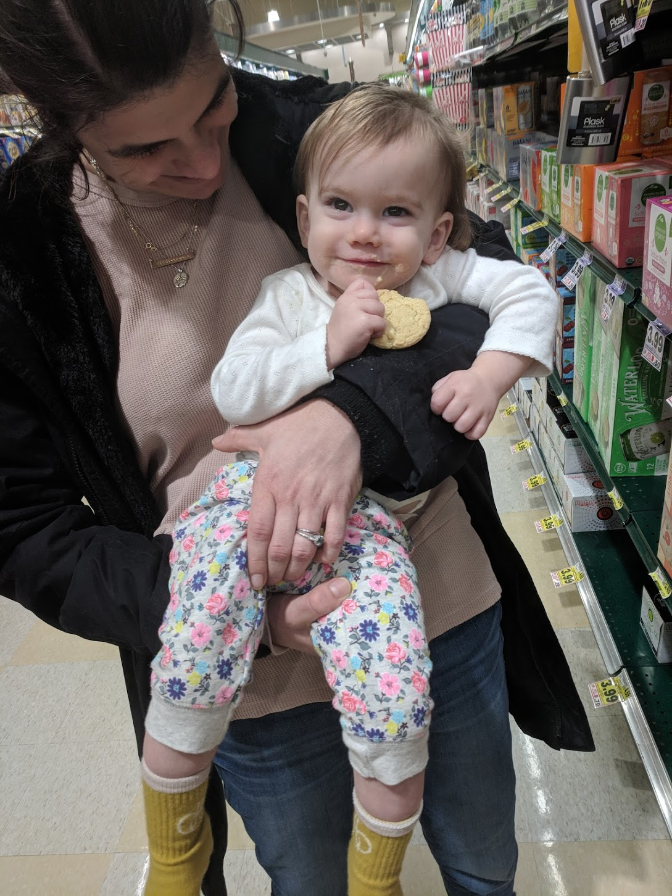

Having started Auri's therapy, we're inching into the unknown, still carrying the fear that has caused us unspeakable grief. However, this week has brought us hope, something we haven't felt in what feels like a lifetime. We're cautiously watching Auri feel better and get a little stronger. I would never have believed it if you had told me in December that I would be celebrating my daughter sitting up in a grocery cart, but here I am with happy tears simply watching her lift her head up. It's the little things right now that both encourage and terrify me. Is it too soon to celebrate? Of course. But, am I scrutinizing every movement? Of course. I'm comfortable sharing that something is happening, but it will be some time before we know what and why.

### Confounding Factors
Over the past month, Natalie and I believe that we've observed improvement after Auri has had blood taken for lab tests. At first we thought we were making it up, but now that we understand her disease better it seems plausible. When she loses blood, the amount of [interferon cytokines](https://en.wikipedia.org/wiki/Interferon_type_I) in her system would be temporarily reduced. Both on Tuesday and Thursday before starting her drug, she gave a large amount of blood to screen for viruses and infection. Additionally, children with AGS sometimes suffer flares when they get sick. The primary cause of this disease involves aberrant immune system signaling of viral infection. A simple cold could make things worse, and the week before starting this drug Auri had one. Her cold started to break just as we started the drug, and we'd expect that alone to make her feel better.

### Waiting on Data
Technically, we still don't have any data on Auri's interferon levels. It might tell us something about the severity of her disease and how it was progressing. Until we receive a few data points showing a reduction in her body's response to the disease, it's impossible for us to even confirm AGS let alone efficacy of the drug she's taking. Frankly, we got started in haste. She was getting worse every day and there simply was not time to waste. Though we still don't have all the details, the diagnosis is pretty certain. In the coming weeks, we're hoping to get data demonstrating beyond a doubt that we're observing measurable improvement.

### Observed Improvements
Within a day or two, we noticed some small but remarkable improvements in her general attitude. Having slept poorly for over a week, Auri went through the night without complaints. She switched from two naps a day to a single, appearing less tired and fatigued over all. Within another day or two, she was holding herself up better. One of the most distressing changes over the past month has been how "loose" she's gotten when you pick her up. Having mostly laid on my shoulder when carried, she's begun to engage her back muscles and sit up more in my arms. She's also using her voice more. In the car on the way back from Duke this Tuesday, she was talking up a storm. Having talked much less over the month of February (or sticking mostly to "mama"), she's bringing back some baby talk that had mostly stopped. Last but not least, she had a strong day at physical therapy. Her ability to participate in PT has gotten progressively worse, week by week. This past Thursday, she was able to kneel and crawl with help.