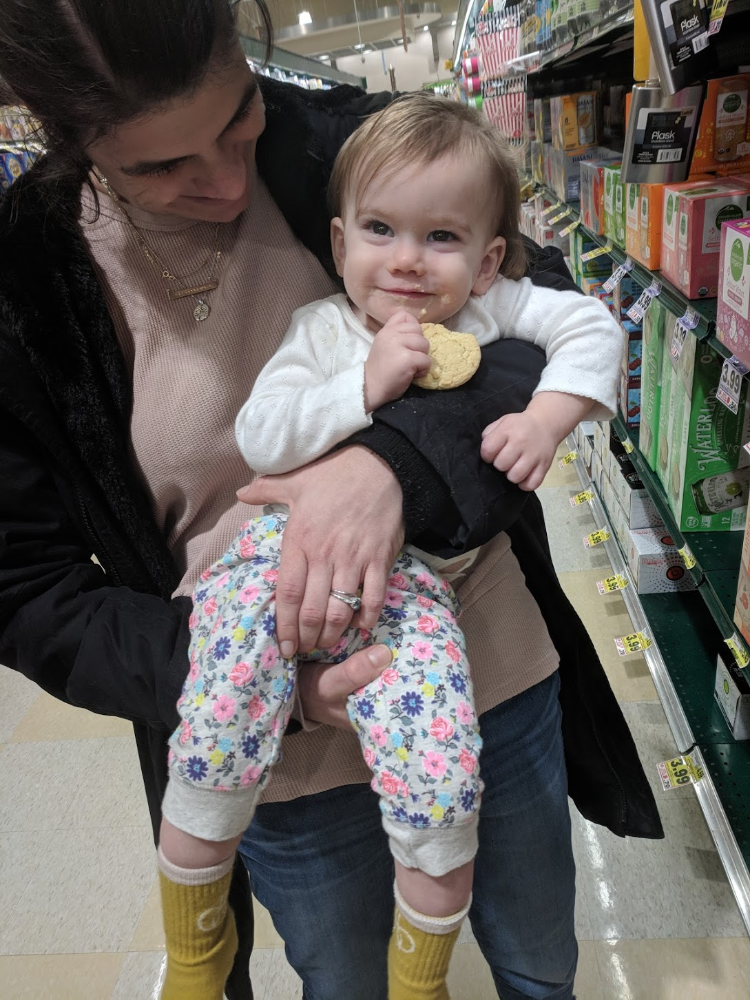
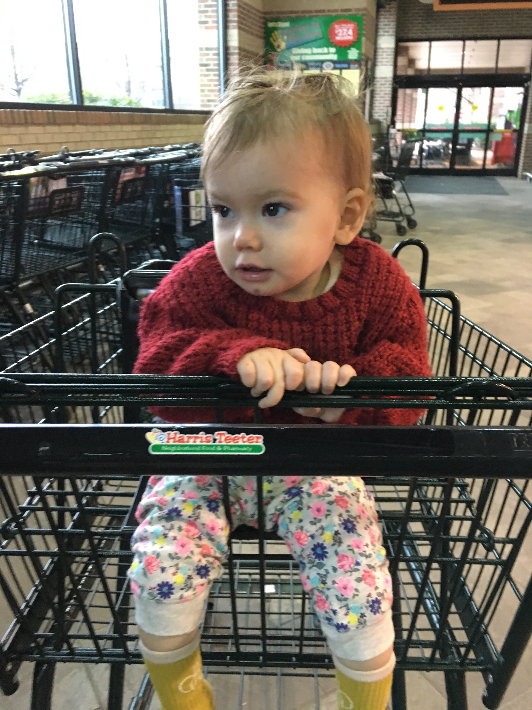
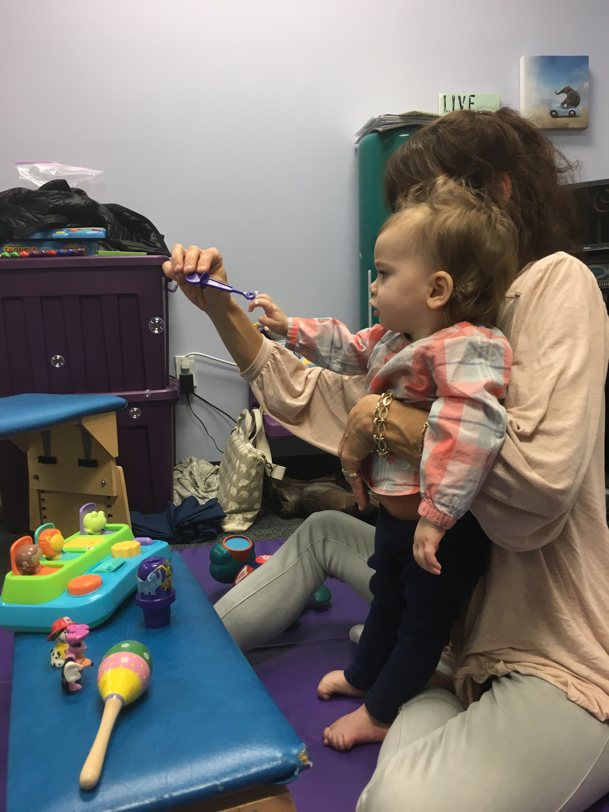
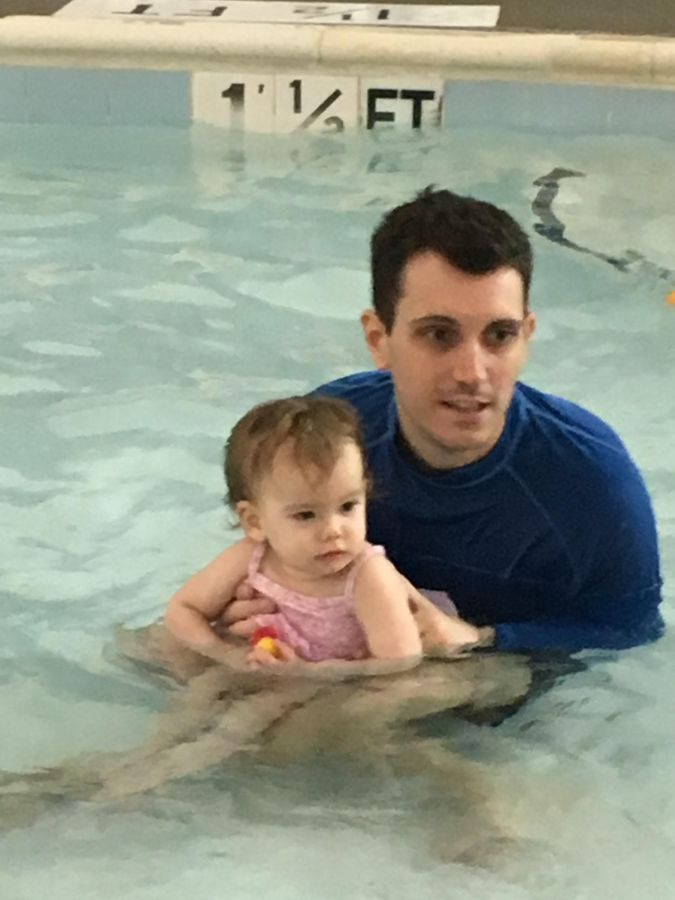

Having started Auri's drug therapy, we're inching into the unknown, still carrying the fear that has caused us indescribable grief. However, this week has brought us hope, something we haven't felt in what feels like an eternity. Last month I was certain we were losing our girl, but a spectrum of possibilities is opening before us.

We're cautiously watching Auri feel better and get a little stronger. I would never have believed it if you had told me that I would be celebrating my daughter simply lifting her head up, but a picture from Natalie of her sitting up in a grocery cart brought me to tears.

It's the little things right now that both encourage and terrify me. Before we began this therapy, every day since December had been worse than the one before it. Since Saturday, February 16th, every day has been better. Is it too soon to celebrate? Of course. But, am I scrutinizing every moment? Of course. Something is happening, but it will be much longer before we know exactly what, why, and whether it will continue.

### Confounding Factors
Over the past month, Natalie and I believe that we've observed improvement after Auri has had blood taken for lab tests. At first we thought we were making it up, but now that we understand her disease better it seems plausible. When she loses blood, the amount of [interferon cytokines](https://en.wikipedia.org/wiki/Interferon_type_I) in her system would be temporarily reduced. Both on Tuesday and Thursday before starting her drug, she gave a large amount of blood to screen for viruses and other signs of infection. Additionally, children with AGS sometimes suffer flares when they get sick. The primary cause of this disease involves the immune system chaotically signaling viral infection where there is none. A simple cold could make things worse, and the week before starting this drug Auri had a bad one. Her cold had just started to break as we started the drug, and we'd expect that alone to make her feel better. We've seen that effect before, but her temporary improvement has never been as strong as we're seeing now.

### Waiting on Data
Technically, we still don't have any data on Auri's interferon levels. It might tell us something about the severity of her disease and how it was progressing. Until we receive a few data points showing a reduction in her body's response to the disease, it's impossible for us to even confirm AGS let alone efficacy of the drug she's taking. Frankly, we got started in haste. She was getting worse every day and there simply was not time to waste. Though we still don't have all the details, the diagnosis is pretty certain. In the coming weeks, we're hoping to get data demonstrating beyond a doubt that we're observing measurable improvement.

### The Drug
I've gotten some questions about the drug that I can answer. It's a chemical called [baricitinib](https://en.wikipedia.org/wiki/Baricitinib) in a small pill that Auri takes multiple times a day. We can't trust her to swallow a pill, so thankfully it dissolves very easily in a tiny amount of water that we mix with yogurt. So far we haven't had any difficulties, and she's been tolerating it without obvious side effects. However, the side effects that we will be concerned about would take time to  develop. The drug acts by interrupting her cells' ability to recognize and respond to certain signals. While it targets the immune signals that her disease is sending into overdrive, it also interrupts some hormones, like those from the kidneys that control blood cell production. In a multi-year [study](https://www.ncbi.nlm.nih.gov/pmc/articles/PMC6026004/) using the drug for different but very related reasons, children received and tolerated baricitinib well for an average of 3.5 years. For these children, the alternatives just simply aren't acceptable and **the modest risk that this drug poses is heavily outweighed by the severity of their disease**.

### Encouraging Observations
Within a day or two of Auri starting this drug, we noticed some small but remarkable improvements in her general attitude. Having slept poorly for over a week, Auri went through the night without complaint. She switched from two naps a day to a single, appearing less tired and fatigued over all. Within another day or two, she was holding herself up better. One of the most distressing changes over the past month has been how _loose_ she's gotten when you pick her up. Having mostly laid on my shoulder when carried, she's begun to engage her back muscles again and sit up more in my arms. She's also using her voice more. In the car on the way back from Duke this Tuesday, she was talking up a storm. Having talked much less over the month of February (sticking mostly to "mama"), she's bringing back some baby talk that had mostly disappeared. At physical therapy, she had a strong day. Her ability to participate in PT has gotten progressively worse, week by week. This past Thursday, she was able to kneel and crawl with help. We even just got back from the pool, where Auri continued to show increased strength and coordination. I'm too nervous to call it a trend yet, but I hope this continues.

