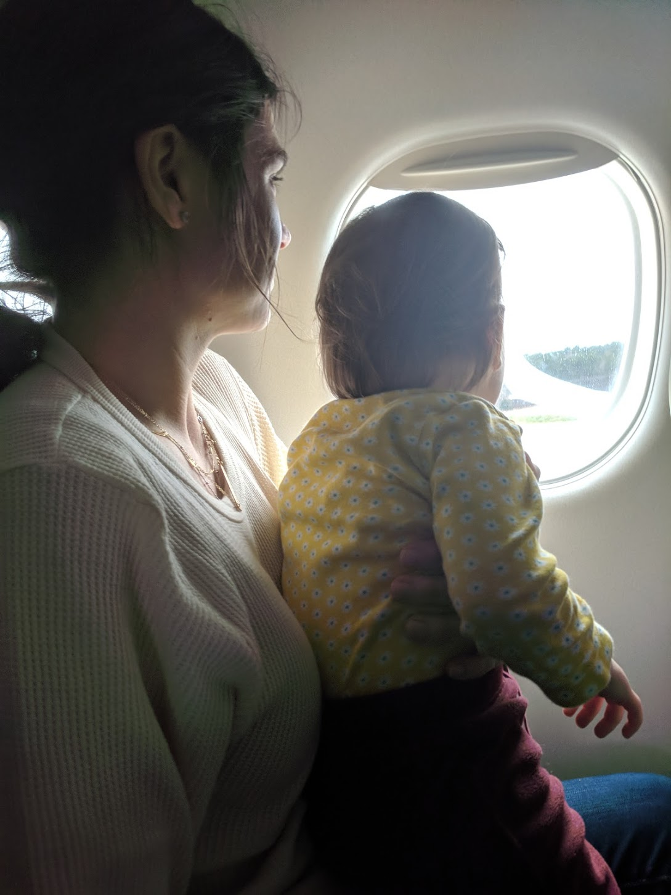
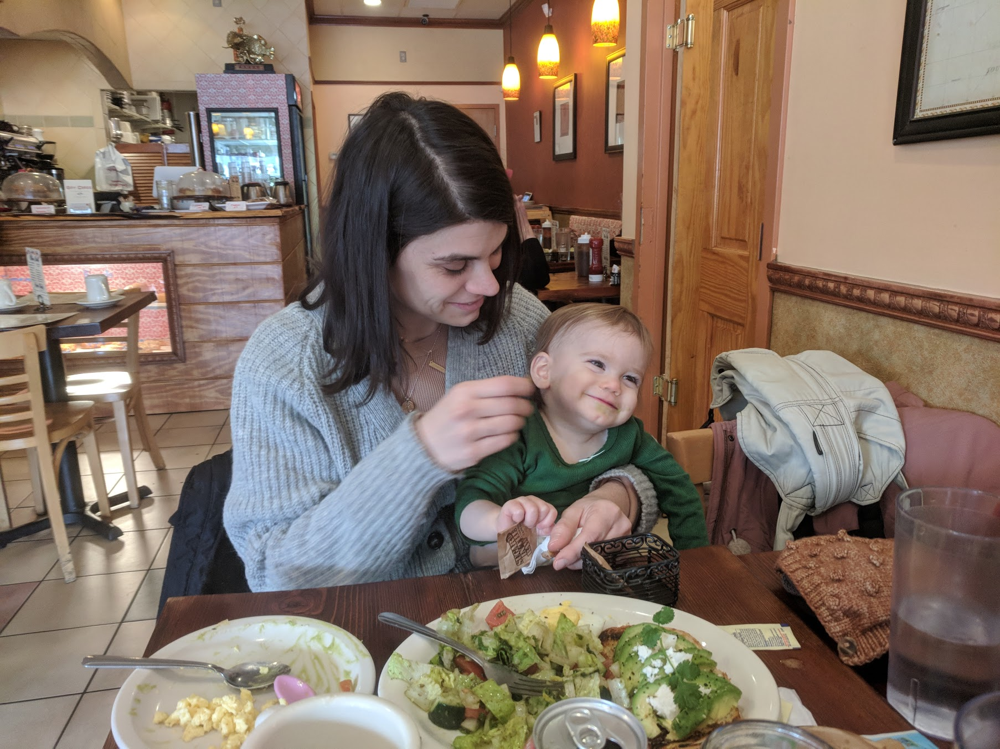

Auri, Natalie, and I traveled to Philadelphia this week to consult with Dr. Vanderver at the Children's Hospital of Philadelphia (CHOP). She's leading research and treatment of AGS in the U.S. and had lot of information and observations to relate about both Auri's disease and medication. I left a little disheartened by our conversation, but not because of anything we're doing or currently witnessing. It's just undeniable that Auri's disease will be lifelong and difficult. Thankfully though, there's every reason to believe that what we're doing for her now will be extremely advantageous to her quality of life. Although nobody will outright say it, the medication she's taking is presumed to be successful at stopping neurological regression and encouraging for managing her future struggle with secondary complications. Consequently, Natalie and I remain hopeful but will forever be in a state of fear that the next setback lies around the corner. I don't know how we're going to handle that constant stress, and I worry about the consequences for Max and Lennox.

I was grateful for both of my parents this week. My mother watched Max and Lennox back home while we were gone, and my father met us in Philadelphia to chauffer and provide support. Sometimes it feels like we can barely handle ourselves and Auri, let alone two older boys and two dogs (one with cancer no less). Every moment that somebody entertains our kids and gives us a chance to decompress helps tremendously. I'm looking forward to a visit by my cousin and her girls, and similarly thankful for my aunt's visit a couple of weeks a go. We need distractions because whenever I'm sitting still I'm worried. At any moment, Auri could start slipping through our fingers again; and she's struggling so hard to hold herself together. I'm finding it impossible to not obsess about every little thing she does.

## Another Cold

We always watch our children get sick in sequence. Two weeks ago, Max had a bad cough. The following weekend, Lennox woke us up in the middle of night with another bout of croup. This week past week was Auri's turn, and we were incredibly nervous given the consequences of previous illnesses. We happened to be traveling to and staying in Philadelphia as it peaked, but despite notable restlessness, fatigue, and irritability, there haven't appeared to be significant changes in her condition. I might say that she got slowed down a bit, but not to an extent that has me worried about recovery. Although her stuffy nose hasn't fully cleared up, she's pretty much back to normal sleep and I'm hopeful that the worst has passed.

It's difficult to describe how stressful this past week has been. Natalie and I try very hard to hold ourselves together, but internally we're panicking. We **hope** that Auri makes it through this and future illnesses without difficulty because any could trigger a disease flare. In a way, I feel like we're treading open water, one storm and big wave away from going under. Although she's still able to eat solids and drink pureed fruits and yogurt, Auri can't swallow plain water. Any further loss of feeding ability or an episode of dehydration might necessitate a feeding tube. For me, this represents a cliff that we're desperately trying to scramble back from. With any luck (and continued health) she may regain a lot of that ability, and we have an X-Ray based swallow study to assess her next week. Unfortunately, with two toddlers in school, there's not a whole lot we can do to keep her away from bugs and germs while she regains her strength. We nervously wait, watch, and hope for the best.

## Notes from CHOP

On Thursday, we had a long appointment at CHOP with a team and doctor that are recognized as the country's  (and probably the world's) experts in AGS. They're also the group experimenting with and prescribing the drug for AGS patients that we've managed to get prescribed locally. Although the travel was difficult for us and Auri, I think the information we received and the relationship we established made it worthwhile. Dr. Vanderver related the widening picture of the AGS spectrum and the long-term, life-long challenges of the disease. In the past, children would likely receive an AGS diagnosis on the basis of a severe neurological condition. As genetic testing has become more available over the last few years, many more children (and adults) have been diagnosed with less severe disease characteristics. This implies an ascertainment bias in AGS diagnosis and that the statistics on disease severity are heavily skewed. Based on a quick assessment, Dr. Vanderver guessed that Auri may suffer a "moderate" disease course (or somewhere in the middle of the disease spectrum), but I have my doubts about this based on the frightening slide that we witnessed in February. The team at CHOP thought that we might have disrupted the disease somewhere in the middle of a regressive episode.

Furthermore, this broadened spectrum and some wider observations suggest that this disease will continue to be formidable for the remainder of Auri's life. Her risk of neurological damage may decrease over time, but the risk of relapse and secondary complications may continue longitudinally. These secondary problems occur as the result of small blood vessel damage and can impact the functioning of other organs. My hope is that this drug will reduce the chronic inflammation that causes these problems, but nobody has observed enough patients and for a long enough time to say anything definitive. Allowing for conjecture based on limited observations, we can hope that CHOP's three-year monitoring of patients on this drug suggests a significant benefit to Auri. Without addressing cause-and-effect or attributing it to the medication, Dr. Vanderver shared that they have not seen a patient's neurological condition worsen while on baricitinib. Again, this comes with caveats; most of the patients have already experienced significant damage that makes further decline unobvious and difficult to measure. This doesn't necessarily mean the drug is working, and we can't treat it like a magic bullet. We received a sobering list of things to watch for, both drug and disease related, that underscore the seriousness of what we're dealing with.

However, I've left with encouraging news. They've treated a child as young as two months of age that has appeared to benefit. Relatively speaking, there haven't been any significant, adverse drug induced events for the children they're treating. And, they have had children successfully on this drug for multiple years. Considering that CHOP continues to prescribe and research this medication for these children, we can assume that there's a reasonable benefit to the patients. Our uncertainty about whether we are seeing improvements so quickly has also been resolved. I'd read this previously, but Dr. Vanderver confirmed that the drug "works immediately."

---

Thank you to everyone that continues to support us. For now, things are still going well and moving in a positive direction. Auri's much happier than she was before we started her medication and she continues to put on weight and slowly improve. We're in the process of ordering assistive equipment (like a supportive seat, stander, and stroller) that should make things a little easier on us. We're all adjusting and trying to experience each day with grace and appreciation.

