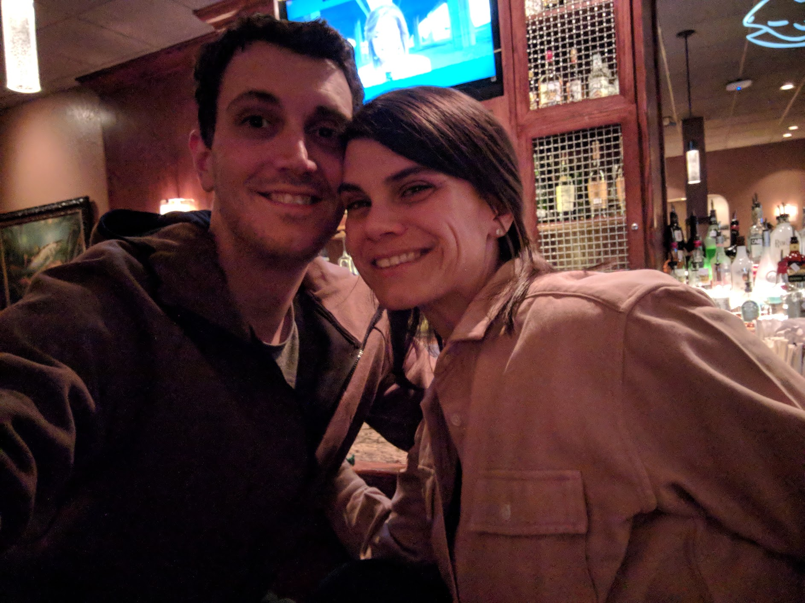
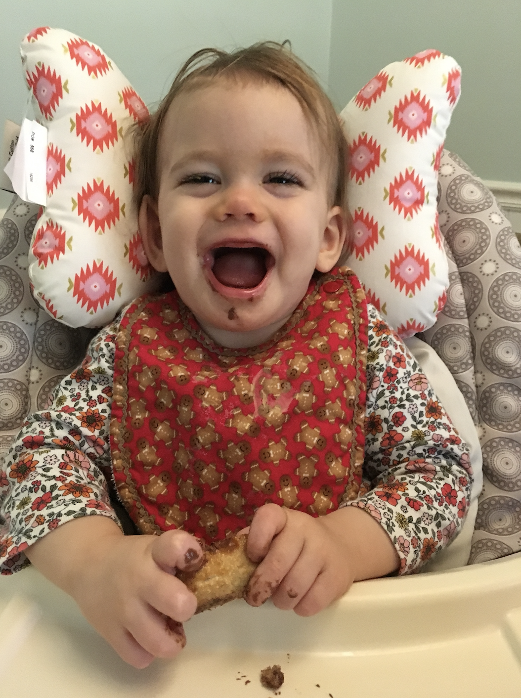

In my past and with mixed success, I've fought my tendency to withdraw. A good friend once described me as "insular," and, admittedly, I'm an introvert that prefers the predictability and control of my privacy. For over two months, unfortunately, that space has been a veritable nightmare: dreadful, unpredictable, and painful. Thus far I've resisted the urge to engage in self pity, trying, rather, to focus on exhausting options for saving my daughter. But what left is there for me to do and how am I to feel now? Where do I direct my attention and from what well can I draw strength? We're alone, committed to an obscured path; and there's nothing more we can do. We move through the dark, in hope of protecting our daughter from further harm, a journey without a destination. Consequently, my personal space has been transformed into an enduring emotional struggle; and I'm tired. Yet I've been forced to come to terms these past two weeks with the insecurity that plagues our family now and forever. And, the feeling of being _apart_ has built tremendously since my last update. How do I answer a polite question like "how are you today?" Can I share how I really feel? Should I? With every friend, coworker, and family member, I'm forced to politely withold. Is this real stoicism? The truth is too difficult. This must be why support groups exist.

You might wonder why I'm writing like this now, when I've mostly stuck to the facts in my other updates. Well, I get asked often how Natalie and I are doing. I don't speak for Natalie. Even though I know she can relate to much of what I'm sharing, still, I'm never confident that I can really answer the question on her behalf. I can't even answer it on mine. Without exaggerating, I can tell you that my feelings change every hour. I swing between grief, fear, gratitude, and hope: grief for my daughter and the changes in our lives, fear that it may still get worse, gratitude for her remarkable opportunity, and hope that she can achieve a semi-normal life. As I watch Auri fluctuate, through colds, infections, and fatigue, I reckon with all of this and swing back and forth, sometimes within intervals of a few minutes. Imagine living on a world that experienced earthquakes with the same period. You'd be in a state of constant panic. How would you deal? Could you go on a date and keep from crying in public? We can't, but we can still smile for a picture.

So there it is, my best answer to the "how are you" question. I'm sure that some can relate, and I don't think we're unique. But most can't. When this all started I just tried to help everyone understand that it was better to say nothing. Trying to find the right thing to say or trying to empathize with an incomparable experience just kind of hurt more. I think that remains true. The depth of this, the biggest and most difficult experience of my life (past, present, and future), can't be communicated and will remain largely unspoken of. I'm grateful that I have a partner who can understand.

---

You didn't subscribe to hear me complain. You want to know how Auri's been doing since my last update. Unfortunately, I couldn't answer the question with any confidence until yesterday. Since March 9th, Auri has been stuggling with an eye infection, on and off low-grade fevers, and the eruption of her first two teeth. She hasn't slept well or predictably, has been weak and tired, hasn't eaten or nursed well, and has had us all sorts of worried. Despite all of this, I had been communicating my belief that it was temporary, a consequence of infection or teething; but, to be honest, I'm not sure what portion of that belief was just hope. We wrestled with a lot of doubt this week. Fortunately, the belief doesn't appear to have been misplaced and Auri really seems to be back on track. As before, the rails are being laid as we travel, and I can't dismiss the likelihood of future derailments. In fact, I fear another cold is on the horizon (from some sneezing and coughing). There's no rest for the weary.

In good news, here's Auri [taking some cautious sips of thickened water](https://photos.app.goo.gl/E99jfQ5vXCreiUJTA) today. We've been unsuccessfully trying to find a way to increase her fluid intake. She's been refusing everything we've tried until yesterday. With this cup and to build her confidence, we're letting her take small sips of thickened water. Of course, this comes with her recovery this weekend and wouldn't have been reasonable last week. Nonetheless, there were a few moments between the sickly naps and crying that had me thinking she was still avoiding the progression of her disease. She's been playing the "how big is Auri? So big!" game with Natalie, lifting her arms above her head (so long as she's laying down). After work one evening, we laid on our backs and I held up a children's tablet for her to play with. She was passing the stylus between her hands and clearly enjoying scratching pictures on the screen. I haven't observed any neurological changes, and she's still feeling much better than she was at her lowest. Also, she really likes nutella...

What else? 

I wrote to appeal our insurance company's denial of her medication. My letter cited all the relevant research, and I provided a folder of about fifteen articles from various journals. One of these days I'll write about how we leveraged this research to get her treatment, but right now I'm hoping it suits this purpose. I burned a whole cartridge of ink and delivered over a hundred pages after Cigna determined, "with the information they had," that Auri's condition "does not involve an imminent and serious threat to the health of the member." They've denied the medication on the basis that there isn't enough evidence for its use. I'm really not sure what the outcome will be, but I've tried my best. The price of her medication wouldn't just bankrupt us, it would make the treatment impossible.

We also got some data this week. Auri's lab results provide molecular confirmation of an intereferonopathy. Between her first sample (before medication) and ten days after beginning baricitinib, expression of her interferon stimulated genes reduced significantly. I had hoped for results from her third sample before claiming anything definitive, but the initial data is encouraging. We'll need to see more samples, given that these levels would be expected to fluctuate during illnesses. I suspect that we'll see a positive trend.
