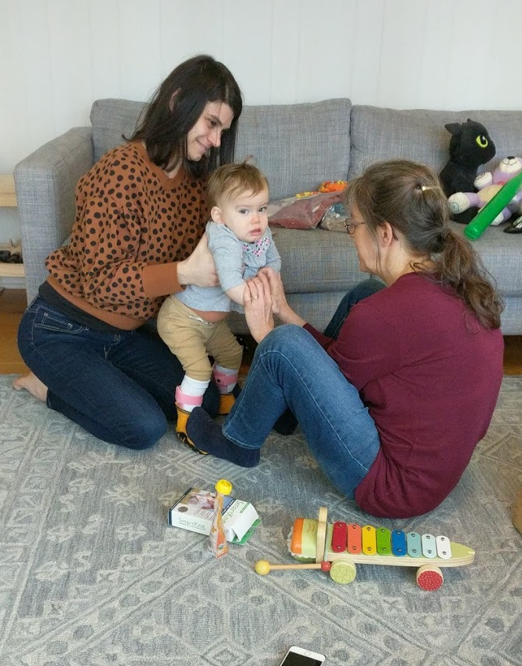
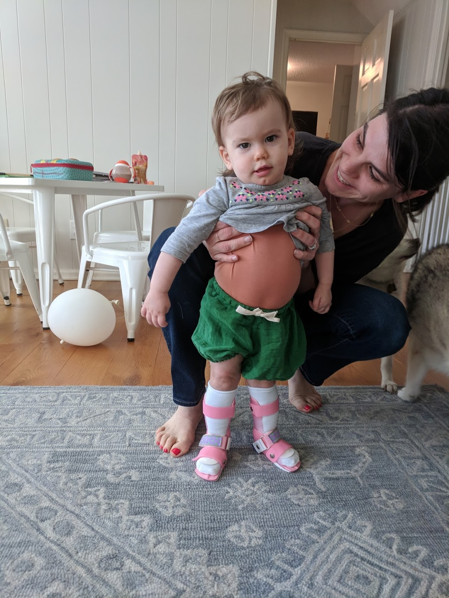
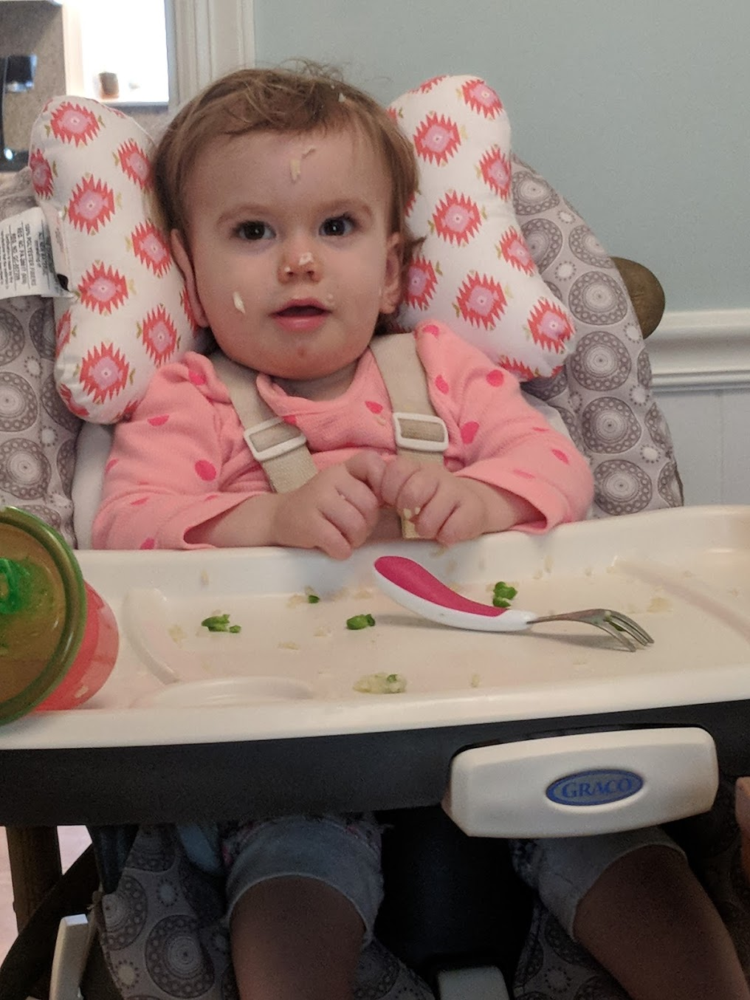
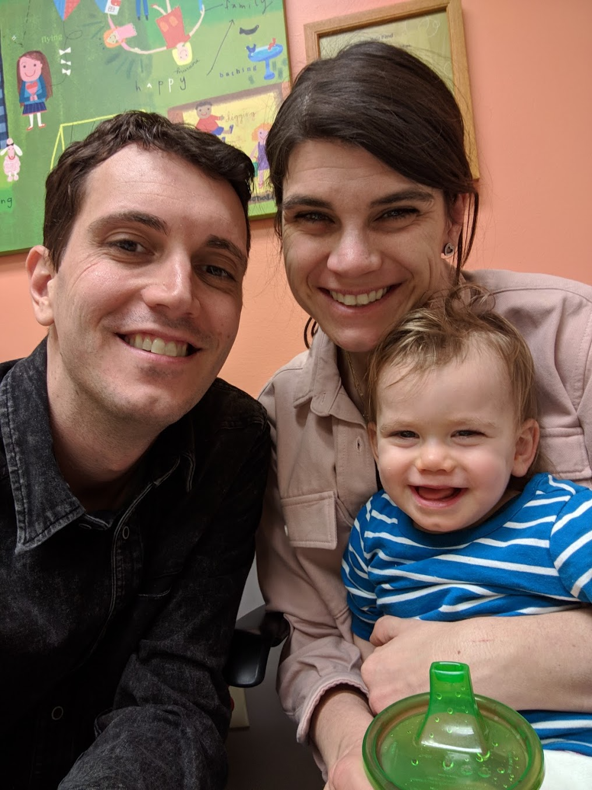
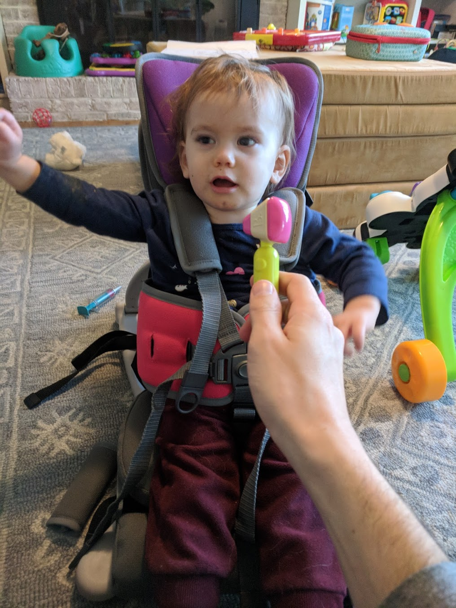
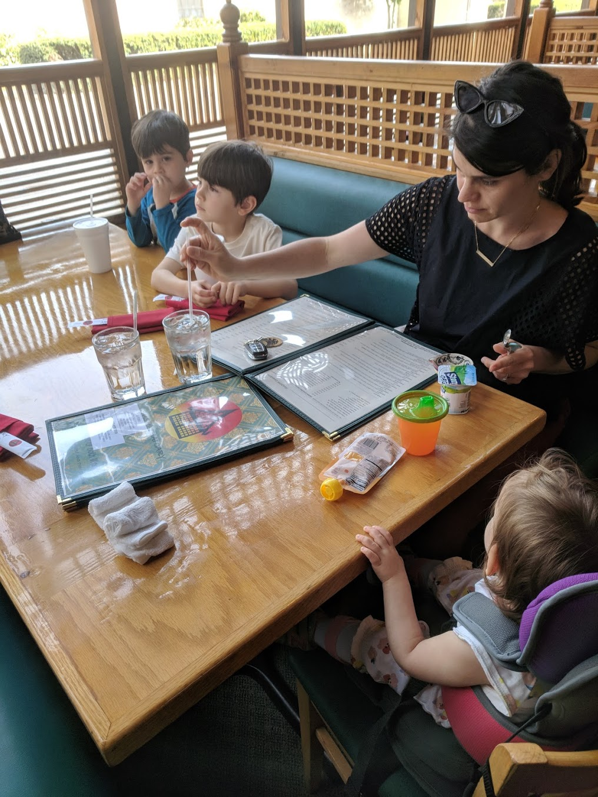
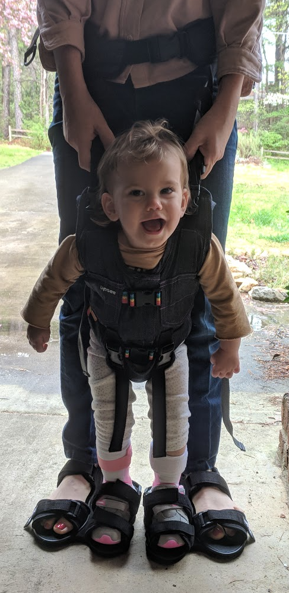

With this update, I'd like to give everyone a sense of our weekly experience. We have a lot of regular appointments with doctors and therapists, but right now they're largely focused on long term management. I believe that we're transitioning from an acute period of tests and diagnostics into a treatment plan that's looking optimistically forward. Behind us are ultrasounds of the heart and kidneys, hip x-rays, broad screening for viral illnesses, and a host of other tests that Auri passed without concern. Moving forward, we're focusing on monitoring changes from the drug she's taking and lots of therapy. In my opinion, the drug is working and Auri's in a category of moderate AGS severity. Relatively speaking, she's incredibly lucky to have a chance at mostly normal development. We're working on helping her catch back up. Again, I have to add the caveat that the doctors and scientists involved refuse to declare success, but that's because they need irrefutable evidence from more patients. For now, we simply need to make sure that she's at a safe dose and stays healthy. In good news, Cigna accepted our appeal and will be covering Auri's medication. I'm sure that we would have found a way to keep going, but this will remove an extremely large financial burdern (at least $4k a month). Now, we're looking forward.

## Therapy
In the past 30 days, we've begun a comprehensive therapy program for Auri. She receives support from the state of [North Carolina's Infant Toddler Program](https://beearly.nc.gov/). The program has helped us coordinate and schedule a number of different kinds of therapists to ensure that she's getting the opportunity to rebuild and regain skills. She most recently had an assessment by a speech therapist, which I'll go into further below.

### Physical Therapy
Twice a week for an hour, a physical therapist comes to our home and works with Auri on gross motor development. Since she received her Ankle-Foot Orthosis (AFOs), we've been working on bearing weight on her legs and feet while standing and building strength in her core.

Auri's therapist will help her stand, make her reach across her body, etc. We tend to place her sitting on her heels, and let her play with toys at a raised cushion. We've seen Auri redevelop  a lot of lost strength in her abdomen this way. Compared to a month ago, Auri's getting muscular. She might not have strong balance or coordination, but I've definitely noticed and can feel a lot more muscle around her sides, back, and stomach.

### Feeding Therapy
Once a week for thirty minutes, Natalie takes Auri to either Duke hospital or Duke's location in Brier Creek to work with a feeding therapist. They spend about a half an hour trying different foods, and more importantly, introducing different thicknesses of fluids and water. Our current goal with the therapist is to find the safest and most effective way to ensure that Auri is getting hydrated.

Auri recently had a video fluoroscopic swallowing exam done that uses an X-Ray machine to watch her swallow foods and liquids. She performed well, demonstrating a small amount of swallow fatigue. But, she manages food well and handles thicker liquids without aspirating. The report's prognosis was promising.

>  Prognosis: Fair for improved function with skilled speech pathology services focusing on stated goals.

### Occupational Therapy
With Auri's occupational therapist, we work on development of fine motor skills. Once a week, and also in home, her therapist plays with her stacking blocks, passing things between her hands, etc. The therapist has boxes with little toys that she tries to get Auri to use both hands with. She has her press with her fingers on buttons and use toys that require her to  push hard with her hand. The goal here is to help her improve her hand coordination. Auri started to lose some skills with her fingers that she's been slowly regaining. At her worst, she began closing her hands and reaching for things in a closed fist or claw like manner. Since then, she's begun using open hands again and can help feed herself yogurt with a spoon.

### Speech Therapy
New this week, we've started Auri with a speech therapist. Although we haven't yet scheduled  these, the therapist is recommending twice a week, thirty minute appointments. I believe that this therapy will focus on helping Auri with expressive gestures and language. She'll be doing things like  making animal noises to build speech skills. The evaluation involved a big checklist of questions like, "does she look at Dad when you say his name?" The answers to the questions produce scores split by _incoming_ understanding and _outgoing_ use of speech and expression. Considering the circumstances, I'm happy with how Auri performed. She's within the range of normal for _incoming_, meaning she understands language and speech. And, she's just below the range of normal for _outgoing_ expression, meaning she's a little behind on developing sounds and gestures. I'm not surprised that she has challenges, considering she's lost a couple of months of normal development. I'm a little sad about this, but in the grand scheme of things it means we caught (and hopefully stopped) this disease before it claimed her intellectually. Before these changes, Auri was wickedly smart and expressive. I don't believe she's lost that, but it makes me wonder where she might be now had she the opportunity to run around and explore. Still, this is **good** news, and she will probably gain a lot from this therapy.

## Follow-Ups
Every _other_ Tuesday, we take Auri to Duke to see Dr. K. At these appointments, they do a handful of blood tests and send a sample off for research. Right now, we're watching things like red and white blood cell counts, kidney and liver enzymes, and for signs of unexpected infections.

So far, things have been going well. I've been watching slow changes in some of these values, but there has not been anything drastic. It's possible that they all settle where they are soon and we sit at the current medication dosage. At some point, probably after another few months, these follow ups will become fewer and farther between.

## Family
I feel like we've really struggled here. We used to go out to dinner regularly as a family, meet up with friends, and spend more time together. Recently, we bought a portable chair that should provide Auri with enough support to sit anywhere we take her.

We went out last night. Max had been asking for Sushi. It was a success! We had been waiting for this to make it through customs for about a month, and I'm glad that it finally arrived. Since Auri can't sit in a high chair, it's been difficult for us to go places. Now I think we'll have more freedom and can get out of the house together more.

## Health Care, Equipment, Care Coordination
Just in general, our deep dive into the health care system has been frustrating. We have a lot of bills coming in, some with mistakes. We've also had to work through exclusive equipment providers to order some things like a pediatric stroller/wheelchair and a standing table. Over the past few weeks we've had Auri measured for equipment and orthoses. For whatever reason, this process seems designed to make it both difficult and lengthy. I have a few tasks on my checklist to follow up and work some of this stuff out. Hopefully, Auri will get some helpful things soon. Next week we're fitting her for a support vest that should help her with core strength and coordination. We just recently bought this contraption, that lets Auri walk around this us.

I also have a few conversations scheduled to talk with different people about different foundations, services, and other financial support options that might be available to us. I believe that Auri will qualify for Supplemental Security Income (SSI) benefits from the Social Security Administration, and she will likely qualify for Medicaid to help pay co-pays and co-insurance. Right now, the financial cost of this isn't big on my list of concerns, but going forward we may need to do things like expand our house or renovate for accessibility. I'll be speaking with a lawyer next week about the possibility of opening a special needs trust.

## Day by Day
Somehow, between Natalie and I, we juggle getting Max and Lennox ready and delivered to kindergarten and pre-school. The morning involves breakfast, dissolving and delivering Auri's medicine, dressing, brushing, packing lunches, etc. It's usually a bit of a dash, but they get there. There's almost always a therapy appointment of some kind before lunch, and then Natalie's feeding one or two kids before naptime. I'm at home a day or two a week, but Natalie's usually managing this chaos on her own. When she's awake, Auri just wants to walk around endlessly. Right now that involves Natalie having to bend over and hold Auri up while she takes small steps around. If she takes a good nap, Natalie gets a little break before doing the same thing in the afternoon. It always feels a little crazy when I walk in the door, because the energy in the house with Max and Lennox can get a little much. It's been difficult to make everyone happy, so there's usually some argument about dinner, shower, etc. We're making it through, but I know that Natalie and I are both exhausted when everyone finally hits their bed. If we're lucky, and we aren't always, Auri will sleep through the night and we get a good rest. In the past couple of weeks, though, we've had wet beds, vomiting, diarrhea, croupe, and some bad nights with everyone. Our boys have been sick with one thing or another, and Auri has been teething and acting restless. We're guessing that she's both learning a lot and dealing with a sore mouth, so she doesn't always sleep the best. We kind of take things day by day and it feels like a coin toss whether we'll get an easy or a hard one. It's starting to feel a little more like it did before all of this happened, though. Raising three children six and under isn't without its challenges.

---

Things aren't easy, by any stretch of the imagination. But Natalie recalled recently that Dr. K reminded us that "it could be much worse." I think that's probably the best way to  describe all of this and the ambivalence that we feel. Nobody wants something like this to happen to their child, but I follow the AGS family group on Facebook and it's really sad. For every child in Auri's condition or better, there's one or two that are _much_ worse. Without pulling together this treatment for Auri, I'm certain she would have been in the _much worse_ category by now. I have so much empathy for those children and families, and it makes me grateful for where we are and the trends we're seeing. I think I might write another post soon detailing how we got here. This opportunity for Auri is truly remarkable and unprecedented.

Thanks for reading and caring.