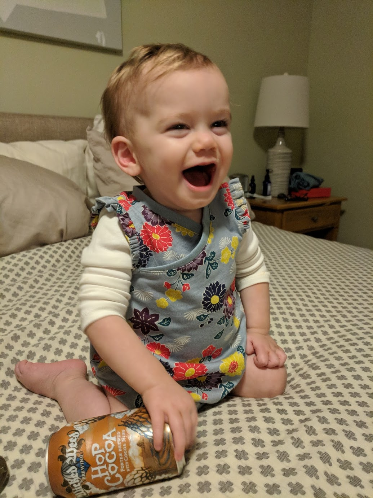
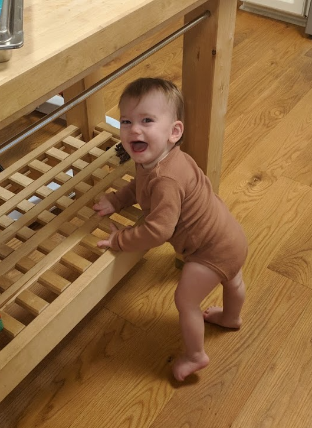
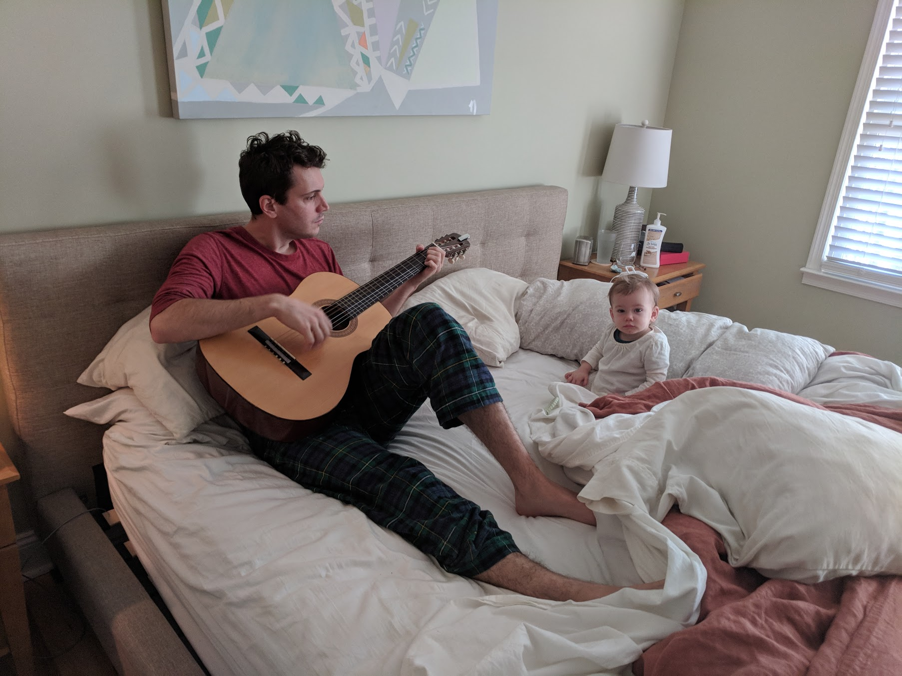
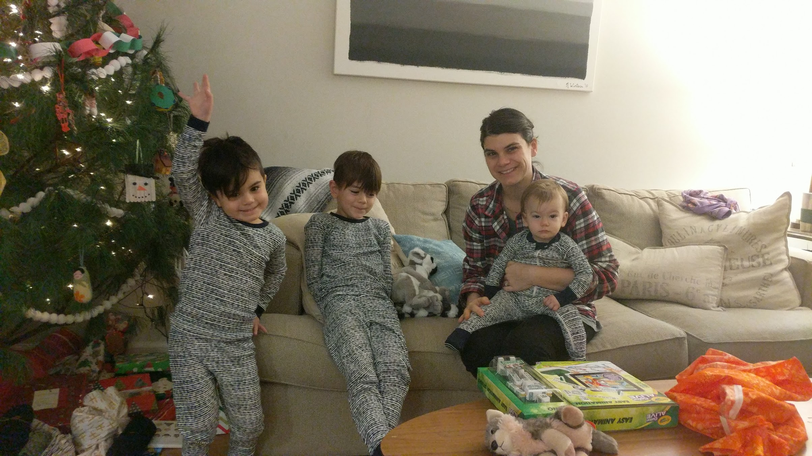
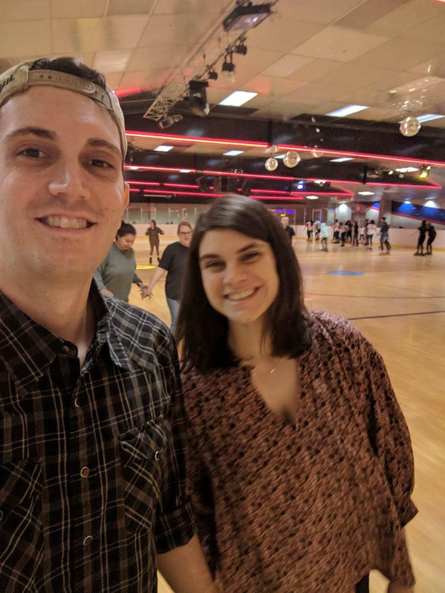
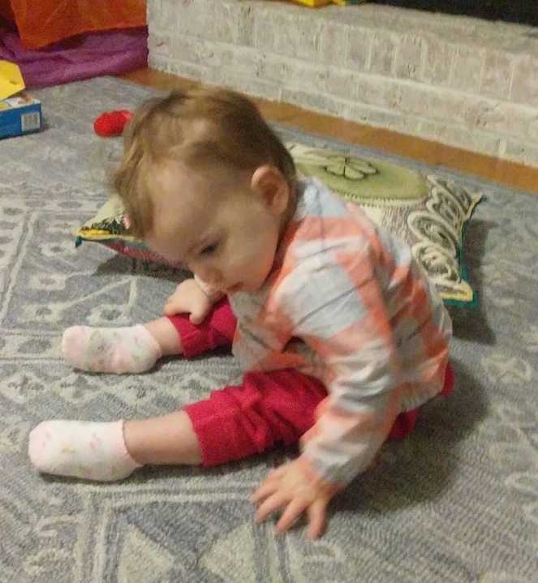
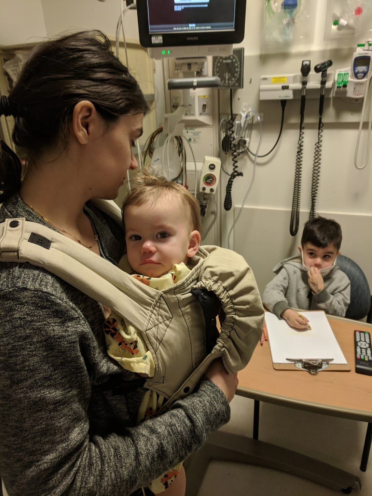

This is **Act One**, where our lives changed.

For posterity, I've tried to write down and date everything that happened and led to diagnosing and treating Aurelia. This will be a _long_, three or four act post, mostly for me and my family; but I've wondered if it would help others that have or have gone through something similar. Since January 7th, 2019, we've been through a whirlwind of events and emotions that I have found difficult to digest. There were so many little details that I've probably lost memory of, but I've tried my best to reconstruct the timeline and include my thought process through it all.

---

## Mostly Normal Development

I can't recall when it started, but Natalie and I have had concerns about Auri for a long time. I think we always felt sensitive about how differently she developed from her brothers. If Max and Lennox had learned something early, Auri had learned it a month or two later. She always gained skills just in time, before it seemed prudent to have concerns. If we brought it up, somebody would remind us that "girls are just different." They might have been right. We'll never know. It's unclear whether she experienced disease related issues at an early age, and if she had, they weren't severe enough to notice. However, Natalie had directly voiced concerns about Auri's developmental to a friend as early as October. If none of this ever happened, we would probably just be telling people, "every kid is different."

## Something's Up - November 13th - December 22nd

However, something felt different around her first birthday. Auri had been pulling up, but not really scooting. She stood on one of her ankles funny, and Natalie and I discussed bringing it up at her one year checkup with the pediatrician. Coincidentally, at that appointment in the middle of November our doctor shared that she scored low on a parent questionnaire about her gross motor development. In fact, she _failed_ it. It was concerning, but we were assured that it happens sometimes. Given that everything else seemed to be continuing alright, we left hoping that it might be a fluke. We had given voice to our concerns, at least; and the pediatrician assured us that she sees more false positives than genuine issues with these questionnaires.

During this period, tensions seemed to be really high in our marriage. In retrospect,  I think we were registering that something wasn't going well. At the time, I felt like Natalie and I weren't on the same page. Auri was constantly complaining to be picked up, and we must have had a hundred arguments about training her to be more independent. After a year of doing everything for a baby, I know that we were both hoping that things would get easier. Auri could and would crawl to play by herself,  but I think that she started demanding more of us. We didn't realize that she was beginning to struggle. Though she was crawling and sitting up on her knees, I can't remember seeing her sit up on her butt. On her first birthday, though, she was having a good time.

Adding more stress to this period, I was in the process of switching jobs. Throughout the summer and fall, I had been working through a great deal of frustration with my employer. I had been given too much responsibility, too few resources, and high expectations. When I successfully delivered despite these difficulties, I didn't receive any recognition. I resolved to leave in October, and started my new position just before Thanksgiving. All of this, and my prior over-focus on work, added fuel to the fire. Natalie, on the other hand, was caring for two children at home. She must have been hoping for Lennox and Auri to start playing together. Unfortunately, they just didn't seem to jive. Lennox didn't want to play with a baby; he had a much more interesting older brother. Natalie was stressed and she started painting. We were both subconsciously trying to address some dissatisfaction that we were experiencing at home, but we never gave it a name  or a shape. We just felt frustrated. In December, Auri was standing and nothing seemed wrong. We hoped it would continue to get easier.

## The Event - December 23rd - December 25th

Two days before Christmas, on December 23rd, Auri woke up with a reasonably high fever (I think it was > 102F). She had slept through the night, but we could tell she wasn't feeling well. I sat in bed that morning and played her some music. She sat patiently, but looked distracted and disinterested. I remember being surprised that she wasn't more thrilled. She had always danced and really enjoyed music.

By Christmas morning, we all fell ill. It was a subdued morning, and Natalie and I probably just phoned it in a bit. The kids were excited, but even they lacked a whole lot of enthusiasm. I remember feeling _drained_, and you can see it in this picture of Auri. We didn't know it at the time, but we now think this illness precipitated what came next.

## Something's Not Right - December 26th - January 7th

Around this time, we visited friends that have a daughter close in age to Auri. I remember feeling like something was wrong, but not knowing how acute it was until seeing their daughter (a few months older) run around and chase the boys. Auri could barely crawl around and play with toys. Something wasn't right, and Natalie and I both knew it. By the week of January 1st, we felt like something was seriously wrong and we had to take action. Natalie phoned our pediatrician and asked for an immediate followup. During the visit, Auri weighed in at _exactly_ the same weight that she had been a month and a half prior, and her "slowness" as the doctor described it prompted a call to Duke pediatric neurology for advice. The neurologist on call _strongly_ recommended we bring her to the emergency room to expedite testing. A normal appointment and consultation might take weeks. We really weren't sure what to do, nor did we have any idea how serious it was. On Saturday night, Natalie and I went rollerskating on a date. We had a good time and didn't talk about Auri much. We didn't think it could be _that_ serious, and we were trying to turn a corner and focus on being more positive together and at home. This is the last time I can remember feeling care free.

On Sunday, we wrestled with the idea of waiting to make an appointment. But after reviewing old pictures and videos that night, we realized that what had thought was some kind of developmental delay had unequivocally become developmental regression. We had been so focused on Auri's standing and attempts at walking that we completely missed her struggling to crawl and sit up. We made plans to take her first thing Monday morning, and I drafted notes to provide to the doctors with dates, milestones, and gained and lost skills. At this point, she could barely sit up and we hadn't really acknowledged how drastic her changes had been. In August, she was crawling around and sitting to play with her cousins at the beach. So much had changed so fast. Sunday night I tried to take a video of her sitting up, but she just fell over.

## An Emergency Room Visit - January 7th

Natalie hopped in the van with Auri just as soon as she woke up Monday morning and rushed to Duke. I had to take Max to school, and since Lennox was off from preschool, I took him with me to meet them.

What followed felt somewhat like a blur to me. I had fears that Auri might be suffering muscular dystrophy, and I kept asking about certain tests. I was so terrified that she would have a degenerative disease, but the markers I was concerned about came back normal. We didn't get any answers that morning, and I was forced to leave Natalie behind and head home to pick up Max. Still at the hospital, Natalie had to manage entertaining an infant through all the commotion. Without remembering the exact details of what happened, I know that they scheduled her for an MRI and a lot of blood work.

I don't remember who helped put Max and Lennox to bed that night (it might have been Dan), but  after getting them ready, I hopped back into the car to drive to the hospital. On the way, Natalie sent me a "where are you, hurry up" kind of message. I just knew it meant she had something to share and I called her back. Somehow, one of the residents had committed a faux pas and read Natalie an excerpt of the preliminary MRI report. Natalie told me that they thought it was a leukodystrophy. I didn't know what that meant, and I almost crashed my car after looking it up while on the highway. I started hyperventilating and everything went dark.