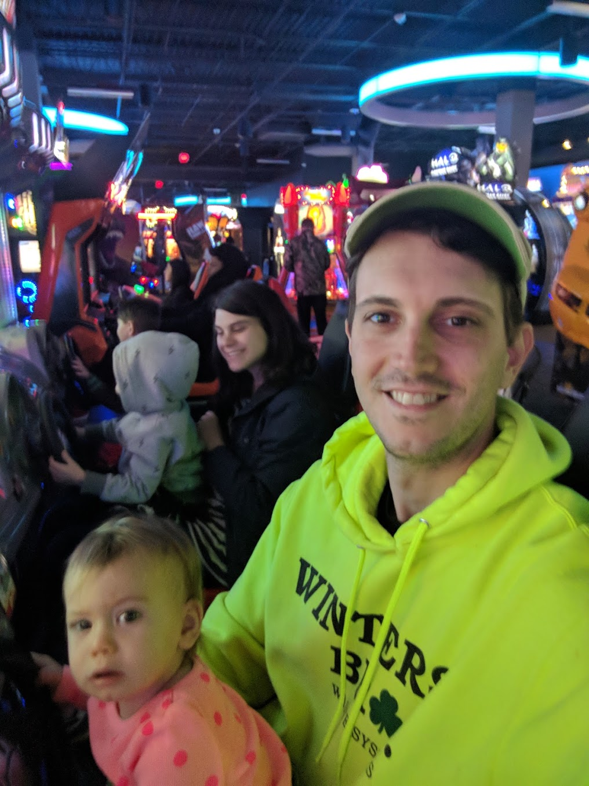
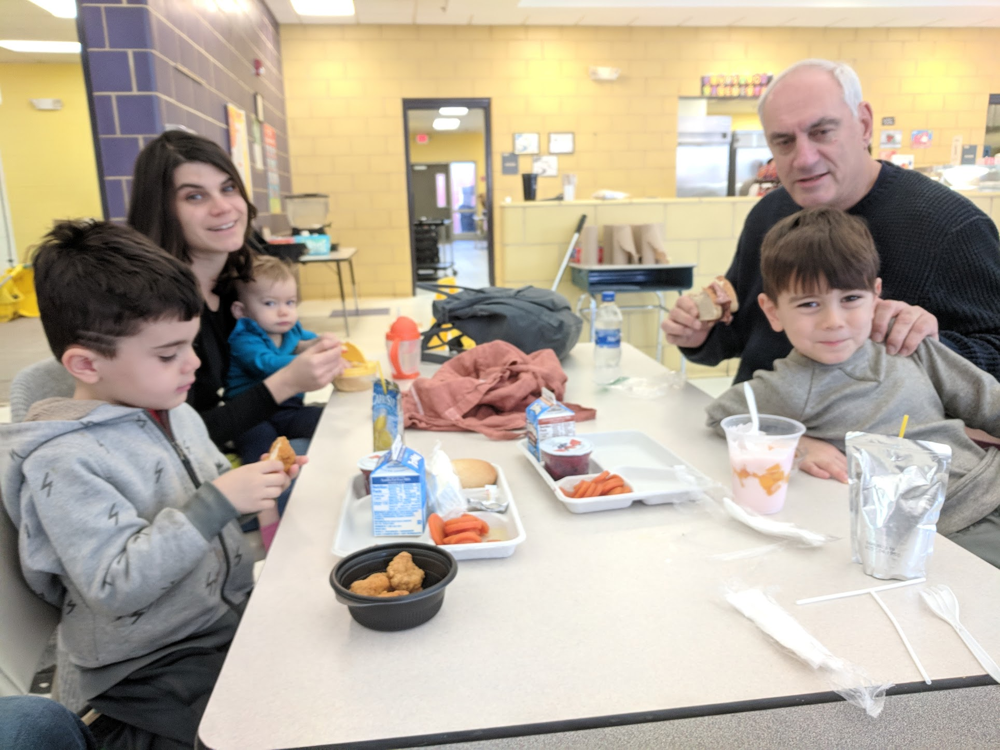
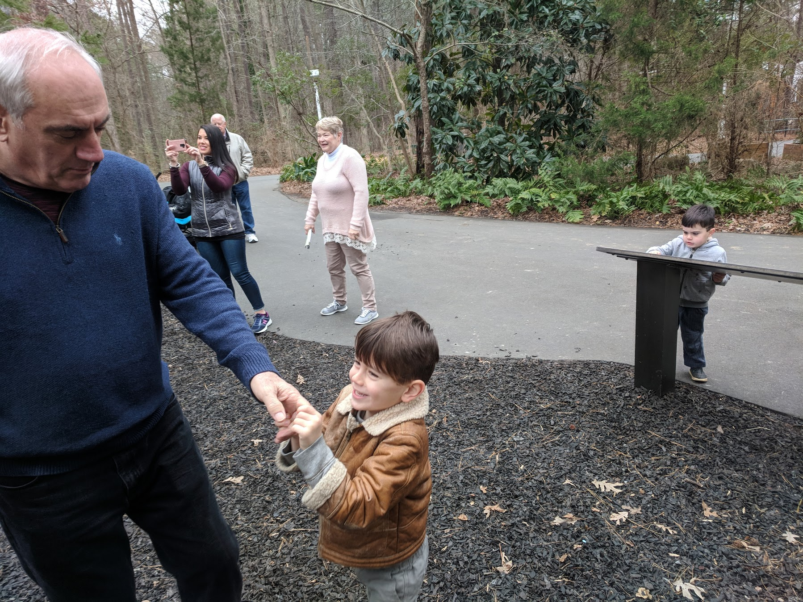
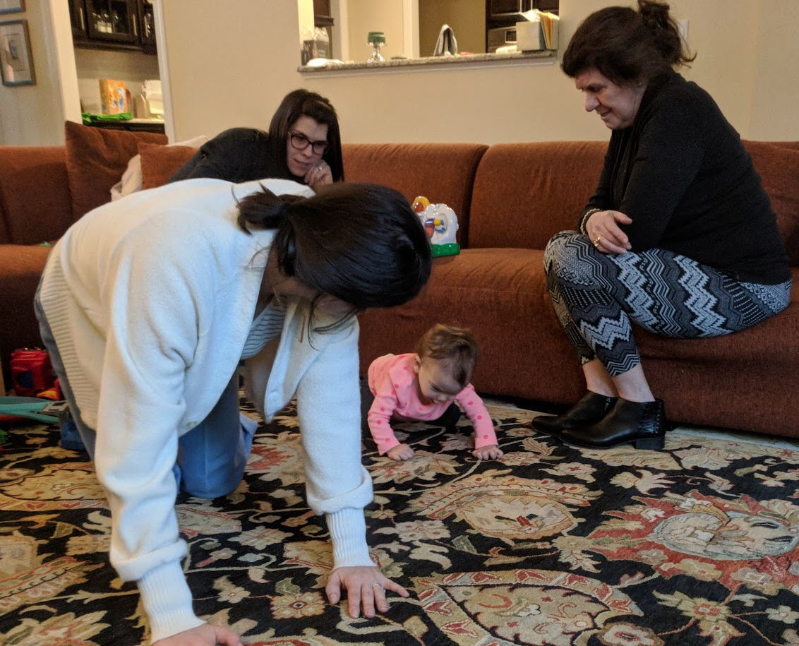
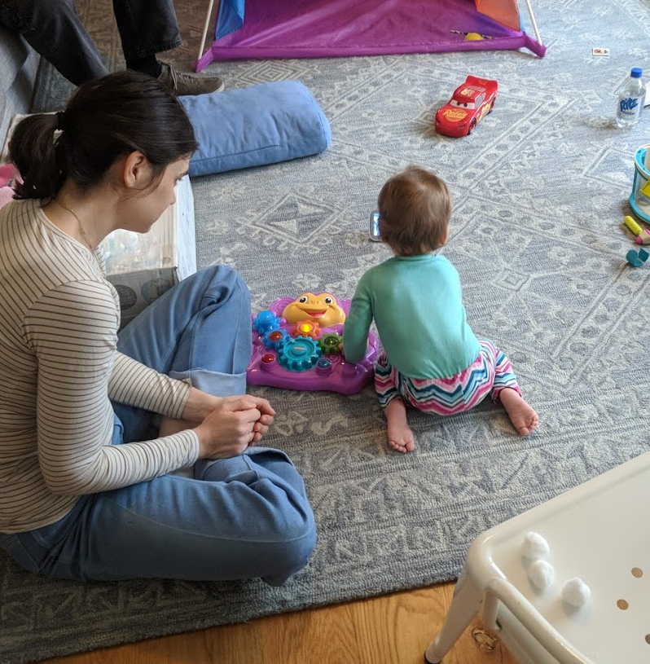

This is **Act Two**, where we received a diagnosis.

For posterity, I've tried to write down and date everything that happened and led to diagnosing and treating Aurelia. This will be a _long_, three or four act post, mostly for me and my family; but I've wondered if it would help others that have or have gone through something similar. Since January 7th, 2019, we've been through a whirlwind of events and emotions that I have found difficult to digest. There were so many little details that I've probably lost memory of, but I've tried my best to reconstruct the timeline and include my thought process through it all.

---

## Dark Hallways - January 7th - January 8th
As I stumbled through the hospital trying to make it back to Natalie and Auri, I had to stop and compose myself multiple times. I kept fearing I was going to faint, and my knees were so weak that I kind of awkwardly fell through the hallways. On the verge of a breakdown, I spotted Natalie's sister in front of me and barely choked out her name. A somber hug and an almost run to the hospital room brought me to them unbearably slowly. Natalie sat on the bed, trying to keep Auri calm. It just didn't look much different than earlier that day, except that they were both exhausted. Auri had to be sedated for her MRI, and she had been poked and prodded and was not making anything easy. As tired as she might have been, both Natale and I knew that she wasn't going to sleep well that night. I had to say goodbye knowing that Natalie had the worst of it and wouldn't get any rest. Unfortunately, I don't remember much about that night. I can't remember how I got home or what I did when I got there. All I'm certain of is that I took a few Tylenol PM because I did so every night for the next month.

After a restless night at home and the emotional difficulty of delivering Max and Lennox to school the next day, I found myself struggling through the halls of the hospital again. When I reached Auri's room, I found that she and Natalie had been taken to prep for a lumbar puncture to draw cerebral spinal fluid (CSF) for testing. Two nurses offered to walk me to them, but I really needed a few more to carry me. I had to stop foor multiple panic attacks before finding Natalie in the procedure room, with Auri on a table about to get a needle in her spine. This was the last of tests before we demanded to leave. They'd have what they needed to try and figure it out. We just wanted to go home. If I had no energy, I can't imagine how Natalie felt after two days in a hospital with an infant.

## Discharge - January 8th
On what I believe was the same day, Auri's neurologist spoke with us before discharge and read us that the MRI indicated "abnormal white matter changes concerning for leukodystrophy of unknown etiology." In what was my first brush with seemingly paradoxical statements about Auri's health, she told us that it was a good catch by the resident radiologist because the abnormalities were subtle and hard to spot. It meant that we caught it early. Something about how that was phrased seemed absurd to me, but I still had at least one foot out the door and a toe dipped in denial. How could I accept what I was being told? I couldn't really process what was happening, and everything I was hearing was terrifying. As Natalie got Auri ready to leave, I spoke with the ER residents and attending about discharge instructions. It was another moment in a month of absurdities. As I sat in a chair in the hallway, they asked me if I understood what was happening and what our next steps were. I calmly explained that I understood that my daughter was dying, and that we were to keep her comfortable and enjoy whatever time with her that we had left. I can remember the pain in their faces and their uncertainty about how to end the conversation. As far as they knew, that was exactly what was happening. At least one looked like she wanted to give me a hug but she must have thought twice about it because they left with that sort of awkward, backward shuffle that people do when they want to get away from a difficult situation. One doctor lingered, but I felt so far from reality. I didn't want her sympathy. I left in a blur to pick up Max from school, relieved that Natalie was on my heels with Auri.

## Maybe It's Nothing - January 9th
"Maybe it's nothing," I kept telling myself. Everyone I spoke with tried to remind me to remain positive and hopeful. "Maybe it's nothing," I lied to myself. The day after we left the hospital, we actually took everyone to Dave and Buster's. I had been taking the boys there somewhat regularly as a treat for good behavior. Natalie and I wanted to do something as a family, and since Auri had never been, we thought it might be the perfect activity.

Given the insanity of the previous few days, we found relief and had a lot of fun. I thought that if we could do stuff like this together, it might not be so bad. "Maybe it's nothing," I thought again. Or, if it _was_ something, maybe it would turn out alright. If I allowed myself to think this was real, I had to acknowledge that either Max or Lennox stood a large chance of having the same thing happen to them. Most leukodystrophies are genetically recessive, and the math worked out to a 44% chance that one of them might have inherited the same thing. I couldn't face that.

## It Definitely Looks like Something - January 10th - January 15th

### An Eye Test - January 10th
We were referred to follow up with a neuro-ophthalmologist to determine if Auri had any damage to her optic nerve that might help with a differential diagnosis. With a clap and a proclamation of "good news" she told us that Auri's optic nerve looked fine. It was _good news_ because damage might have been a sign of "one of the bad ones," she was referring to leukodystrophies. That struck me in such an awkwardly painful way that I stared to tear up. "Is there a good leukodystrophy?" I wondered. "Are you okay, sir?" she asked and actually handed me a lollipop. "Am I okay?" It was such a strange thought to think that there was good news, or that she had just given me some. It was what I came to understand (and later describe) as a relativism that continued and grew stranger with every appointment. However, the lollipop did make me feel better.

In the waiting room, Auri was [eating a banana](https://photos.app.goo.gl/bWVydTzLdPVCQdFc6) and playing with toys. She was sitting up in Natalie's lap. I couldn't make sense of anything.

### Reaching Out - January 11th

The next day, on Friday, January 11th, I sent an e-mail to Dr. K about her [clinical trial](https://clinicaltrials.gov/ct2/show/NCT02254863) introducing umbilical cord blood as an advance and adjunctive therapy to bone marrow transplantation. I had hoped that we could get Auri prepared for whatever might be necessary by finding the right contact. A portion of what I wrote her:

> "If we receive confirmation that Auri is experiencing the onset of a late infantile leukodystrophy, I would like to be in a position to offer her options. I'm sure you know that the rate of progression of these diseases in infants can make HSCT inadvisable, and I'm hopeful that your trial may provide an avenue for treatment."

### Meeting Dr. K - January 15th

To my surprise, Dr K. replied over the weekend and asked to take a look at Auri's case. By the end of Saturday, she had scheduled us to meet in clinic the following week. On Tuesday, the 15th, we drew some blood samples to do HLA typing (to find a donor match). From what I remember as an afterthought, she suggested we order Whole Exome Sequencing (WES). The results of some of the blood and spinal fluid tests had already ruled out some of the more common leukodystrophies, and Dr. K. said something to the effect of "whatever this is, WES will tell us faster than anything else." She and her team were to see about getting it rushed. This meeting and that decision proved to be _critical_ to our story. At the time, I worried that Dr. K wouldn't be able to help us. I asked her what would exclude Auri from bone marrow transplantation as a treatment. She told me that it can take up to six months before it has an effect, and that further regression and increased spasticity would rule it out. My understanding of how fast leukodystrophies progress meant that even if the treatment proved to be an option, Auri might not survive long enough or be in a good enough condition to make it advisable. With tremendous difficulty, I asked her point blank if she thought this was a leukodystrophy. She didn't mince words. In her opinion and experience, it _looked classically so_. Confusingly, the nurses and aides in the room kept remarking to each other how remarkable it was that Auri still had "so much function." They seemed genuinely surprised to see a child with what appeared to be such an early and rapid diagnosis. This gave me some hope, but it also made me begin to wonder.

## What's Actually Going On? - January 16th - January 24th
By this point, we were over a week into this tragedy and the stress had already taken its toll. I don't remember eating anything but a handful of crackers and a lollipop after checking Auri into the hospital. I weighed myself, and I had lost over ten pounds. When I shared this with Natalie, she had lost the same. Between us, we weren't sleeping or eating; and I hadn't shown up for work in over a week. I wish I could say that this was my lowest point in this story, but it continued to get worse. We still tried to maintain composure and do things like meet Max at his elementary school for lunch and go to the park or kid's museum.

On January 20th, Auri was clearly [struggling to crawl](https://photos.app.goo.gl/1b6H3dnPpzMUzDAh6), but the changes still seemed slow. I don't have a picture or video of it, but Natalie remembers January 23rd as the last day she was able to do so.

### Follow-Up with Neurology - January 17th
Ten days after entering the hospital, we had a follow up with our neurologist that gave us more questions than answers. The comprehensive set of CSF and blood tests were inconclusive. Mostly, they ruled things out. It was unclear what to try next. So, if I remember correctly, the doctor said that we were going to go "old school," and tests for things, however unlikely, that might be immediately treatable. This included checking for (among others) vitamin deficiencies, heavy metal poisoning, and thyroid problems. To me, it seemed like Auri might have avoided the really terrible diseases; and I hoped that there was a simpler explanation. I _clearly_ remember examining the concentration of zinc in her diaper rash cream and researching the levels need to induce toxicity. What an outrageously naive thing to think, but we had no idea. 

### More Research and Attempts to Contact Help - January 18th
At the same time, I began contacting others. I had a particular fear of Vanishing White Matter disease, and I tried writing a handful of clinical researchers to get advice. Even though I wasn't getting any responses, I didn't really have any other idea what to do. I was grasping at straws.

> "My investigations have demonstrated that you're at the forefront of research into white matter disorders, in particular the role of astrocyte dysfunction in vanishing white matter disease. I'm writing you in request of information about possible experiments into glial stem cell therapies or any other potential treatments for this disease. I'm under the impression that experiments are only being done on mouse models right now, but I was hoping that you may know better."

In hindsight, I was at least practicing my communication skills. I had written so many e-mails about Auri's condition that I had a template that read like a medical summary. In the weeks to come, I think that practice helped me to demonstrate, when it counted, that I had a reasonable grasp on what I was asking for.

### It Wasn't Adding Up - January 18th - 24th
Something didn't quite add up for me at this point. I had read about leukodystrophies, and so many of them moved terrifyingly quickly. While Auri had lost skills and was struggling, she was still _kind_ of hanging on to things. On January 20th, she was still crawling a little and getting into a kneeling position to play.

For a leukodystrophy, this didn't seem to add up. I began to wonder if there was something else going wrong. It was still possible that something fixable was occurring. Auri was still trying to do so much. We tried to spend time together as a family, and we had some visitors. I kept reading about leukodystrophies and sent a number of questions to our neurologist. In one e-mail on January 22nd, I _kind of_ hit on the idea that the brain damage we were witnessing was secondary to some other process. In a roundabout way, it turned out to be true.

> "Could inflammation markers (sedimentation rate and vWF antigen) indicate inflammation in the MRI as a secondary effect of some metabolic disorder rather than a primarily demyelinating disease? I've been trying my hardest to research and follow along, and I'm curious if you think it could be helpful to consult with any other specialists. I'm under the impression that Auri's case may be unfolding in a unique way."

## The WES Report - January 24th
The preliminary genetic report was made available to our neurologist relatively soon after we sent for it. It had taken less than two weeks from our appointment with Dr. K. I knew when the results were available because I had been in contact with the laboratory, but when I tried to get information from our doctor, she requested that we meet her the following day. Obviously, I couldn't sleep that night. I was _pissed_ then and now that we were made to wait, but I think our doctor needed the time to do research. Aicardi-Goutieres Syndrome (AGS) is rare, and I can't imagine she felt comfortable discussing it with us without having time to figure out what it meant and what our options were. When we finally did meet, it was clear that there really weren't any. But I was handed a few research articles that I devoured on the way home that gave me some hope. There was at least one clinical trial that had been run for a few years, and researchers had speculated in the past about treatments and favorable outcomes:

>[Observations about the natural history of AGS] are important because they suggest that:
> 1. Treatment in the early stages of the disease might result in attenuation of the associated inflammation and consequent tissue damage
> 2. It might be possible to discontinue treatments after the subacute encephalopathic period subsides

> ["Therapies in Aicardi–Goutières syndrome"](https://www.ncbi.nlm.nih.gov/pmc/articles/PMC3898548/) Y J Crow, A Vanderver, S Orcesi, T W Kuijpers, and G I Rice. 2013

Additionally, we were made aware of a clinical research trial in Philadelphia that had just closed. We planned to contact the Children's Hospital there (CHOP) as soon as possible and see if they could provide any recommendations or assistance. We were to meet back with our neurologist in no longer than two weeks to build a plan and discuss what she could dig up.

I was devastated. There's no pretending otherwise. But, I had _something_ to direct my energy towards. I had been given a name of what I knew only as fear. It was a relief in some ways, another paradox.

## Edits
Some things I remember that I didn't add in the first pass.

* Dr. Pizoli said that we were looking at a "formidable foe" when she reviewed the MRI with us.
* I watched all five Jim Gaffigan specials, one each night. I remember being really grateful to find something that helped me relax.
* My dad and mother-in-law came to visit
* One day we went somewhere with the kids to meet their cousins. I put on Lady Gaga in the car thinking it would lift our sprits. Imagine hearing [Joanne](https://www.youtube.com/watch?v=8ll04Zzw5UM). I've never held Natalie's hand so tightly.