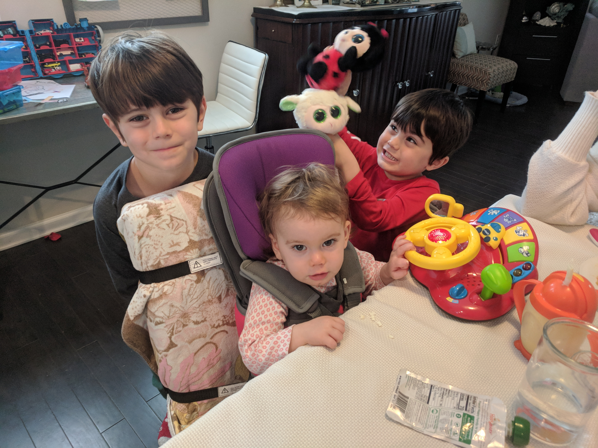
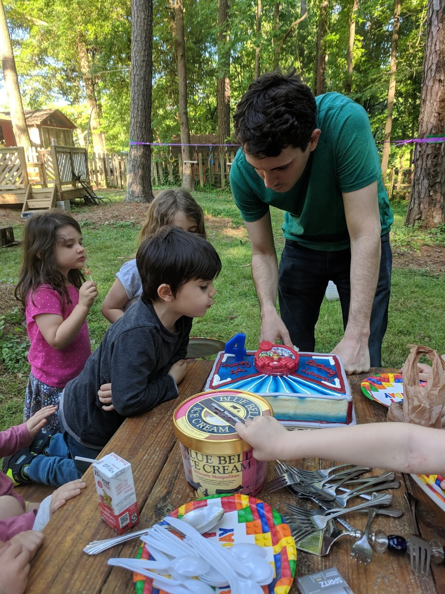
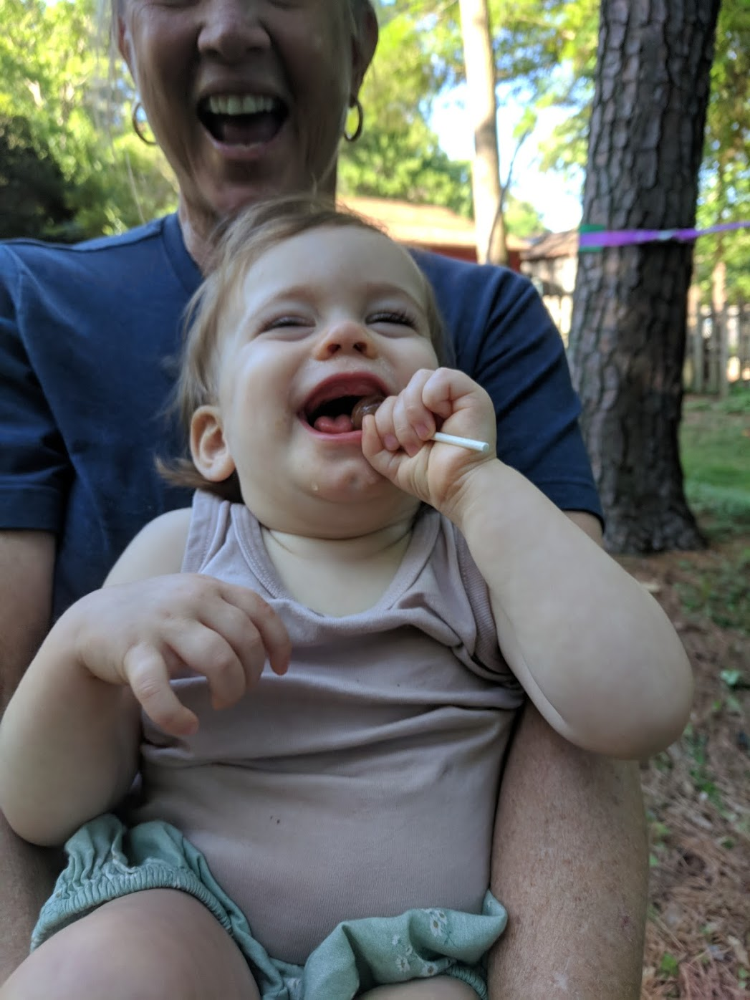
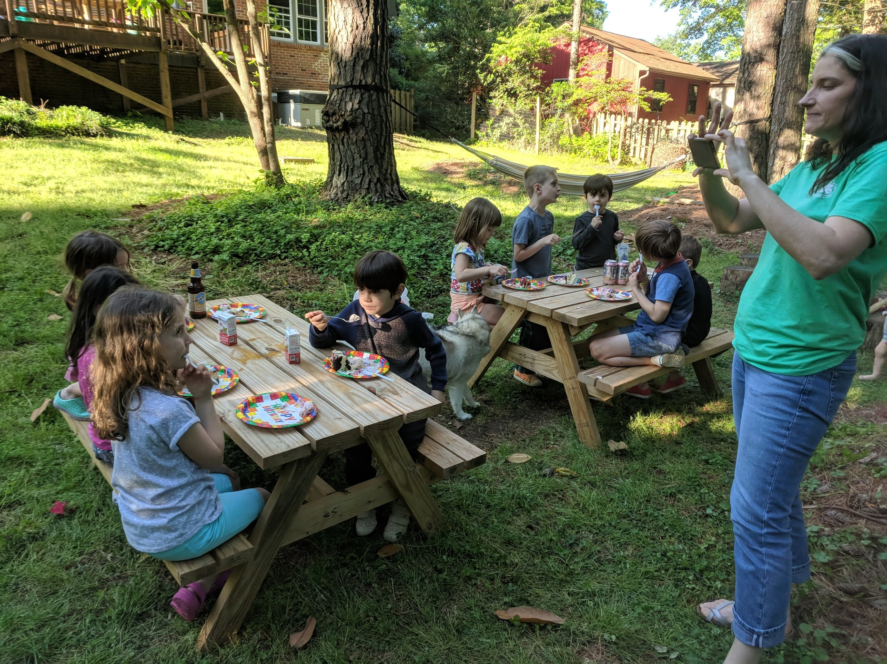

### A Roller Coaster Ending With Improved Lab Tests

It's been a stressful few weeks. On my birthday, April 9th, Auri had some disappointing lab results. Some of her white blood cell counts dropped significantly and her EBV viral count went up an order of magnitude. Her doctor assured us that there wasn't anything necessarily abnormal about what we were seeing. Auri had tested positive (at very low levels) for EBV in February, and she might still be working through it because the values weren't that high. Additionally, her cell counts were potentially related and she expected them to recover. Over the last few weeks, she hasn't been sleeping well and we expect another tooth. The tooth has yet to come but we can see the slit. And, she's been running a fever for the last couple of days, which adds to the stress. Last night was particularly miserable, but she's been happy during the day. When she cut her bottom teeth, we saw something similar. We just have our fingers crossed that we'll see a tooth soon and have a better few weeks.

Piling on, on April 17th, our dog had _major_ surgery to remove a large tumor. He's doing better now, but when I brought him home I panicked thinking I had made the wrong decision. He's been suffering knee trouble again and had a _really_ difficult time getting up for a day or two. Now on his feet again, he seems pretty happy and relatively normal. But, he has a _gruesome_ wound with twenty staples. For a few days I had to empty fluid draining from the cavity left by the removed tumor. I really wish that we didn't have to deal with this too, but I think we're past the worst of it.

Thankfully, this past week we saw Auri's white blood cell counts recover and her EBV count go back to where it was before she started treatment. Additionally, we have another result showing _big_ improvements in Auri's interferon scores. These scores indicate the activity of "interferon stimulated genes," which are used to measure disease activity in AGS, CANDLE, and SAVI (among others) in a research setting. The numbers for AGS patients, I've been told, can range between 50 and 500 during active disease; but I can't find the data to back it up. In what's published, it seems like there's "a trend to higher levels in IFIH1," Auri's genotype. It's clear that her scores when we started treatment were _high_ and indicated active disease. I hope that these reductions continue and that we see more stability to go with it. I think the most recent value puts Auri pretty close to normal and within the baseline they see in stable children with AGS.

| Sample Set | IFN Score |
| -- | -- |
| Healthy | -4.8 Median |
| CANDLE | 738 Median |
| SAVI | 495.6 Median |
| AGS Pre-Treatment | 27.3 Mean |
| AGS Post-Treatment | 8.9 Mean |
| Auri 2/15/19 | 191.9 |
| Auri 2/27/19 | 50.79 |
| Auri 3/13/19 | 52.24 |
| Auri 3/27/19 | 26.52 |

> Commentary: I think the "AGS Pre-Treatment" values seem low because the disease has this "once and done" kind of behavior. The samples would be from children that have already experienced their active and acute disease phase. In contrast, CANDLE and SAVI are chronic diseases that never let up.

### Some Videos of Auri's Movement and Play

At our bi-weekly followup with Auri's doctor this past Tuesday, we were asked some questions that made me realize how difficult it is for the doctor to gauge Auri's progress through pictures or short visits. I believe Dr. K. asked if Auri was capable of taking toys out of a box. Natalie and I were probably surprised that the question would be asked, but Auri does spend most of the office visit sitting in our lap and yelling. So, I asked if it would be helpful to share some videos. I sent her an e-mail (below) with a few videos from the past two weeks. And, I have one additional video to share from this week.

April 25th - In Her New Jumper - https://photos.app.goo.gl/ryssLUsW11rYCLid8

> Hi, I have a lot of these little videos documenting Auri's progress. I should have offered confirmation today; yes, she's been improving, slowly. My anxiety has been about whether she can maintain this treatment, not about whether it has been working. I don't think she'll check any boxes for regained skills soon, but her strength has improved and she's headed in a positive direction. If we could bill insurance for all the hard work Natalie makes her perform, we'd be millionaires. Auri is always moving, always working. Here are a few videos that answer some of your questions today.

> \-\- Patrick

>April 20 - Standing, supporting weight at coffee table

>https://photos.app.goo.gl/h9px6xrJELeGukKUA

>April 20 - Sitting with her hands for support

>https://photos.app.goo.gl/LQ28TnVkJj5HgxWH8

>April 19 - Sitting, taking toys out of a box

>https://photos.app.goo.gl/U9yNkoQd5thS213B9

>April 13 - Taking steps

>https://photos.app.goo.gl/yCBSqu1rcyCDPa9r5

>April 13 - Manipulating toys in her stander

>https://photos.app.goo.gl/g65ii7zakw3HkHBj7

>April 11 - Rolling a little bit before bed with her brothers

>https://photos.app.goo.gl/yWr35icWcj3bBRkaA

### Lennox's Birthday Party

Yesterday we had a small birthday party for Lennox. We invited just a couple of his friends over and played in the backyard.

For some reason, we've established the expectation that we'll have a Piñata. [The kids love to beat the hell out of it](https://photos.app.goo.gl/BwCqyjHeM25Gpbi29), but they can never get it open themselves because we won't give them a metal rod. It felt nice (and normal) to have a little party. We've been terribly stressed this month, and watching everyone have a good time helped dull the edge a little. We can't stop feeling stressed, but I feel like I can start to see normal on the horizon.

🤞