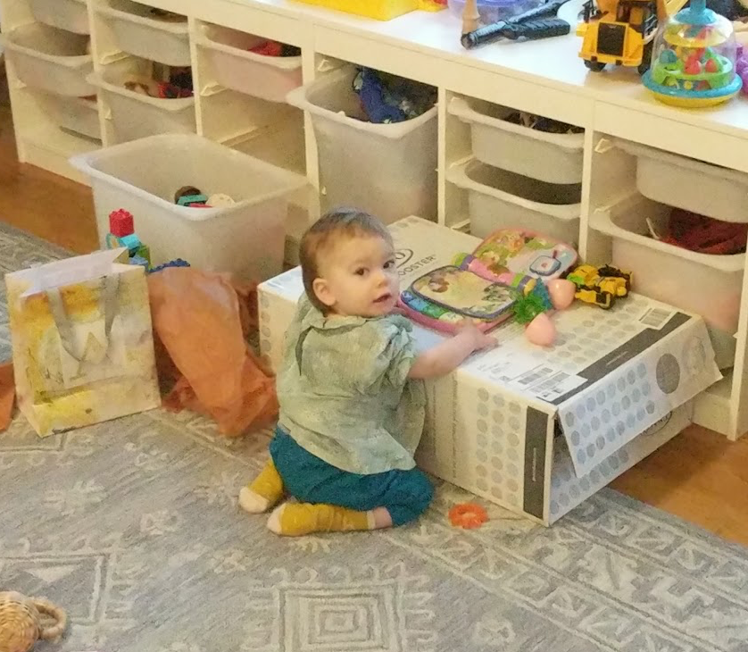
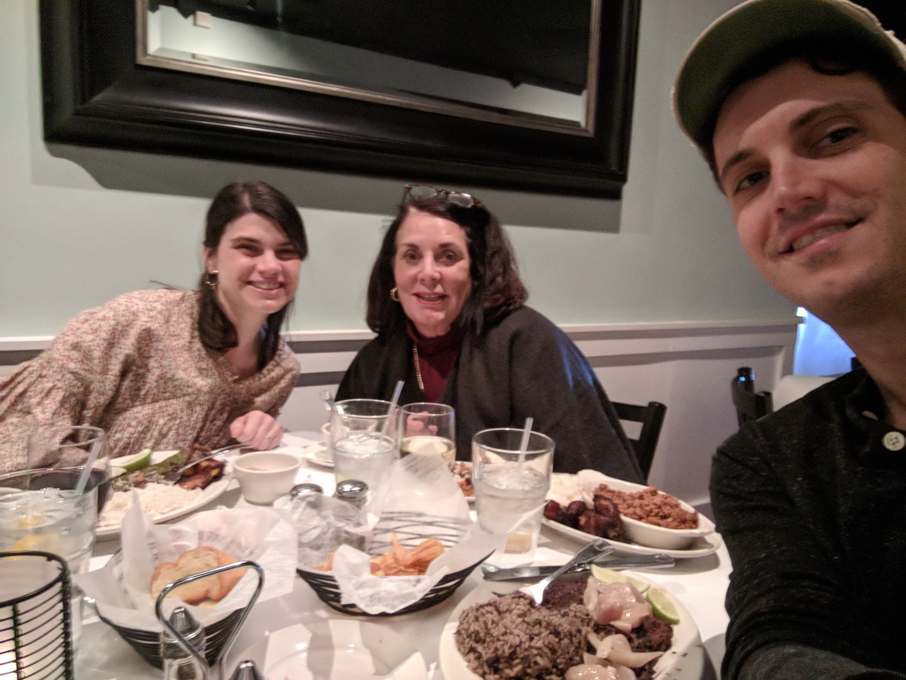
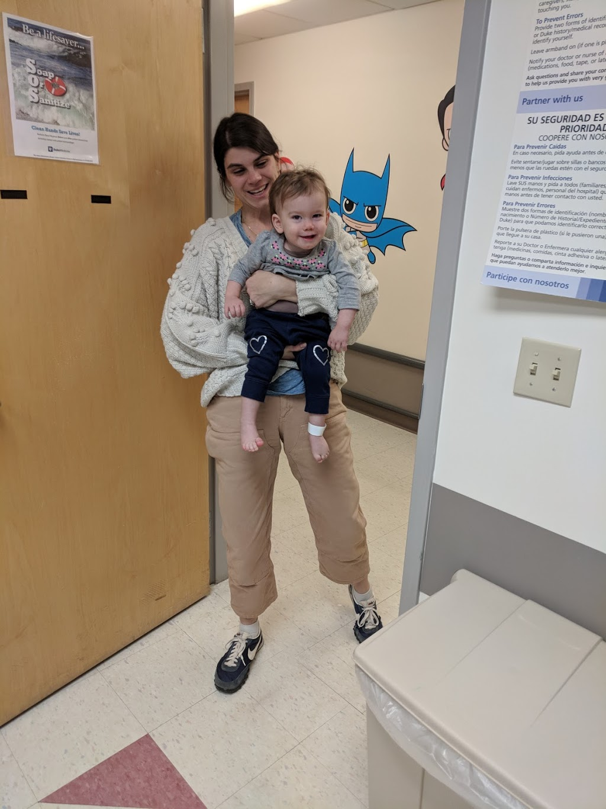

This is **Act Three**, where we managed to secure treatment for Auri.

For posterity, I've tried to write down and date everything that happened and led to diagnosing and treating Aurelia. This will be a _long_, three or four act post, mostly for me and my family; but I've wondered if it would help others that have or have gone through something similar. Since January 7th, 2019, we've been through a whirlwind of events and emotions that I have found difficult to digest. There were so many little details that I've probably lost memory of, but I've tried my best to reconstruct the timeline and include my thought process through it all.

---

## Frantic Research - January 24th - January 25th
I didn't sleep the night that we received Auri's diagnosis, not because I was sad or nervous but because I couldn't stop researching. I began reading everything I could about AGS, and a particular name kept popping up. Yanick Crow seemed to be an author on every important paper. He had penned a comprehensive overview of the disease in _Nature_ and even coined the term "interferonopathies" to describe a category of diseases with a similar pathology. He was leading one of the two clinical trials using reverse transcriptase inhibitors (RTIs - HIV drugs) and had theorized quite a bit over the last ten years about potential therapies. The next morning, I found his e-mail address and wrote him. A portion follows:

> "I'm reaching out in hopes of learning about early indications of efficacy within your RTI trial for AGS patients. We need to develop a plan of therapy (or understand the necessity of a trial) as soon as possible in the hopes of arresting or reducing [Auri's] neurological decline. I understand that these trials likely monitor interferon alpha levels in patients _after_ their acute neurologic episode, but with very little in the literature about other scenarios we're looking to understand and try anything of use."

Fortunately, he replied quickly and provided me with the clinical research he had been involved in with JAK inhibitors.

> "We and others are trying to work out if the drugs that are currently available make a difference at the neurological level (I attach the papers that we have published on JAK inhibition), but I have to admit that it is not completely straightforward to know that (it is one thing to see an effect at, say, the level of the skin, another matter in regards to the brain)."

I had already read a ton the night before and had some context for his conservative reply. At least a handful of papers had discussed the theory behind JAK inhibition, and it seemed like it had been guessed that it could be a promising therapy for AGS. I blew past his warnings, thrilled at least that I had received a response and been on to something. Encouragingly, I also had success contacting CHOP on Friday and began the process of authorizing medical record release and signing up for their research studies. I started to feel some relief that we not only knew what we were dealing with, but there seemed to be experts and options. Surely we'd find something.

## Making Contacts - January 25th - January 29th
On the 25th, after speaking with CHOP's research coordinator, I put together a bunch  of pictures and videos of Auri. I had hoped to demonstrate to them how early we had intervened in Auri's disease, so that they might register the importance of acting quickly. I shared videos of her eating, playing, and standing. It felt like we were getting connected to the team that we needed the most.

On January 27th, our neurologist received word from CHOP that made me simultaneously hopeful and frustrated. It seemed to confirm that JAK inhibition, which had been tried with success by Dr. Crow, had been working in their clinical trial. Unfortunately, their clinical trial was closed. The principal investigator wrote as follows:

> "We expect to re-open our trial of baricitib soon, though we are not enrolling yet. It is a janus kinase inhibitor, and we think blocks the IFN mediated end organ damage. We see moderate success, in particular for these kids with later onset."

In the following days, I scheduled a clinical visit with CHOP for February 21st and set up to have blood samples sent to them for testing the activity of "interferon stimulated genes." The scores computed from these samples would confirm whether Auri had this disease and possibly tell us something about its severity.

## Trying to Figure Out What to Do - January 29th - February 4th
I had some confusion about the state of things, and I spoke with a college friend of mine, an M.D. that works in the University fo Colorado hospital. He assured me that since baricitinib had been approved by the FDA for an indication, it _could_ be prescribed for any other reason. It was just a matter of finding a doctor that would prescribe "off-label." It became clear that CHOP either could not or would not participate. A nurse practitioner described the situation to me over the phone as a Catch-22, and assured me that they would be restarting their clinical trial (_side-note: it's May 2nd as I write and they still haven't opened another trial_). I have more empathy now for the awkwardness of the situation; they're working diligently to collect data in _controlled_ experiments to undeniably demonstrate this therapies safety and efficacy for helping _children_. This is no light matter, and we're taking risks not knowing what the long term effects of this will be. Nonetheless, on February 3rd, I replied to an e-mail from CHOP's research coordinator asking about whether we were able to send blood samples. I was really upset:

> "I received your message, but I'm contemplating next steps. I was hopeful that your organization would be willing to either treat or guide treatment for Aurelia much sooner. February 21st represents an unacceptable delay to me and further loss of my daughter's QOL. Without any guarantees from CHOP, I'm hoping to pursue anti-JAK therapy at Duke. With any luck, we'll be discussing options this week with our team here. Assuming they take the lead, I'm certain they'll want to measure interferon levels. I don't want to submit Auri to any redundant or unnecessary blood draws."

Fortunately, with all of this happening in the background, our neurologist replied to me after what felt like an eternity to assure me that she wanted to treat Auri:

> "I'm in agreement with your sense of timing needing to move quickly. I am going to get pieces in place for JAK meds if we need to do them here."

This looked difficult, though. The drug hasn't been studied well for this use, and barely at all in children. What's more, Auri's situation was unique. My research had confirmed what our neurologist described:

> "In general- the treated people I can find have not been in a clinical situation similar to Auri, so we are in very very uncharted waters here as far as effects of treatment."

As far as I could tell, there hadn't been a single child with AGS that had undergone this treatment at this stage of the disease. It was simply unknown whether it could halt the neurological damage, and everyone I spoke with offered caution about jumping to conclusions. (I later found out that this was not entirely true, but the children that have had interventions with JAK inhibitors could still be counted on one hand.) Still, the rationale in research seemed strong; and it didn't seem surprising that it hadn't been tried like this yet with such a rare disease. Auri had been diagnosed remarkably quickly. I couldn't understand why everyone wasn't jumping at the opportunity to help her.

## All Out of Options - February 5th

### Dejected - Morning February 5th
I had a morning phone call with our neurologist on February 5th that destroyed my hopes for treatment at Duke.  I took this call in a small conference room at my office. I sat at a desk and took notes while we spoke. The team at Duke simply didn't have enough experience, evidence, or research to make this happen. And, CHOP wouldn't assist; they had a responsibility to establish evidence of this therapy working in AGS before participating in treatment of children outside of their study. However, if they thought through their research that it was working and knew that they couldn't re-open their clinical trial in time, I couldn't understand why they would not help. Our doctor didn't have the answers, and she seemed disappointed. 

I didn't know what to say. If there was nothing we could do, we were back where we started, hopeless. I had been grieving for weeks, assuming that I was going to lose my daughter. The diagnosis and my research had let me begin to believe that there was a solution and that we could save her. As it turned out, there was more experience with and evidence for the promise of this therapy than I had known. I felt so low, but I had to finish the remainder of the day at work. In what reflects the seriousness of the situation, our doctor had suggested to me a few weeks prior that I focus on enjoying what time remained with Auri. Until this point I had been unable to slow or calm down. Ending the phone call, I remember assuring her that I would do so now. Paraphrasing, my response to her "we can't save your daughter" was "then it's a good thing I'm spending quality time with her."

### I Might as Well Try - February 5th
It seemed like every door had closed, but their was still one loose thread. Dr. Rafaela Goldbach-Manksy and her group at the NIH had originally established the treatment and monitoring protocol that was being used by CHOP. I didn't know enough about her group's work at the time, but I was aware that my doctor had attempted and failed to make contact with her. I thought that I might as well try to reach out. Maybe I could still make something happen. I called. She didn't answer. I left a voicemail. I recently wrote her a thank you, and I'll just let it tell how I had felt in that moment.

> "... returning my phone call, gave me renewed hope on the very day that I had lost it. I had just navigated an entire month of grief, panic, and fear that included a humbling acknowledgement of a problem in my previously healthy child, a terrifying suggestion of a likely fatal leukodystrophy, panic that my other children might meet the same fate, the paradoxical relief and devastation of a rapid genetic diagnosis of a de-novo mutation for AGS, the hope of promising clinical trials, and finally the somber disillusionment that said treatment would be inaccessible to Auri when she needed it. Throughout most of January, I sat helpless while my daughter turned to sand and began slipping faster and faster through my fingers. As soon as I received Auri’s genetic report, I got to work on research. As a graduate student of computer science, I worked for Richard Bonneau at NYU’s Center for Genomics and Systems Biology. I felt uncommonly prepared to ensure that my daughter had the best options. I read so much. I took notes. I contacted PI’s. Within a few days, I became convinced that JAK blockade represented an astounding and perhaps unprecedented opportunity for Auri. Unfortunately, I quickly found myself helpless again. Our neurologist shared my eagerness to treat Auri promptly but was unable to garner the necessary support, neither in nor outside of Duke. We would have to wait until CHOP began enrolling in a follow-up trial. Auri’s doctor and I had a difficult conversation that ended with something to the effect of “good luck,” knowing full well that Auri faced an overwhelming likelihood of neurological devastation. That same afternoon after work, waiting in line to pick up my son from kindergarten and after having cried the entire drive, I decided to try calling you."

I brought Max home and went through the motions with the kids: dinner, shower, book, bed. I couldn't believe that all of my efforts were going to come up short. I felt like I had worked so hard. At this point, I was in tears most nights in bed; and this evening was particularly rough. Lights off, trying to sleep, my phone buzzed. I received a text message from an unknown number.

> "Thank you for your message. We do not have a protocol for AGS but please send me your e-mail and I will send you our dosing data. The neurologists in North Carolina should be able to prescribe baricitinib as it is approved."

**"HOLY FUCK!"** I shouted. I can't remember what I did after that, but it wasn't sleep. I'm certain I replied, carefully, acknowledging where things stood and what I was trying to accomplish.

### More Regression - February 5th - 8th
While we waited, I kept researching. As much as I was capable, I tried to build an understanding of the disease and it's mechanics. I kept telling Natalie that I could understand what I was reading, but it was really hard to connect papers because I had no background knowledge. I had no recall, and simply couldn't remember details about what I had read the day before. I was trying to pull something together with little to no relevant education. It was incredibly frustrating. While I was doing this, Auri got sick again and this time it seemed much worse. Based on what we understood about her disease, it was possible that she could be less severely affected and stop worsening. What we witnessed this week seemed to make it clear that Auri's decline continued, and she was running out of skills to lose.

The events of the week had me in a panic. Auri had been sick, likely worsening her disease; and she wasn't sleeping. Natalie had spent every night of the week on cushions on the floor of Auri's room. She was waking, crying every hour, if she was even able to fall back asleep. I had joined an AGS family support group on Facebook, and, if I remember correctly, somebody had asked this week about how others help their kids sleep. Parent after parent shared that their kids awoke multiple times at night during the best of times, some because they were unable to shift themselves or roll over. Seeing what could happen and reading about others' outcomes, I was a wreck. Auri was becoming "floppy," an actual medical term describing a lack of muscle tone. We would pick her up and she felt like a sack of potatoes, with absolutely no strength in her back to sit up in our arms and look around.

As a side note, I had called Dr. Fatemi's office at the Kennedy Krieger Institute hoping for other options. I believe, at the time, that he was the chairman of the United Leukodystrophy Foundation. Through a surrogate, he replied that his organization (and most others) refer AGS patients to CHOP due to their experience with anti-JAK therapy. Another door that I knocked on failed to open.

### A Frantic Plea for Help - Evening of February 8th

When Friday evening rolled around, I checked out of the family routine. I decided that I *had* to do something and got started immediately after work. I sat on the couch downstairs, while everyone else ate dinner and did bedtime, and began to make a list of people to contact. I started with every member of the United Leukodystrophy Foundation's medical advisory board, and began including authors from anti-JAK research papers that I thought could be relevant. Dr. G had told me that she was aware that some patients had achieved private insurance approval/coverage of the drug, and that made me think some of the doctors involved might be using this drug outside of clinical trials.

I wrote a lot of e-mails that night, trying to stay professional but understanding that this was really a last ditch effort. I had also been asking parents in the support group whether any of them had any other ideas or people to contact. During the week I had contacted a doctor from a different children's hospital based on their advice, and this evening I received another name that I reached out to.

However, I knew that this drug therapy was complex and required careful and constant monitoring. I would have been willing to do just about anything (I had in fact told Dr. Crow I would fly to the U.K. in a heartbeat if it were an option), but I recognized how important it was to make this happen locally. I wrote a few e-mails pleading for help and demanding a direct rejection.

**To our neurologist:**

> "My sweet, joyful, smart, expressive, and clever little girl is dying. We will love however much of her body and mind remains, but we will have lost our daughter that we take so much pride in. I recognize that Auri's in need of a courageous doctor, I'm asking you to be that person. For my daughter's sake, I can't stop trying; her salvation lies within reach.

**To the chair of pediatrics:**

> "This questionable time frame [for restarting clinical trials] represents severe CNS organ damage for my child and severe physical and intellectual disability. By our account, she's cognitively on par with her peers right now. Without guarantees [...] and a time frame that has changed in the past, I'm not willing to take this risk. Waiting is tantamount to abstaining from treatment.

> Right now, Aurelia has no acceptable options and continues to worsen. We're willing to do whatever possible and pay whatever it costs out of pocket to make this happen at Duke. The risks of not treating her far outweigh the risks inherent to anti-JAK therapy. I'm guaranteed to lose my daughter in mind if not body. Can you help us make something happen?"

**To Dr. K:**

I hadn't spoken to her in a little over two weeks, when she had wished us luck after hearing that some preliminary genetic results were communicated to our doctor over the phone. I knew that her specialty wasn't really relevant to this, but I hoped that she might be able to advocate for us.

> "I was hoping to appeal to your experience for some logistical and advocacy advice. I'm sorry for the lengthy e-mail but I think context is important (it's rather rich now after two weeks). I've poured myself into AGS research and made contact with a few of the right people. I feel like Auri is up against a logistical problem, not a medical one; and I'm wondering if there's any advice or assistance you could provide. An effective therapy exists, but it's complicated, off-label, and we somehow need to motivate and inspire a handful of doctors at the same time to try something new. I really don't know how to present the context or what questions to ask you. Frankly, I'm frustrated because this therapy could arrest Auri's CNS damage, but we have not secured any guarantee of treatment. I believe [our neurologist] is willing and eager but requires support from pediatric rheumatology at Duke. Do you have any ideas or influence that could make an IND or treatment at Duke happen quickly? Is this not the right thing to do; am I asking too much of everyone? Is an IND necessary given that we're willing and able to pay out of pocket?"

> [...] Thanks to WES, we have a rapid and early diagnosis for Auri, but I can't seem to secure her treatment. We're looking at a wait of many months with CHOP which could have profound consequences on her intellect and health. She stands to save so much if we could start now, and she continues to deteriorate. There's more genetic, biomolecular, and clinical AGS research than what I've provided. [...] I have so much more to stay about this, but my research and efforts seem to hit a brick wall and I don't have a ladder. Would you be able to help me build one?

She replied within twenty minutes, "I’m in meetings until tonight.  I will study this and send back a reply later tonight or tomorrow."

## A Fucking Miracle - February 9th

By nine in the morning on Saturday, February 9th, Dr. K had replied; and I'm certain that reading this brought me to tears. It still does.

> Hi Patrick:

> I see no reason why one of these two anti JAK drugs couldn’t be tried.  I also think that Auri is going to need aggressive supportive care.  That will include a gastrostomy tube for feeding, hydration and medications, and possibly other interventions. You and her mom will also need to fully understand the side effects of these drugs so that you are not surprised if some of them occur.

> I cannot make this happen over the weekend, but I can ‘talk’ with the parties involved to figure out if we can make this happen at Duke or if we need to refer her to another institution to get the therapy.  I completely understand that Duke would be preferred and I will do whatever I can to make it happen.  

> I’ll be back in touch on and off over the weekend with updates.

This was just another moment in a serious of traumatic highs and lows that brought me to the edge of insanity over and over again. I've wondered lately how I managed to keep from snapping, having placed so much pressure on myself. From my perspective, I was trying desperately to save my daughter's life from a couch with a computer. Natalie and I went to dinner with my Aunt that was visiting to help us. We managed to smile and make small talk, but only Maureen would remember how much we were really present. I think I was somewhere else.

### Logistics - February 10th - 11th

A few important things happened on Sunday. It was clear that Auri's situation had escalated over the weekend. The chair of pediatrics at Duke replied to me that she was personally reaching out to Dr. G, whom she had worked with in the past. She assured me, "please know we do understand the urgency to get her the right care." I didn't understand the gravity of her involvement and _almost_ kept pushing. Natalie's sister pointed out how significant this development was, and even Dr. G expressed the same sentiment. I kept my mouth shut and simply said thank you. I was in a _panic_ at the dinner table, wondering what was happening and whether this was going to be a breakthrough. I didn't eat. I just paced in the dining room.

In the evening on Sunday, I also heard from another doctor elsewhere about the possibility of doing anti-JAK therapy. This felt like a backup plan, but I started signing authorization forms to send medical records and began a back and forth e-mail chain that kept me up until midnight. By the end of the weekend, we had arranged a clinic visit with Dr. K on Tuesday and were developing a promising lead. Monday was calm. I think I went to work, watched the clock, and hoped we would receive good news on Tuesday.

### Success - February 12th

In short, we got the green light and Dr. K was going to manage treatment. It took a minute for the news to come out, and we went into the appointment not sure of the decisions made over the weekend. Before getting the news, I expressed to Dr. K how grateful I was that she took up the cause and how _small_ I felt in all of this. I had done whatever I felt I could, but continually reckoned with how little control I had over the outcome. I think she might have thought I already knew their decision, because I had to ask for clarification ("does this mean you **are** going to do this?"). When she said yes I put my head in my hands and broke down.

I still have a **_really_** difficult time recalling pivotal moments like these without losing it. My daughter's future seemed to balance on so much outside of my control, but I wouldn't have been able to live with myself if I had failed. At some point in the previous week, Natalie had told me that she was proud of all the research and work I had performed. I appreciated her saying so, but I told her that none of it mattered unless we succeeded. While there were a few moments of uncertainty in the following days, there was nothing that put access to this treatment at risk. We had succeeded.