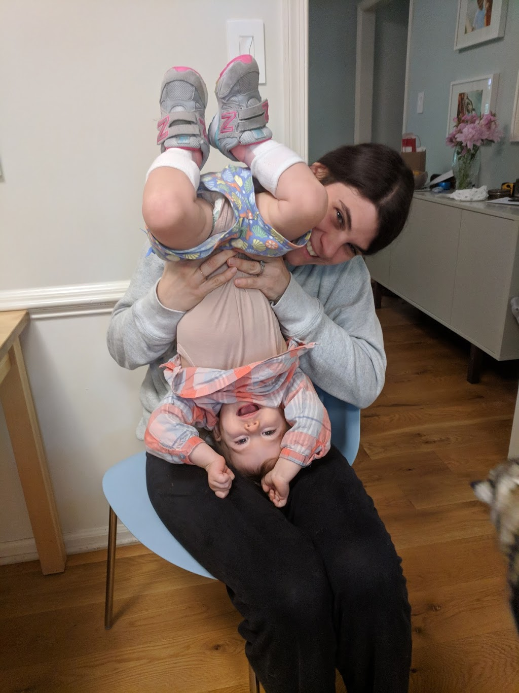
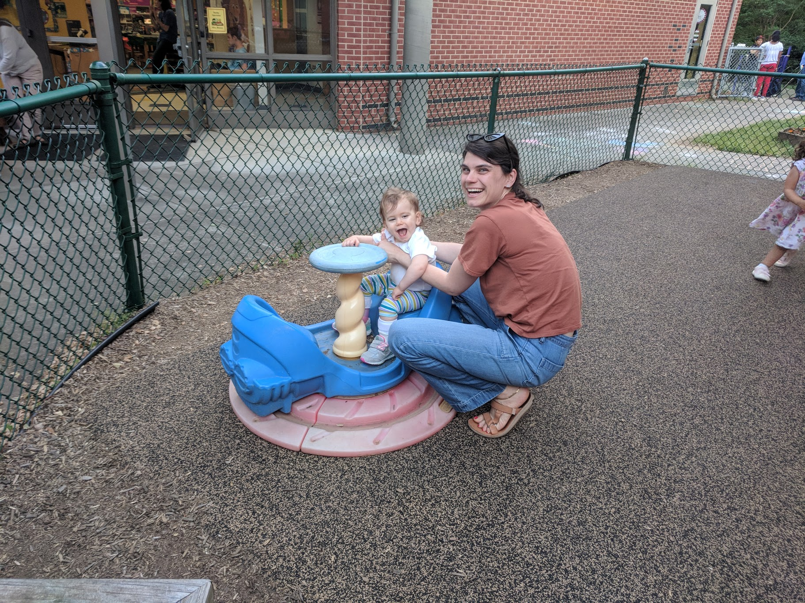
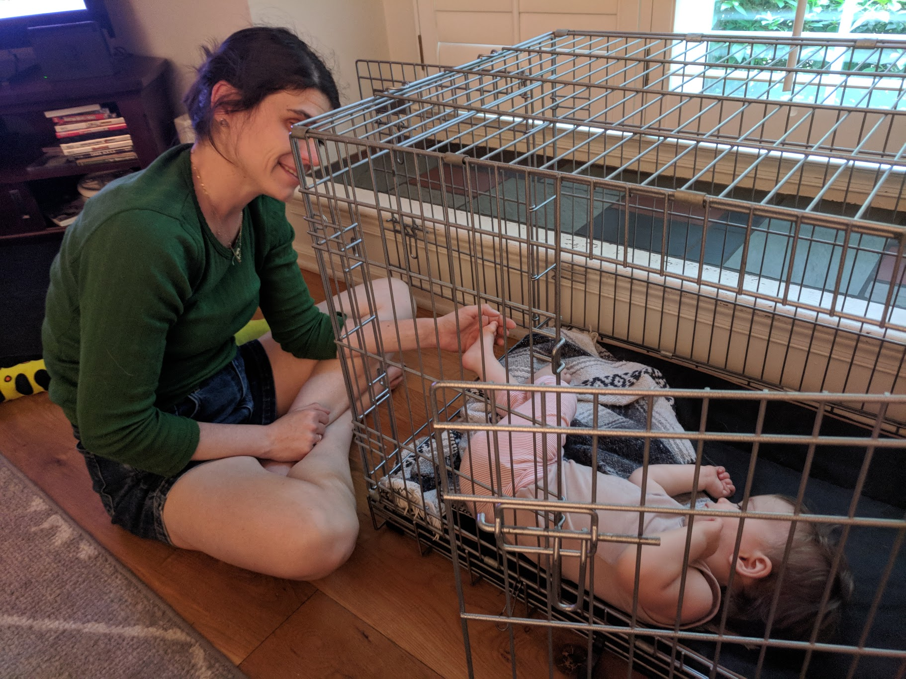
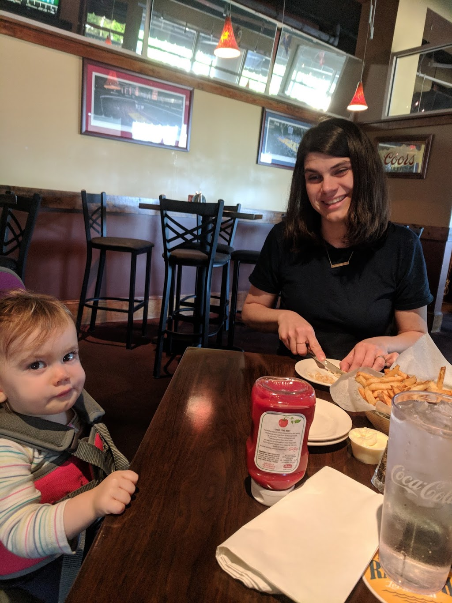
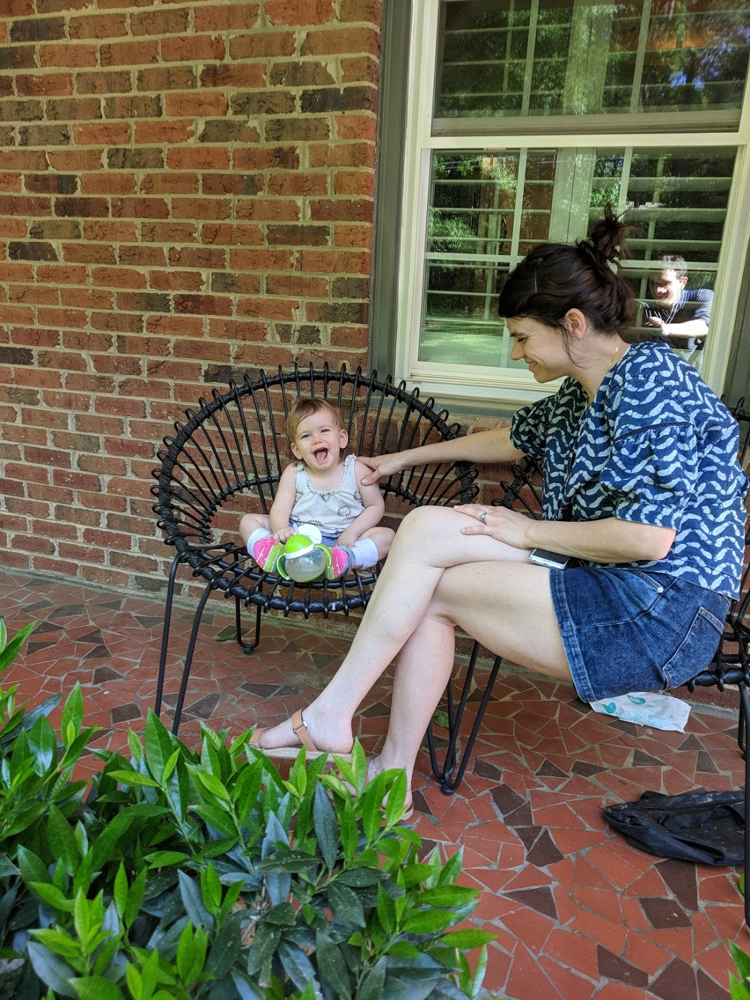
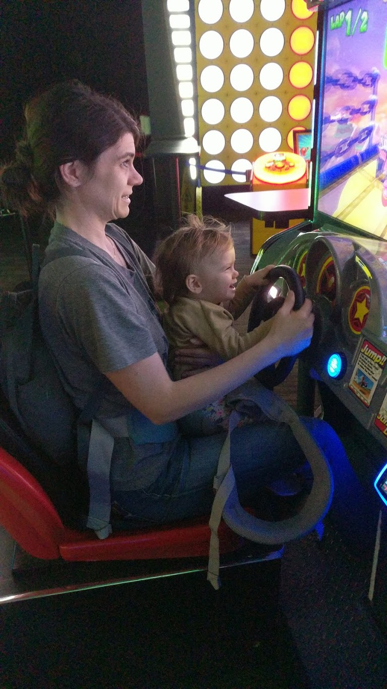
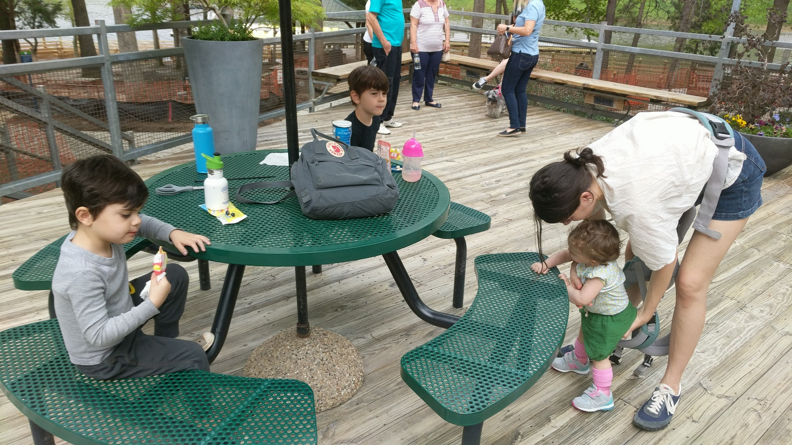
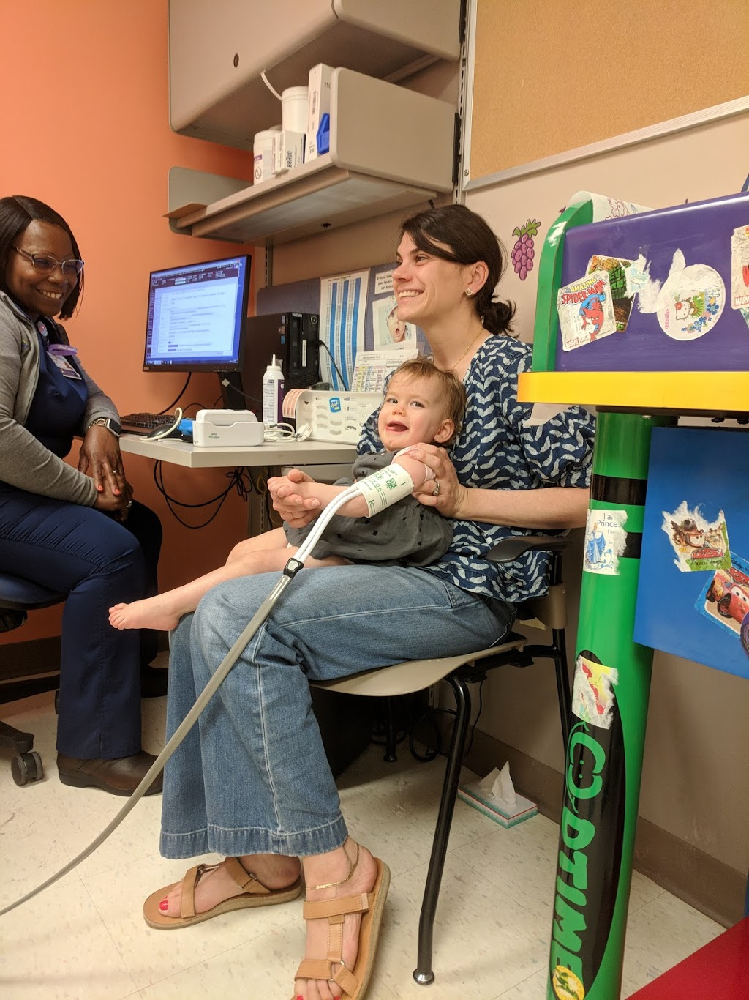

Our lives flipped upside down, but I'm grateful to have such a strong partner. She's become a veritable super mom, carrying my daughter and my children through insanely difficult times. She carries me too, but that's not what today is about. That's not what this post is about. This is about how grateful I am that my daughter has a mother so committed to helping us achieve her best.

When Auri first started her troubles, I fell into a dark and sorrowful place. Natalie kept going. She never gave up hope, and she continues to look forward with an optimism that I know will give Auri every opportunity. Where my back is sore from thirty minutes of playing, Natalie won't stop walking with Auri until the sun goes down. She's up early every morning, making sure my daughter gets as much out of the day as possible. Natalie has grown in the past few months and blossomed into somebody really special.

I could have never have guessed where we would be, but thank goodness for such a wonderful mother.

