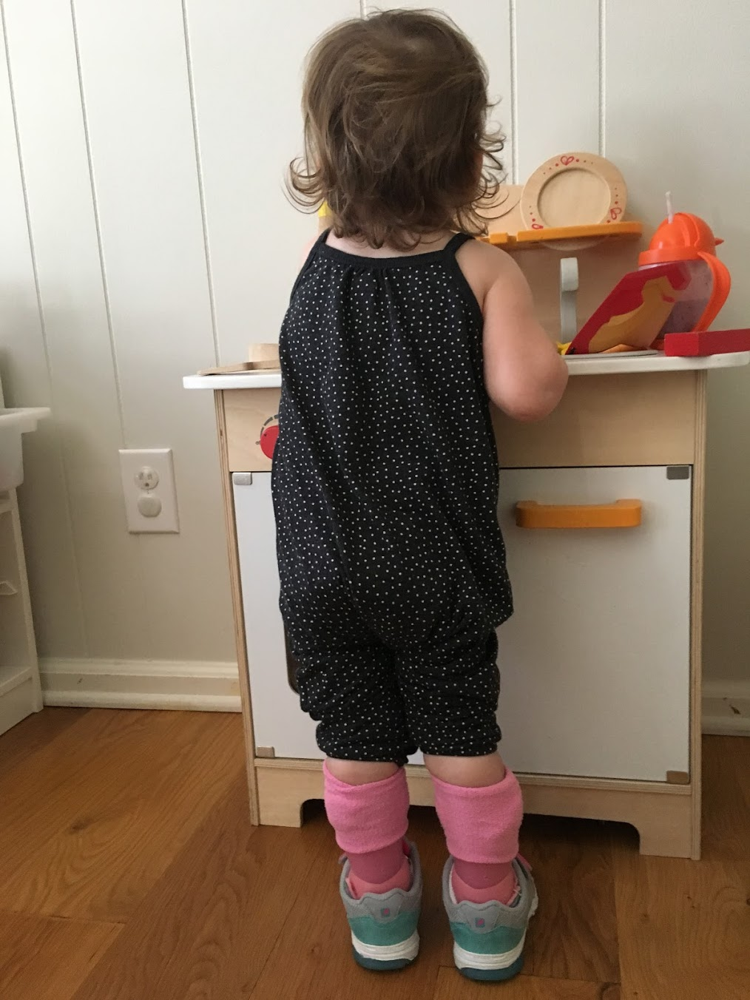
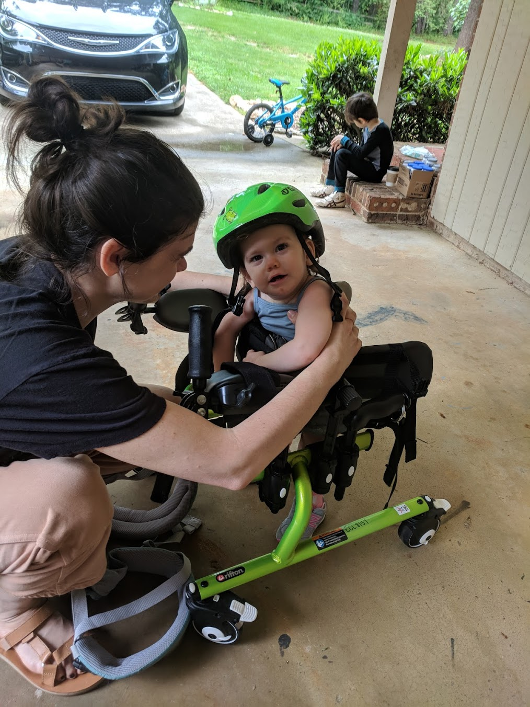
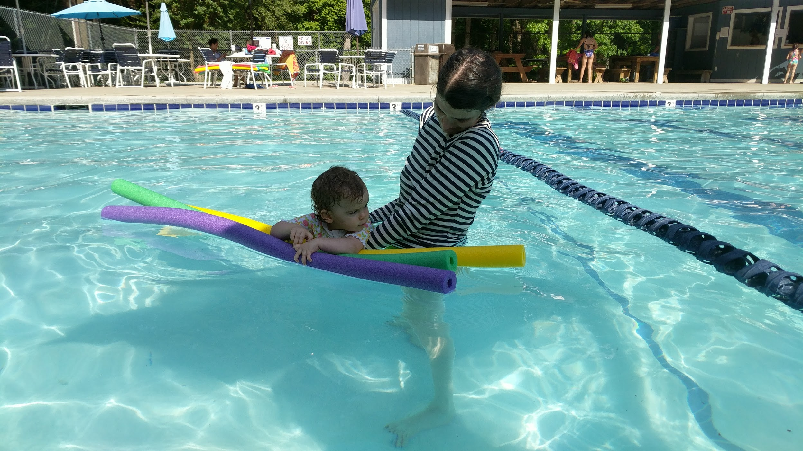
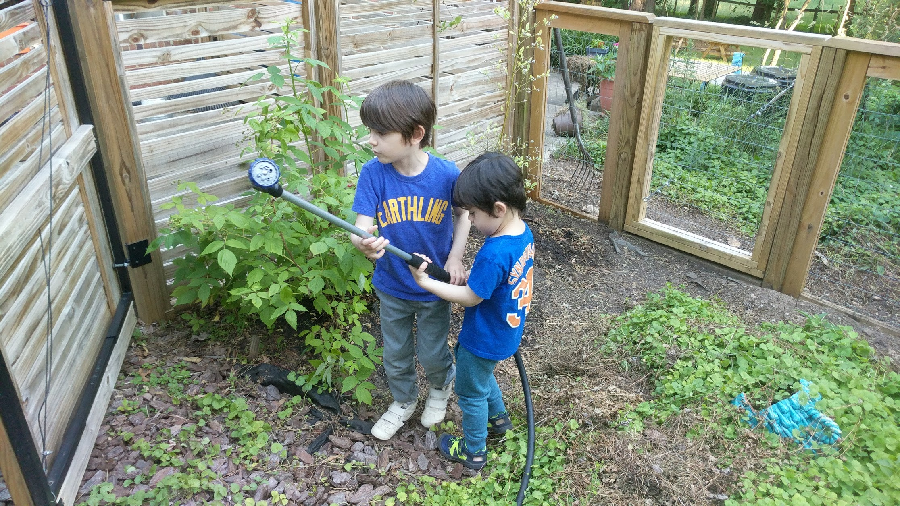
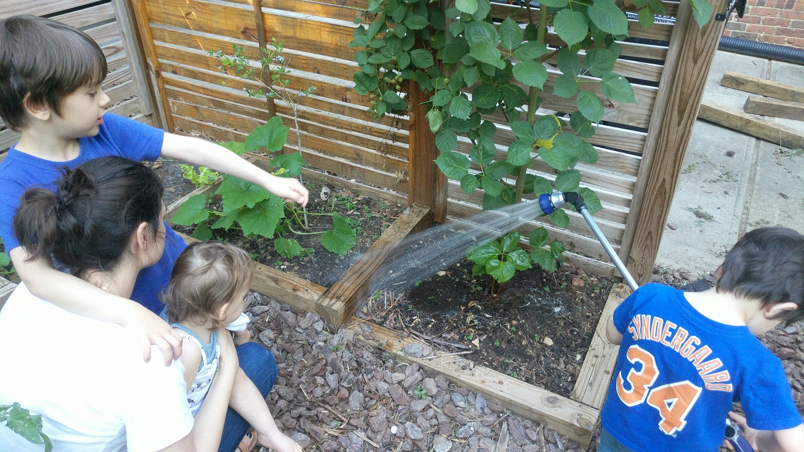
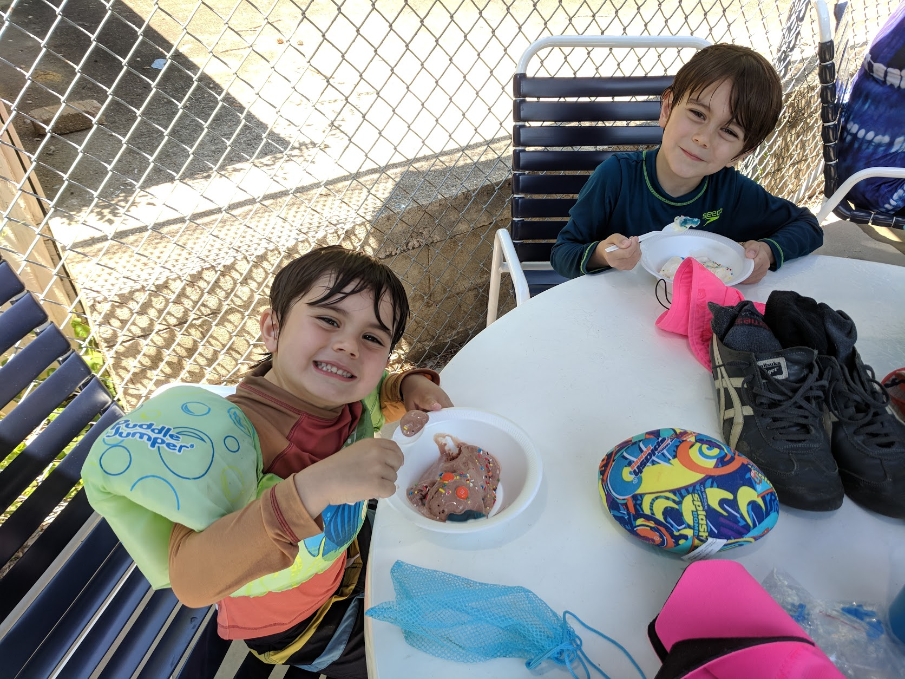
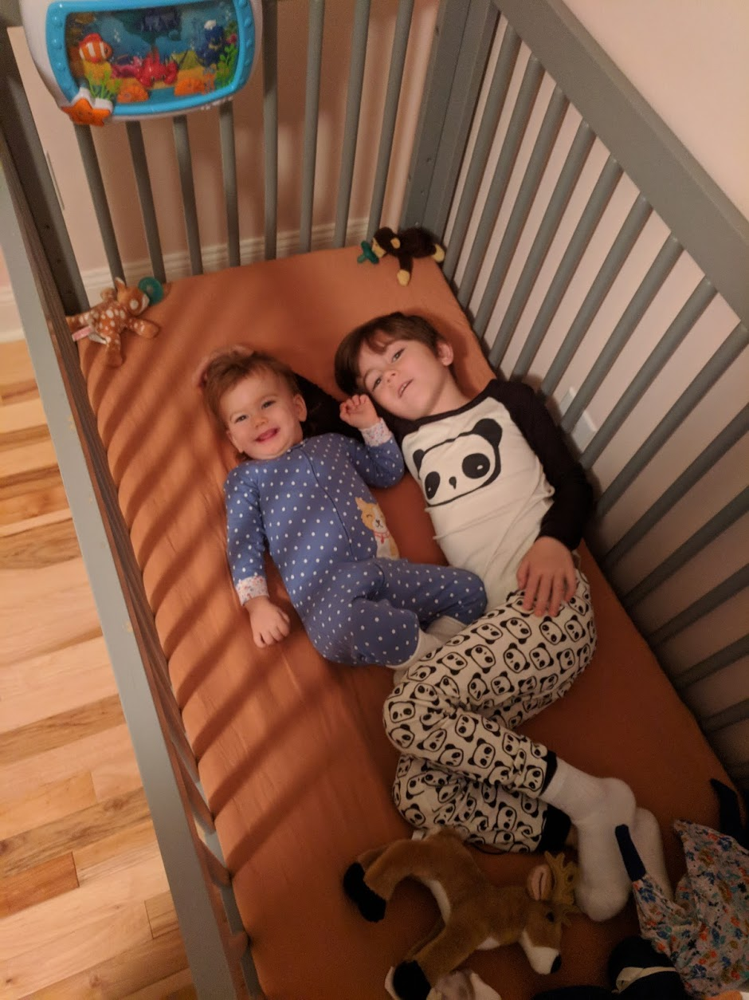
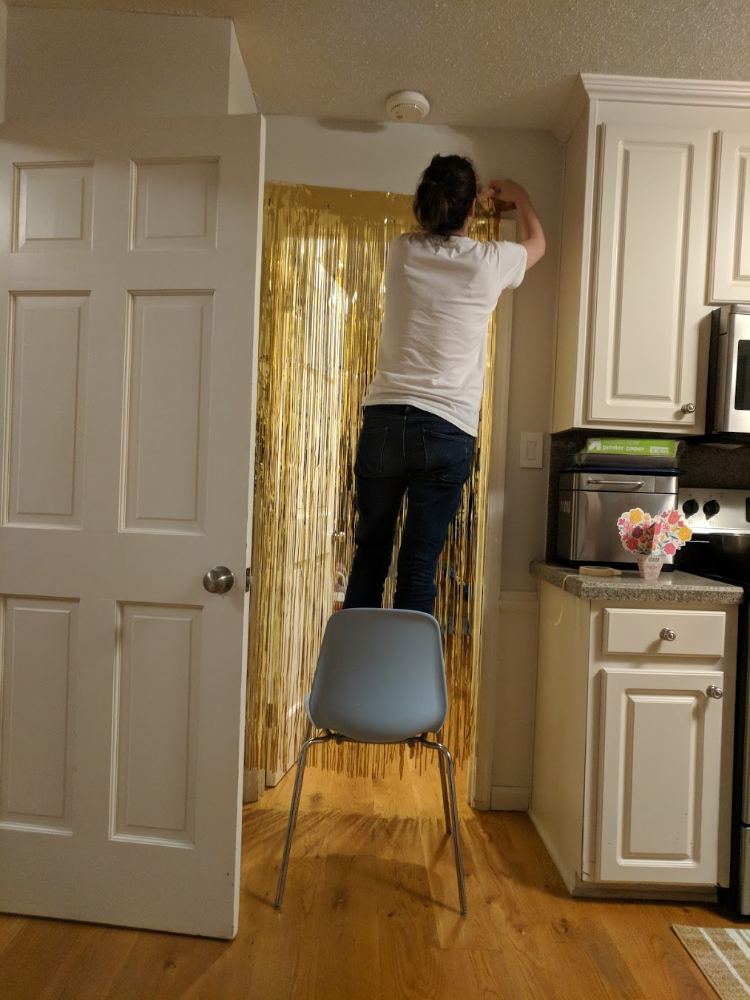

# Slow and Steady, Auri

## Slowing Down

Heading in to Mother's Day, I think Natalie and I had been feeling a little defeated. For whatever reason, Auri seems to be feeling the same way. She's been adjusting (or perhaps adapting) to her circumstances, but this means she's been less enthusiastic about the hard work needed to regain the skills she's lost. Watching her cousin Tom crawl around the room like Speedy Gonzalez, she was [struggling to army crawl](https://photos.app.goo.gl/T1YRhQUUoD2Xv2YAA); but she was at least trying. It hurts to see her like this, but not nearly as much as it hurts to see her give up. Both Natalie and I scrutinize everything Auri does, so this decreasing enthusiasm has caused a great deal of anxiety and panic in us. We've developed (and fought) doubts about Auri's trajectory, and we've been worried about backsliding. I can't emphasize enough how deeply this anxiety has embedded itself into our lives. The only cure for this is time. I keep saying it and hoping that we get through this year quickly, but I'm trying a lot harder to make sure I don't have my eyes closed. We began Auri's treatment looking up, possibly naive about the long, difficult road ahead. I believe that we're finally coming to terms with the kind of parents and family that we need to be.

## Keeping Steady

Objectively, though, I think Auri is still improving, just slowly. Auri's therapists have observed and shared some subtle but important things like Auri lifting a leg while standing and shifting her weight, having more strength in her arms for maintaining balance, and using new consonants and expressions to communicate. We hoped for more, but I maintain the belief that we'll feel much better a year from now. This will not speed up in a day or a month. To be honest, it might not ever. But, we're moving forward. I'll never forget the fear of watching it move backward. This is _much_ better.

I took the opportunity to take Auri to physical therapy yesterday, and I was amazed at how hard she was working. I've never pushed her so much at home. She needs a lot of support, of course, but she's [climbing up slides](https://photos.app.goo.gl/8dUh4JHg3tmqSEwz8) and "recovering" from different positions, building core strength.

### Regaining Skills Will Take Time

I shared this picture on the Facebook recently. It had a *really* profound effect on me emotionally. Auri can't *actually* do this, but Natalie captured something that she might be able to do with confidence in the future. She's working hard, it's just going to take a lot of time. I grabbed [a video of her practicing in her walker](https://photos.app.goo.gl/itMC9qTjfSxtUX1h8), and you can see how hard this is going to be. It will take time.

### All is Not Lost

[Playing with the computer at the doctor's office](https://photos.app.goo.gl/wkQ1Dcciko56ysqQA), I think you can see that Auri has a reasonable future. It might not be the one any of us had wished for her, but Auri's going to be alright. She can sit at a table, mess around with stuff, push buttons when she focuses. As she gets older, I'd expect her to have more patience and concentration. It should help a lot. At a year and a half of age, she's just throwing herself at whatever she wants to do. Eventually she'll plan and practice, and she's going to do everything more effectively. This is a far cry from what I had been worried about. When this all happened and *I* hit rock bottom, I kept begging and pleading that I'd at least be able to have a conversation with her in a few years. Now I think I'll be able to. Our daughter has lost a lot, but not everything. She may very well tell me in a few years that I was overreacting. We may [swing](https://photos.app.goo.gl/k2g9Lkowk8bdQrUg8) through highs and lows, but I'm grateful for where we are and what we have.

### Swimming!

We've recently looked into aquatic physical therapy, thinking that it would be really beneficial for Auri. Thankfully, our neighborhood pool opened this weekend and showed us just how great it will be. On Saturday, Auri had a fantastic time [swimming](https://photos.app.goo.gl/ggyTYnXvekduKnny9), splashing, and thrashing about. We've spent a couple of weeks starting to feel disappointed and worried that she's hasn't been trying as hard, but then I saw and felt her moving in the water.

# Onward, Max!
Today we celebrate Max's sixth birthday, and I've never been prouder of him. He's really the most thoughtful and kind hearted person. And, he's too smart. Walking the neighborhood this week, Lennox started talking about how it was night time because the sun was "going down." Max let him know that the sun never actually _moves_. It stays put while the Earth rotates. I've been saying stuff like this to him for years, and he keeps showing me that he not only listens but understands. He's a great kid. Here he is helping Lennox water the berries.

And, he walked Lennox up to get Ice Cream at the pool without me. 

He's developing more confidence and playing a big role as helper in our family.

I also want to give Natalie credit for always making these events special for the kids. Every birthday and holiday, she's up late hanging decorations and laying out little surprises. Everything would be so dry without her.

