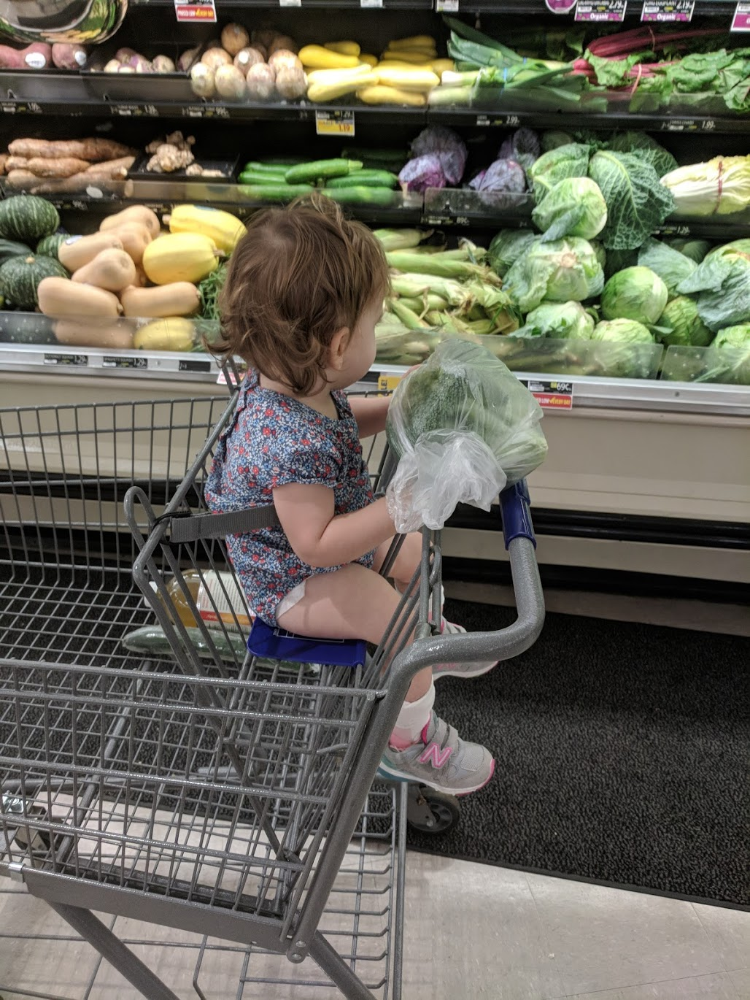

The 15th of June marked four months of Aurelia's treatment with Baricitinib. When her treatment started, we were given the expectation that it might take this long to know whether Auri would tolerate this drug and respond to it favorably. Since she began, we've been to Duke every two weeks and subjected her to regular blood draws and lab work. Well, it _has_ gone well enough and we're celebrating this milestone and spacing out her followups moving forward. My understanding of her condition and my expectations and hopes for the future have become more grounded. Without a doubt, we and Auri remain remarkably fortunate that she's either in the minority of AGS victims with some semblance of normalcy or that this drug and her treatment have saved her life. Although I have my suspicions, we don't know which it is. It also doesn't seem to matter very much right now. Auri and the ensemble of professionals that work with her day in and day out communicate their optimism that the small steps she's taking and subtle improvements we're observing are laying the foundation for her continued recovery.

## Weathering Storms

In December, Auri failed to bounce back from a febrile illness. We believe this precipitated her decline, and research into her disease seems to support this as a plausible trigger. Through January and February, it seemed like we couldn't shake our constantly recurring colds, each coinciding with some loss of skill or increased difficulty of Auri's. For that reason, we've been anxious every time one of our kids gets sick. We don't know whether another illness could cause a disease flare. Thankfully, we haven't observed one. In the past four months, Auri has had a few colds, some severe, some less so. This past month, we had three consecutive weekends where one of our kids was sick with a significant fever. Max, in fact, peaked at 104° F in the middle of the night. We weren't able to keep Auri from getting sick, but she was spared what Max and Lennox experienced (sleeping in the bathroom, chills, etc). However, she developed an eye infection for the second time, this episode of conjunctivitis less serious than the first in March.

The positive in this is that Auri _has_ gotten sick, no more or less severely than in the past. And, She's done _fine_. We don't know if that will always be the case, but it's a promising sign that either the drug is working or that she's in some kind of remission. I'm speculating here, but I think the illness that really triggered her disease was "mono" (EBV or mononucleosis). Most people contract the virus by adulthood, but she tested positive in February at a year of age. It's a nasty virus that makes your immune system go a bit nuts and then stays latent in your cells for the remainder of your life. You fight it for a few months after the initial infection, which might roughly align with Auri's period of decline and stabilization. I hope that she never experiences a relapse, but maybe this is a sign that it would take something more than the common cold to cause her issues.

## Developments

At some point in February when I was frantically trying to find a doctor that would treat Auri, I had spoken to some parents of affected children. One asked me, referring to Auri, something like, "what skills does she still have?" That hit me kind of sideways. I wasn't in denial exactly, but my daughter went from being 100% normal to significantly disabled in the course of just a few weeks and she was getting worse. Everything happened so quickly that I'm not confident that I can objectively say how bad things really were. And, Natalie and I remember things a little differently. My recollection isn't perfect, but I did keep a journal that tells me that things are what I would describe as _qualitatively_ different now compared to February. 

So to calibrate, on February 12th I wrote the following (and keep in mind I was desperately looking for and granting her positives):

> **2/15 Positives:** Understood new word balloon. Bringing spoon to mouth to feed herself. Signaling with head nods and pointing. Socially engaged. Loud cry, voice, and cough.

> **2/15 Negatives:** Difficulty with and refusing water. Less trunk strength, not sitting up when carried. Less head strength, leaning when eating. Trouble getting arm out from under when rolling over. Exaggerated startle.

Today, you can watch her [walking in the Hallway](https://photos.app.goo.gl/gfnQrzE8iC5moMPD7), [playing in the grocery cart](https://photos.app.goo.gl/NLPoxrj1Xd6pXCLY9), and [swinging at the playground](https://photos.app.goo.gl/uFspcjRdAFTHAwCw6). You can see for yourself that she has challenges, but many children with her disease would find these activities impossible without tremendous support. 

I'm not sure what, but it says something that I celebrated Auri pointing clearly with her index finger by taking a picture. Auri's hands are still pretty tight and she has difficulty rotating them and isolating movements in her fingers. But I'll be damned if I didn't think this was a good sign.

She also seems to be developing more consistent strength in her back. I won't pretend that [Auri sitting in a highchair](https://photos.app.goo.gl/AjVPBh7LunqvsFdG6) looks great, but what you wouldn't notice without me pointing it out is that she's _not in a five point harness_. I've wondered whether Natalie and I are just becoming more comfortable with her circumstances and allowing more stuff like this, but the professionals have noted some gradual improvement too.

With liquids, we've begun a step protocol to gradually reduce the amount of thickener we used to make it safe for Auri to drink. We have the numbers on our chalkboard and increase the amount of water in her cup by 5% every week.

So far, this has gone without incident; and we've simultaneously increased the overall amount of water that she's drinking. She has a slow flow straw cup, and it takes her more time to drink. If we're patient and encouraging, she'll keep going and get a lot more than we've given her the opportunity to in the past.

With communication, I've wondered if we're seeing things slow down. It's obvious that Auri's understanding us as well as we would expect, but she hasn't been using a whole lot of new sounds or words. Rather, she's been picking up a few hand signs and gestures. This past month she added "please", "help", "eat", "all done", and "water" in her modified, imperfect sign language. Like most kids, she defaults to yelling at us to get what she wants; but it's clear that she understands the gesture and the purpose for using it. With her speech therapist, Natalie's singing a lot of songs with gestures (like the itsy bitsy spider) and Auri's picking up some of the movements. Auri's therapist encouragingly reassures us that any kind of expression is promising and that she sees Auri continuing to develop. I know that some children with Auri's disease can't speak even though they have less severe disabilities. In these cases it's not an intellectual problem but something to do with injury in the parts of the brain that either control the fine movements of speech or the planning that translates the idea into the movement. I have very little idea of what to expect, but she's learning new things and I still hear her babbling in her crib and car seat sometimes. I bet that Natalie will correct me when she reads this, but that she will _have_ to says something. This is one of those categories that I find hard to anticipate, but everyone that works with Auri remarks about how _opinionated_ she is and that she communicates what she does and doesn't want pretty effectively. 

Whether Auri will speak clearly or not, I'm confident that she's going to be intellectually normal and communicating one way or another. _edit: Natalie asked me to emphasize how important and promising it is that Auri is signing to communicate. I agree._

Fatigue is still a bit of a problem, but I don't know what to say about it. Auri's being pushed to do a lot of physical and mental activities that she finds difficult. Everything is hard work for her now, and she has mornings or afternoons where she just looks worn out. I'm pretty certain that this is normal for anybody with a significant brain injury, but it causes me a lot of anxiety. I'm at a distance with work, and I can't always see the day or week as a whole. I come home to see Auri tired and weak some days, unaware that she walked all over the damn playground that day. Fortunately, Natalie has a much more positive and optimistic perspective. I trust that she's able to see the big picture, and she tells me that the big picture looks good.

### Growth

Before this chaos _really_ began, we had taken Auri to her pediatrician at the start of the year with our concerns. At that appointment we learned that Auri hadn't gained any weight over the preceding month. That's a bad sign for any child, and for Auri it was a signal that something was terribly wrong. There's a big dip in Auri's weight chart at 15 months, right when shit really hit the fan. This was *just* before starting treatment, when she was choking on food and water and suffered the worst of her regressions. She was persistently sick and got very thin. She went as low as the 13th percentile. Four months later, she's eating and drinking better and holding the 30th percentile. Within the first few weeks of treatment she became remarkably enthusiastic about eating and quickly regained a lot of weight.

This length chart tells a story that only Natalie and I would immediately recognize. You can see how inconsistent the measurements are, and it's a result of how spastic Auri's legs became. It's difficult to measure her length carefully because she has trouble relaxing her feet and legs when she's stressed. You can imagine that she doesn't like laying on a table with people trying to push her. I don't know what this chart will look like in the future, but it's very likely that Auri has suffered some growth delays. I imagine that recovery here would take a bit more time, but I don't think we've observed anything serious.

### Teeth

I'm still genuinely worried about Auri's dental development. She didn't have any teeth until _just_ after starting her drug therapy when she got her bottom and top incisors. Before we knew that she had this disease, we had calmed ourselves by learning that some children just _do_ get them this late. However, abnormal bone and teeth development has been associated with Auri's disease. Some children with AGS get their teeth late, out of order, and have major issues with them. When they do, it's usually a sign of other disease characteristics that we havent' observed in Auri like osteoporosis or hardening of the heart. When her front teeth came in first, I breathed a sigh of relief; but since, her upper first molars have jumped the queue a bit and have begun to come in before her canines. For now, her teeth appear normal. They may be coming in _slightly_ out of the expected order, but it isn't what I was worried to see (back molars months before front teeth). I worry a lot, but in the last four months her teeth have started to erupt. It's a good sign, even though teething has added a lot of stress.

## The Next Milestones
We don't know what milestone will come next, but there are a few things that we're working toward. Auri has gotten a little stronger at sitting and she's begun to adapt by supporting herself with her arms. She's going to need strength and coordination in her arms, shoulders, and back to make this happen.

This past week, we've been encouraging Auri to [take steps using her arms for support](https://photos.app.goo.gl/Ly89goQNamnNhNUd7) in an effort to make her [walk as she will need to with a gait trainer](https://photos.app.goo.gl/y4WuXXpbNW8MJqfX7). If she can ever walk independently it will take a lot more time, but we'll celebrate even the smallest and fewest steps with a walker.

And, we're going to keep marching with our fingers crossed toward regular water. The clinical research, provided by Auri's feeding therapist, showed promising results. The majority of children that they did this with managed to wean off thickeners entirely, and all the children that didn't still achieved a significant reduction in the amount of thickener they required. Auri has been doing well and drinking more, and we're going to celebrate every successful step.

# Other Family Stuff

With Lennox starting school full time at the end of the summer and Max having finished kindergarten, we decided to keep them both home. I think that they're going to do a short summer camp session, but they'll mostly be home with Natalie and Auri for the summer. While I've been able to take advantage of my profession's flexibility, I can't be there for the daily therapy appointments, the scrambling lunches, hectic nap times, and all of the chaos that a normal family with three small children experiences. For those reasons, we looked for somebody to help out a couple of days a week. We're fortunate that a young woman in university who had been babysitting for us was able to make that schedule work for the summer. After having tried it out a few times, I kept hearing from both Natalie and my boys how helpful and fun she's been. I've witnessed it myself now, and can share that we're incredibly lucky to have her help this summer.

Other friends and family have thrown in their time, friendship, and _meals_. Recently, Natalie's sister watched four kids for the entire morning (all three of mine and one of hers) so that Natalie could have a spa day. I don't think we _need_ this kind of support until we get it and it makes me realize how thin we're stretched with cleaning, cooking, laundry, etc. And, speaking of laundry, I haven't known how to properly thank my neighbor Pam for washing and folding our laundry every week. I was so embarrassed at first about the idea of it, but this may be the single most helpful thing that anybody has done for us.

Perhaps contradicting what I said about Max and Lennox at home this summer, I may take them for an extended visit with their grandmother in Florida. Since Lennox is starting elementary school, we want him to fulfill the kindergarten vaccination schedule early. Auri _cannot_ get a number of important vaccines because of her disease and drug therapy, and it's important that our children (and _all_ friends and family) are fully up to date with theirs. But, Lennox will be getting a number of weakened (but live) vaccines that mean it's best for us to keep him separated from Auri. I have no idea if we're overreacting, but specialists have been in agreement that we should be cautious and conservative when possible. I'm aware that anti-vaxxers have grossly over stated the consequences of "vaccine shedding," but you _can_ shed small amounts of the virus for about two weeks and Auri has multiple risk factors and unknowns that make it best to avoid. I'm roughly planning to take the boys down there, work remotely for a bit, and have Natalie and Auri join us for an end of the summer beach vacation before returning. Other than multiple upcoming visits from family members, we don't have any additional plans.

What else? Natalie and I celebrated nine years of marriage at the end of May. The world keeps turning and surprises abound. We're trying to make the best of it, and I think we're doing a pretty good job.

