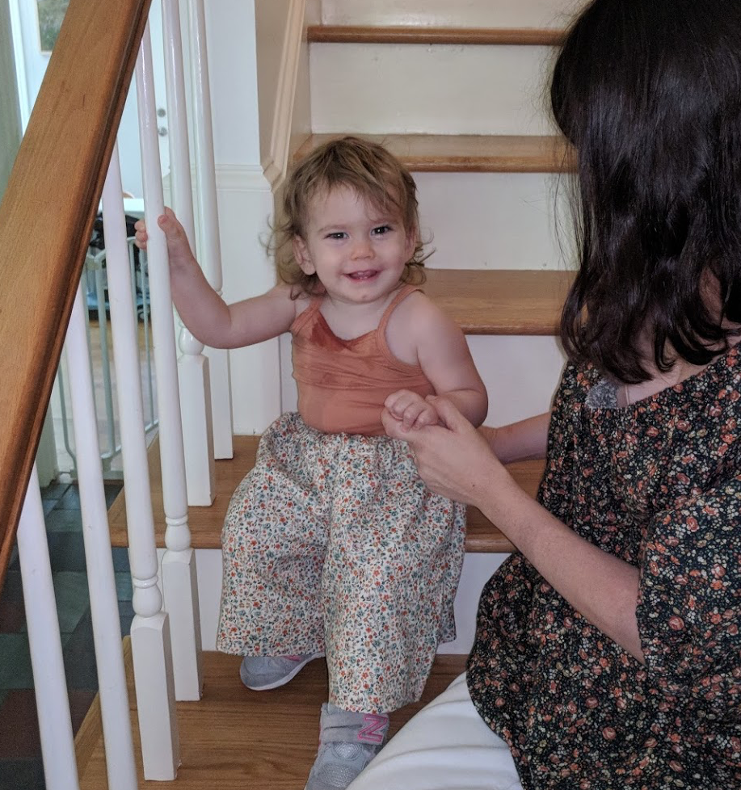
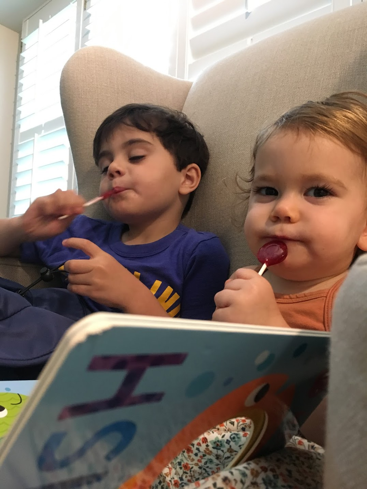
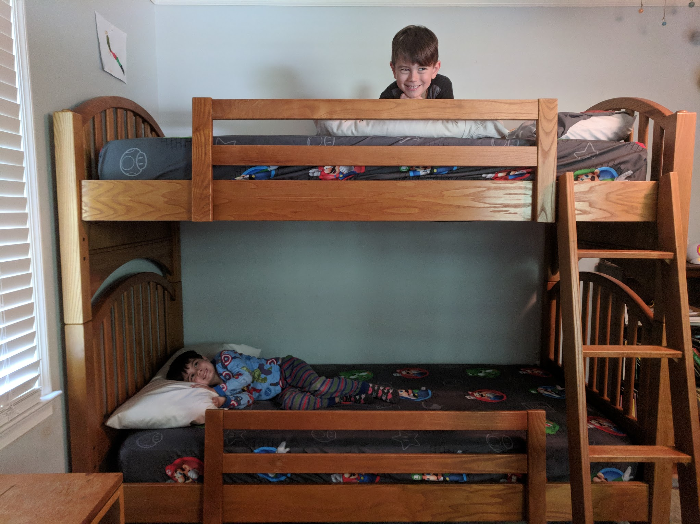
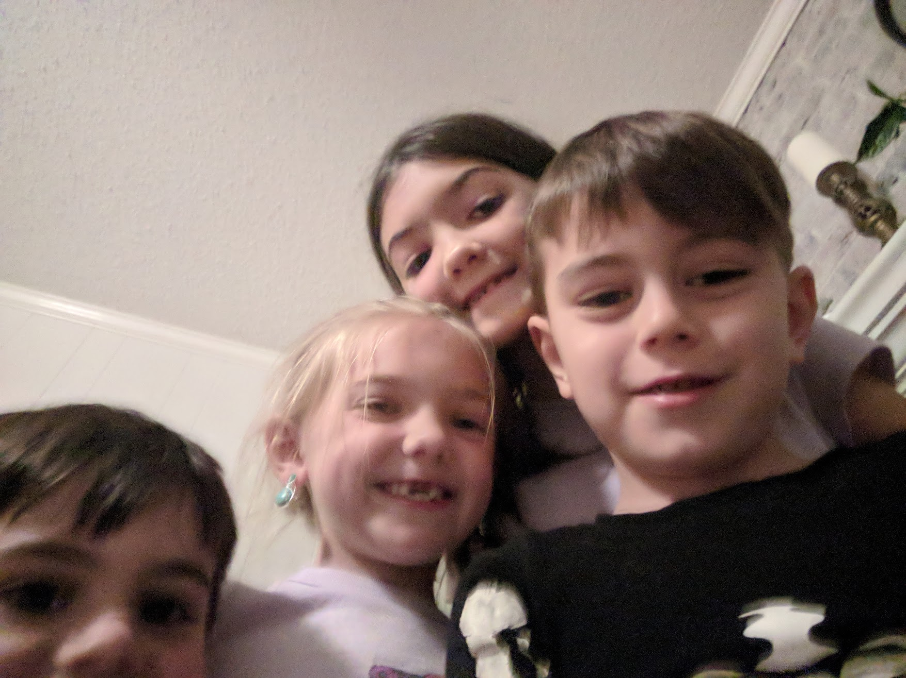
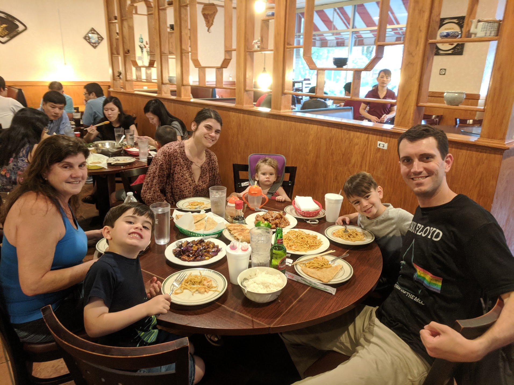
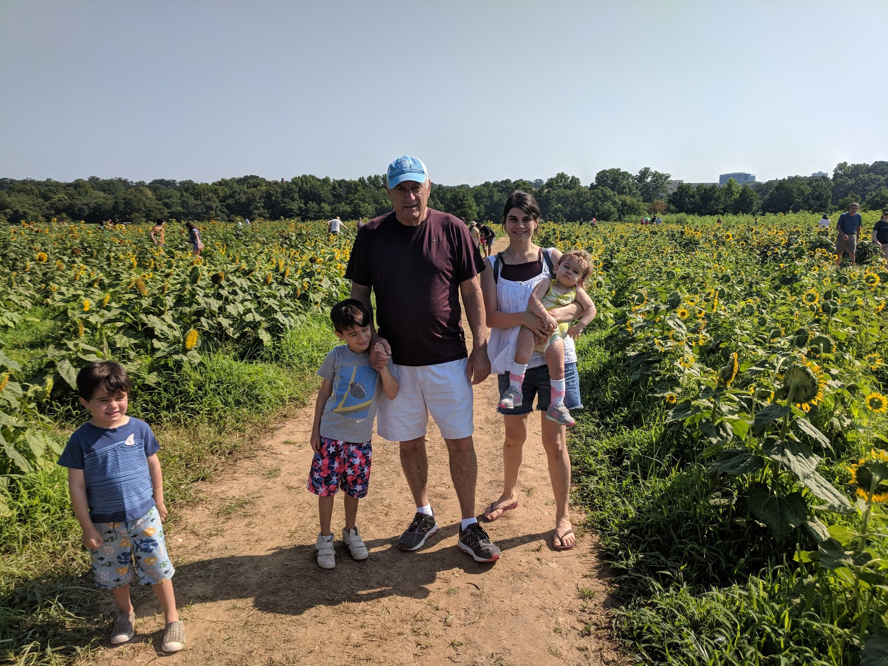
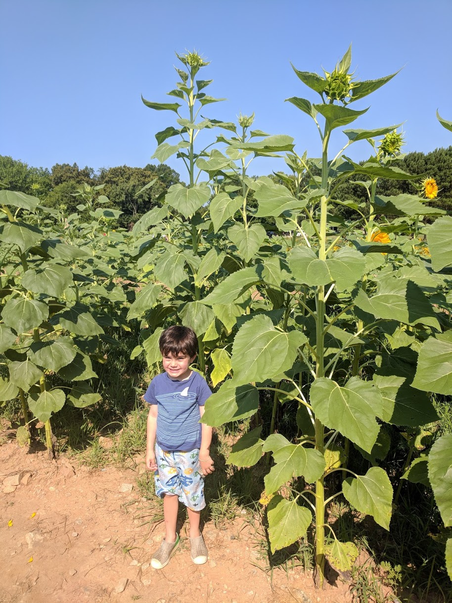
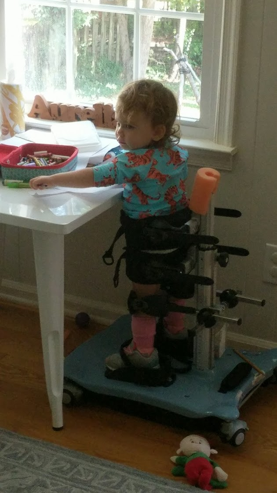
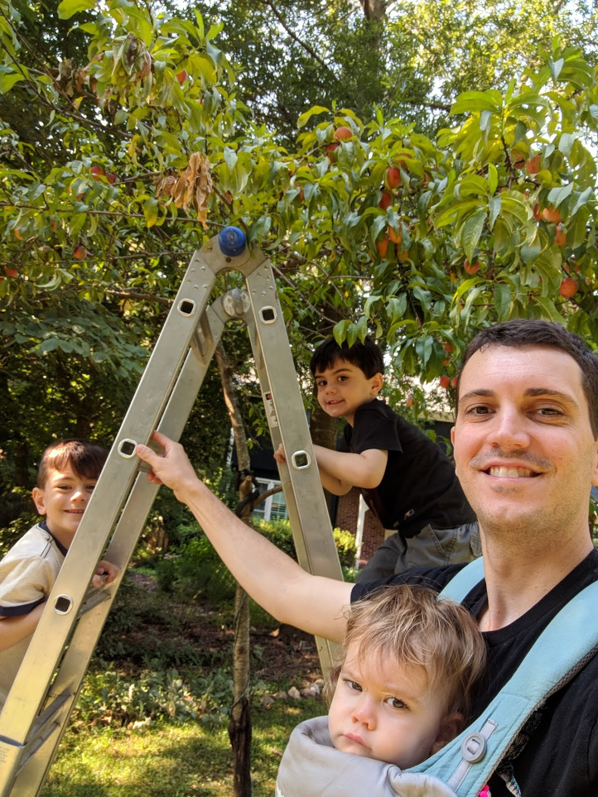

We're finally achieving a peace that has been hard won. The past month has brought more of the same kind of waves that have made this year so difficult and stressful, but we're sailing through them with less concern for the ship. We're finding peace in the midst of the storm.

## And Happiness

There's a lot of happiness in our home now, maybe more than existed in December. It's complicated and we're certainly suffering in a lot of ways; but we've been looking at ourselves and our family more positively. I feel as if we've had a near death experience, for which I'm painfully troubled and confusingly grateful. With my father's words of encouragement this past Sunday after he headed back home, I was reminded of my panic in January. I had warned him then that he should visit immediately, because I was uncertain about how much longer Auri had remaining. Having lived with that pain for months, I'm so grateful for how quickly it's subsiding. We can play, work, and love now with confidence that there will be more tomorrow. And with every day of play, work, and love, we're coming together. I've been reflecting about how differently I love my wife and children after having gone through this, and I don't think I'd have measured up without having faced the threat of losing it all. There were a number of weeks where the odds and genetics favored one of my boys suffering as well. And, it seemed that all possibilities lead to their ruin. I'm a lot happier with this outcome. Go figure.

I have to share how excited these boys were to get their new bunk beds. When a neighbor offered them up for free, I jumped at the opportunity. Both of these kids couldn't contain themselves and spent days in their room hanging sheets and pretending to camp. In many ways I think they're happier. Though we struggle at times to manage our behavior (Natalie and I included), the acute, underlying stress that's responsible for our transgressions has been largely alleviated. Max and Lennox will play outside again, have fun at the pool, and are returning to normal. They have many things that make them happy, and their expressions of joy are helping to replenish our strength.

## Visits

It's been a busy month! We've had visits from Natalie's mother, my father, and my cousin and her family. When I went back to pull pictures for this post, I was surprised to see how much we had done. Together with her two daughters and husband, my cousin came from Michigan during the work week. I had to partially focus on work, but the kids had a fantastic time together. Since Ava and Marin are older, Max and Lennox play "up", in that they play and talk more maturely.

Natalie's mother, Hilda, also came to visit. She spent a lot of time with Max and Lennox, and I hope she enjoyed them because she's about to get a lot more. We decided on traveling to Florida for a few weeks, and Hilda is going to help me by watching Max and Lennox while I work remotely. My next update should include some fun pictures of the beach vacation we're planning on the tail end of the trip.

Last but not least, my dad came this past week. We saw him both in January, before we knew exactly what terrible thing was happening, and in Philadelphia in March, where we travelled after starting Auri's medicine to consult with an expert. Fortunately, we were able to do fun things like visit the big Raleigh sun flower field, spend a day at the pool, and go out for pizza and ice cream.

## Independence

Previously, I wrote about milestones and how we don't seem to have any more. Well, this past month I've decided to set goals instead. For much longer than me, Natalie has been resolute in her belief that Auri will be walking. I think she might, but I have a different belief now. I'm certain that Auri will be independent. I don't know how long it will take, and I don't what it will look like; but Auri will be independent.

At a minimum, I want to be alone with Auri one morning each week. I've been taking her to the park and playground early to beat the heat on Sundays. After everything she's been through, she's been overly attached to Natalie. We haven't wanted to push her too hard to break out of it, so we've fallen into a division of labor that means Natalie handles almost everything with Auri. If mom's around, Auri doesn't really want much to do with me; but if I take her out alone, she shares a lighter and more playful side.

- [Riding the playground horse.](https://photos.app.goo.gl/c9oUuYkC16G29Ndo9)
- [Digging in the sandbox.](https://photos.app.goo.gl/9wCNZricqfgLFfUr8)

So, the question remains: how are we going to make this happen? How do we help Auri recover and develop enough to take care of herself?

## Recovery
You might have seen a video I shared of [Auri dancing in her stander](https://photos.app.goo.gl/8YBqoSLP6a4YjaCLA). Just a week prior, Auri's doctor said something to the effect of wanting to see her develop more core strength. A week later at physical therapy, Natalie and the therapist decided to see how she handled a _half_ stander that wouldn't support her core. Surprise! She nailed it. While we've been anxiously wondering how much she'll improve, she's been quietly building strength. All the therapy and exercise we're forcing her to do is paying off, and I'm beginning to see clear and obvious signs of improvement that only her therapists were able to notice previously. It seems like she has stepped up and impressed us whenever we've begun to get discouraged or worried about something. So, we're not only keeping the faith but we're doubling down on work and exercise. We're asking more of her and raising our expectations. I recently started forcing Auri to walk out of anywhere that we visit together. I think Natalie thought I was crazy at first, but I noticed that she recently started doing it too. We might be the girl's legs right now, but we're going to get her used to doing it herself. And we're making her play by herself more often, forcing her to _figure it out_.

- [Auri playing by herself sitting.](https://photos.app.goo.gl/nC3gxAZkMQNNpdh4A)
- [Auri playing by herself standing.](https://photos.app.goo.gl/PirCsPxmGqtV1GPt8)

I also keep telling people how lucky we and Auri seem to be within the context of an extremely unlucky situation. We are really fortunate to have Auri's doctor, and I recently asked her about secondary therapies to support Auri's recovery. Dr. Kurtzberg happens to be a pioneer in the field of cellular therapies, having recently experimented with direct infusion of mesenchymal stromal cells for children with cerebral palsy. I'm under the impression that she's one of the few stem cell experts doing this, and that _if_ we decide to give it a shot, Auri will be given a remarkable opportunity under an individualized study. You can't just call up a pharmacy and make this happen. And, I have queries out about human growth hormone and a delivery of CBD arriving any day. We're starting to do research to figure out what else we can do to maximize her rehabilitation. 

I think everyone is enthusiastic about Auri's condition, and we all see the obvious potential for recovery.  I feel like we're racing headlong into the new phase I talked about in my last post. We might be a few years away from major achievements, but the significant improvements of the past month or two mean that we can hold Auri with one arm and afford her some independent play. These mean _a lot_ considering Auri suffers from a disease measured in part by whether or not she can smile.

## Sickness

It doesn't seem to quit! Natalie's sister and mother were kind enough to take Max and Lennox to the movie theater with their cousins, but by the end of the day I heard that the cousins tested positive for Strep A at the doctor. Unsurprisingly, Lennox woke up the following day complaining that his throat hurt. Although he tested negative (maybe because it was too soon), both he and Max developed rashes and sores and complained about not feeling well for over a week. Like every time prior, Natalie and I did our best to keep the healthy separated from the ill. And like every time prior, I ended up sick too. This time, however, I was the only one to get a fever. I laid in bed for a few days wondering what the hell has happened to us. We just keep getting sick. I've been told it's the stress, and I believe it. But, I don't care. I just want it to stop.

## Harvest

This spring was supposed to be the year that I finally finished my master piece garden. That didn't quite work out, but thankfully the fruit trees don't care! They've been digging roots for over five years and mostly take care of themselves.

We snagged a few freezer bags worth of peaches that made their way into some unofficial Howling Cow ice cream, courtesy of our friends. And, we harvested a great deal of figs this year. All the kids helped with [washing figs](https://photos.app.goo.gl/UuVxdDiPoKA1JwjQ6) that made their way into some jam and baked desserts.
