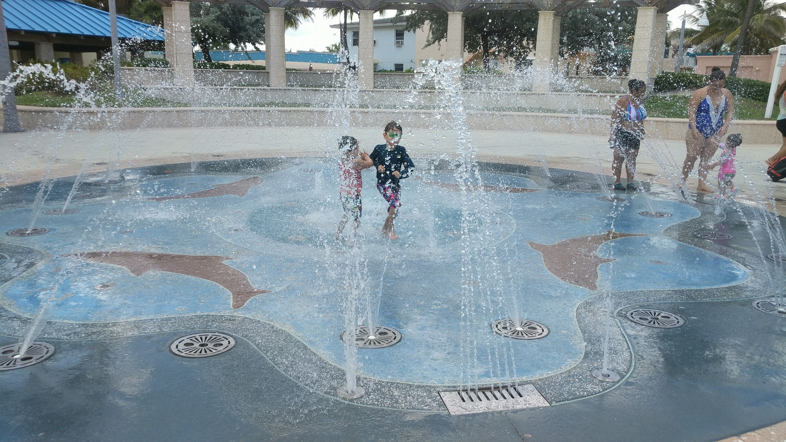

I recently returned from a three week, self-imposed exile in South Florida. With Lennox starting elementary school next week, we wanted him to get up to date with the kindergarten vaccination schedule. Out of an abundance of caution, I took him and Max to stay with their grandmother for two weeks; and when the danger was gone, Natalie and Auri joined us for a family vacation.

### "Can You Take Me To The Hospital?"

A bad omen, the day after we arrived Max stepped on a sewing needle that went completely into his foot. With only the eye exposed, we had to actually thread it with string to pull it out. He handled it alright, but I just got this sinking feeling that things weren't going to go as well as I had hoped. A few days later, my mother in law's sister surprised me with a request to take her to the hospital due to chest pain. Less than a week later, she had open heart surgery to bypass two major arteries. Thankfully, she's doing well now, at home, and feeling better and stronger than before her surgery. But, naturally, this came as a surprise and changed the nature of our trip. Hilda had planned to spend the time with my boys while I worked, but we had to improvise a little to keep Esther company and help make sure she was taken care of.

A silver lining, our family was able to stay with my aunt and uncle, unplanned, for two nights while Natalie and Auri were with us. When Esther returned from the hospital, we couldn't all fit in Hilda's house; so we asked to stay at Nancy's house. It was nice to spend so much time with them, and they were generous to open their home to my caravan.

### Quality Time with Max and Lennox

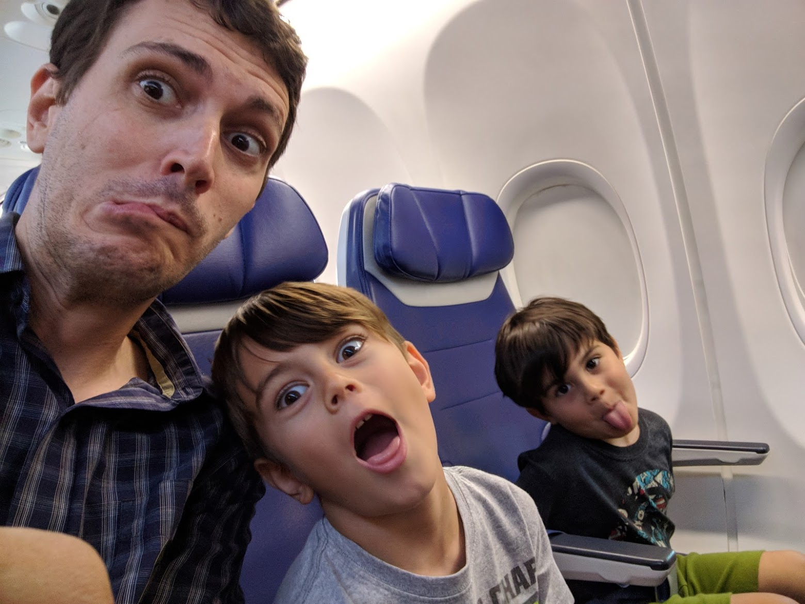

This year has been as difficult on my boys as the rest of the family, and I'm grateful that I was able to spend so much time with them. They've been in need of attention, and I'll admit that I've been unable or unwilling to give it to them. My anxiety has kept me emotionally paralyzed, but the distance afforded by this trip allowed me to stay more focused on their needs.

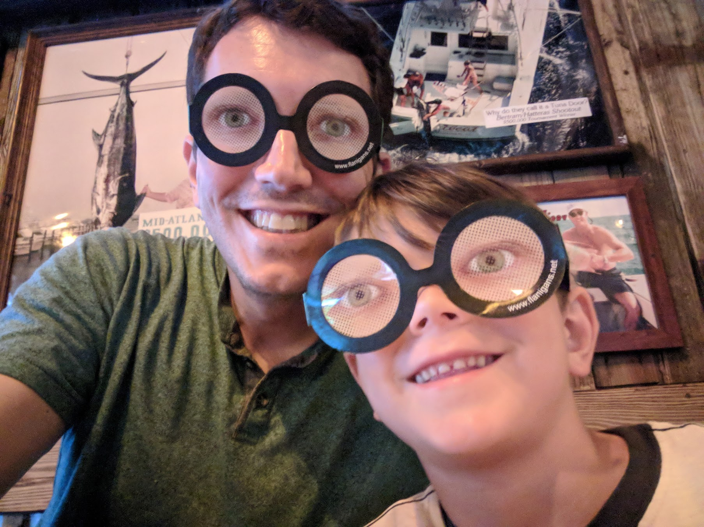

Among other activities, we spent a day at CB Smith's water park. It was relieving to play with them without worrying about how Auri's doing or whether Natalie needed my attention. I was able to just run around with them, ride the slides, and goof off. I never feel comfortable doing that when Natalie's around because she's always working so hard with Auri that I feel like I need to be ready to tag in.

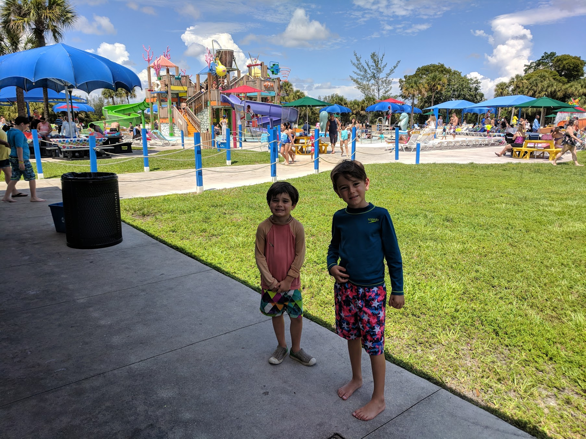

Lennox begins elementary school in a week, and I'm amazed at how smart and independent he's become this year. His development has made some of our time together more difficult, but I was able to find a more positive perspective about it during this trip. Both of our boys are remarkably funny and demonstrate a depth of awareness uncommon for their ages. They made me very proud this trip.

### Quality Family Time

When Natalie and Auri finally joined us, I think we were all greatly relieved. Even though we were holding video calls every morning and evening, Auri was getting increasingly upset about our not being there. We're usually together a lot and share routines; so without the brothers for entertainment, I know that Natalie and Auri felt lonely. When they arrived, though, we were unfortunately all on edge having been apart and away from home for so long. We may have preferred to simply go home.

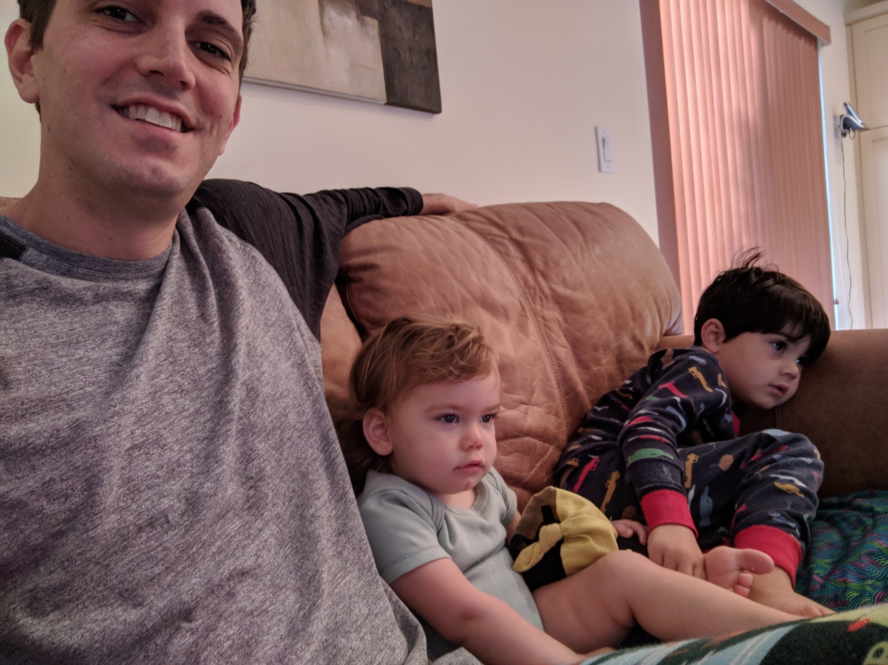

After a night or two with family, we headed to a beach condo for a few days. With mornings in the waves and afternoons in the pool, we carried a lot of gear and sunblock back and forth. Logistically, travelling together was more difficult than I had expected. However, I can see it getting easier and more manageable, enough so that I wouldn't be afraid to travel in the future. I had concerns about whether our changes would confine us to our home, but we're getting more competent and patient about handling the increased difficulty.

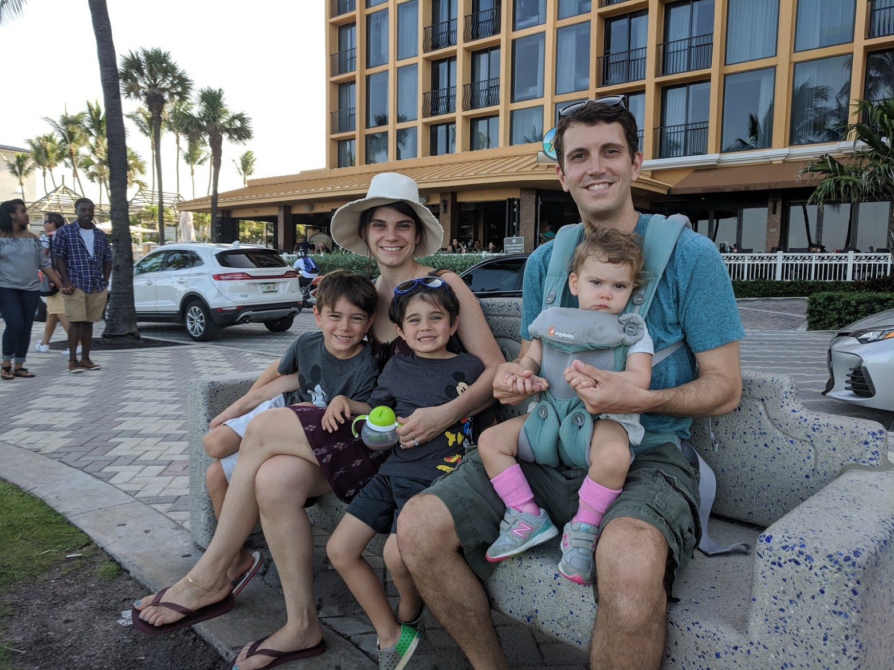

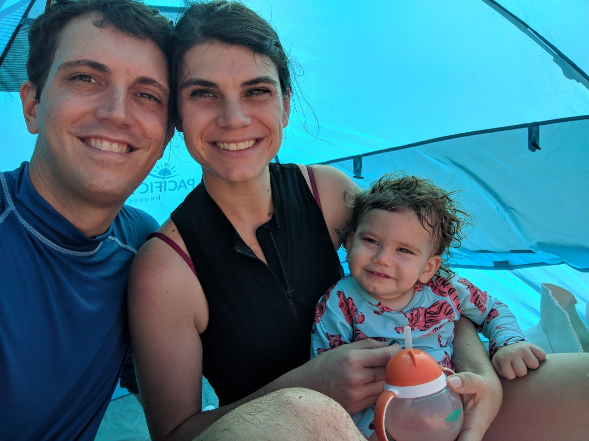

We also learned that Auri does **not** like the beach. I think she might have been too hot, but she was also not sleeping very well and seemed over it in less than an hour each day.

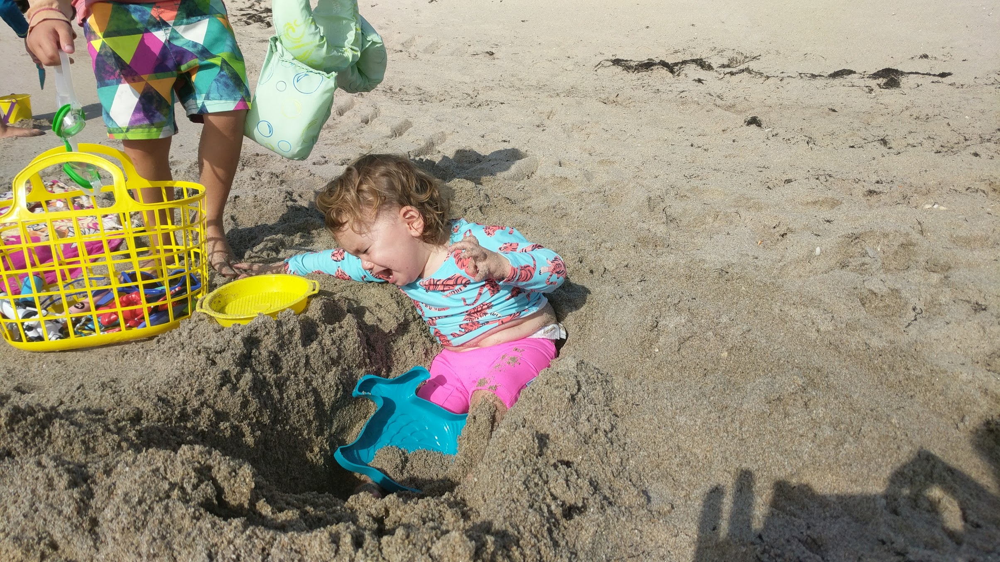

Assuming her condition remains stable, we're going to need to adjust Auri's expectations because she's still hopelessly attached to and demanding of her mother. Natalie, thankfully, handled this well during our trip and took it in stride, keeping Auri calm and happy enough for us to enjoy our vacation. Frankly, I'm not sure that this was too much unlike traveling with two children and a baby. It might be difficult, but it's still good for everyone.

### Developments

I've been reckoning lately with my feelings about Auri's development. As the months count on, we're continuing to digest how serious her condition is. This past week, a young boy that takes the sister drug to Auri's medication appears to have suffered a relapse after two years. I don't know a lot of details, but it underscores how precarious my daughter's health is and the reality that we're never going to stop being worried for her. Another parent recently described Auri as a success story, given that we intervened so early. But I'm worried that you can't recover from a brain injury as quickly as you can suffer one. I don't know how we'll live with that anxiety, but there are still good things to say.

Auri's recovery, then, continues slowly. Contrary to what I've claimed in previous months, I beginning to think that much of her gains come from simply getting older. She's maturing into a silly, sweet girl; and we continue to see slow improvements in her strength. 

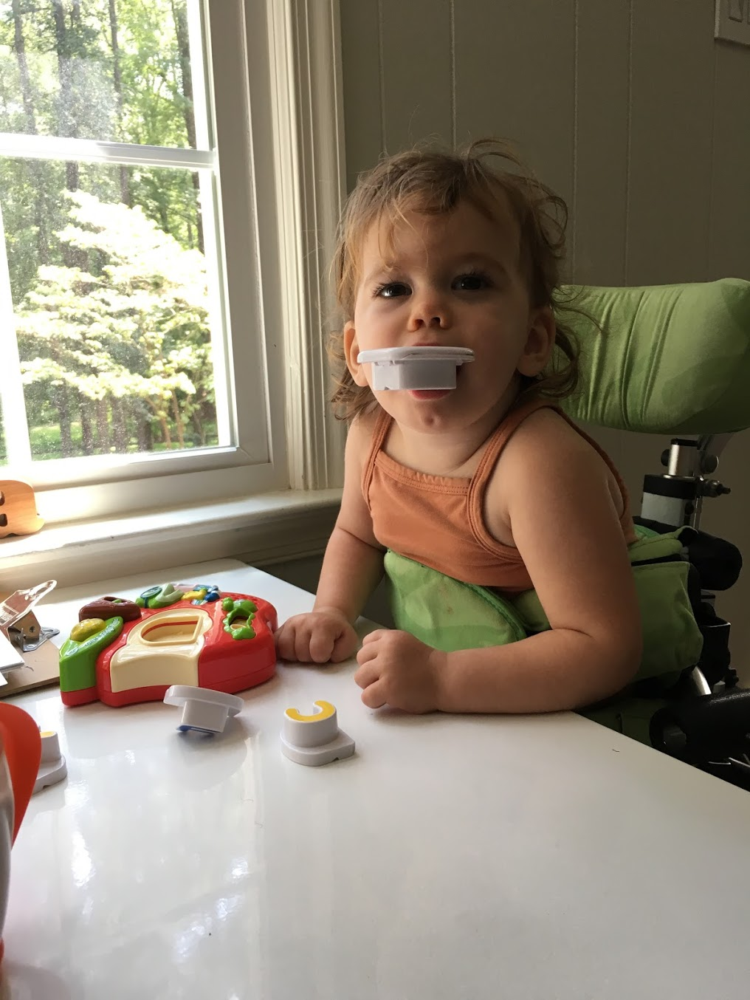

Recently, Auri started asking to wear bows in her hair; and Natalie's been pulling it back into a ponytail. Likewise, she likes to pick outfits and headbands and has strong opinions about what she wears. Recently, Natalie bought her a couple of little charm bracelets that she was so excited to show everyone. She's transforming, so to speak, from a baby into a little girl. I'm proud of how smart, silly, and clever my boys are; but I think Auri might take the cake.

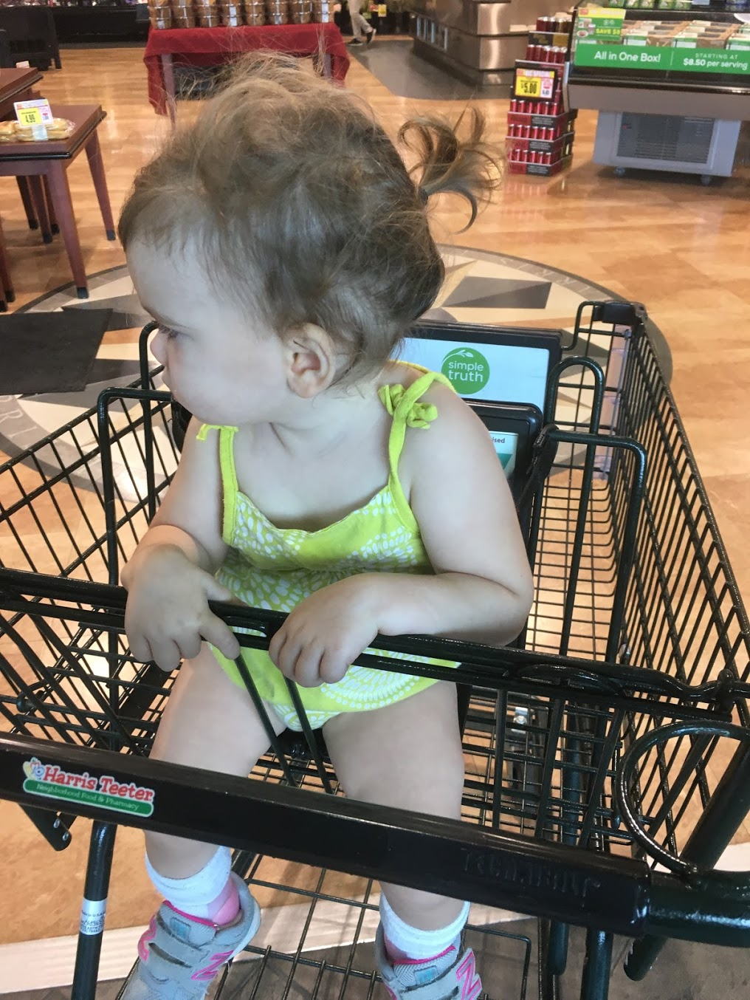

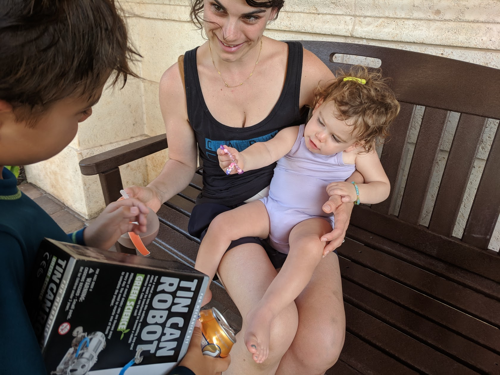

The biggest physical development lately has been an improvement in Auri's ability to sit. She's able to do this now for about ten minutes if we help her get into position. Though she's still using her arms for a lot of support, she's developed enough core strength to keep upright enough to play with toys. This morning, she was sitting on the couch while Max read her and Lennox a book and she was able to stay with some support and an arm rest.

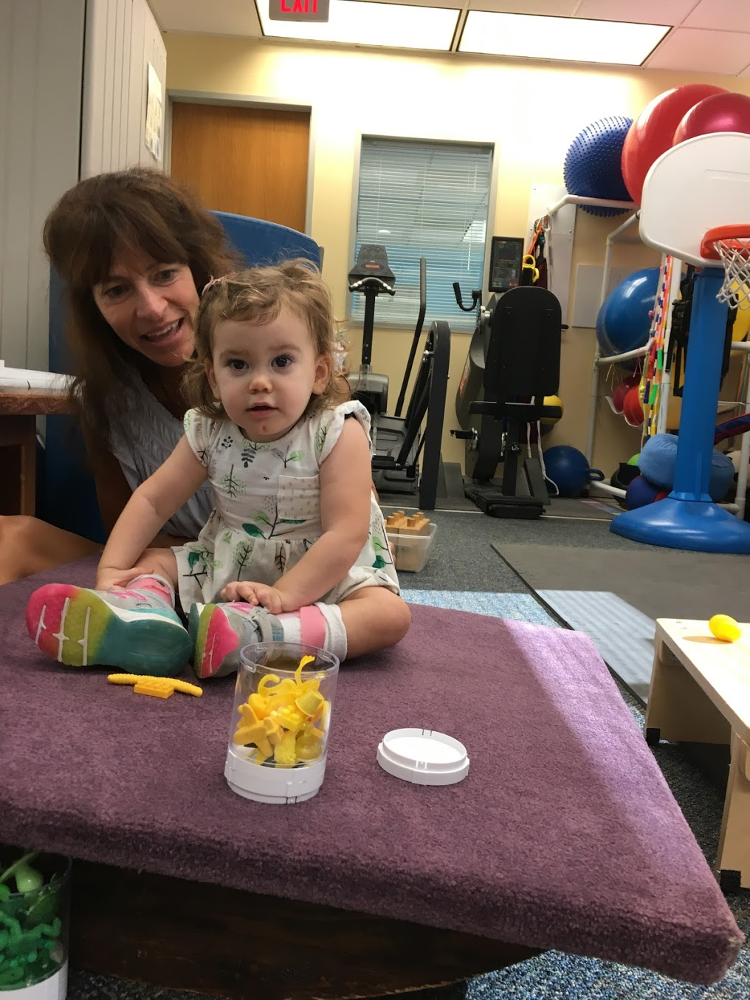

Her hands are open most of the day now too, as long as she's relaxed. She's still grasping things poorly, but I can see this getting manageable as she gets older. With concentration, she uses an imperfect pincer grasp and can pick up cheerios and other small foods to eat. I've tried to remember to grab a better picture of this, but by the time I grab my camera she's usually back to raking things again. As a young child, I believe she defaults to the path of least resistance without consideration of the value of practice. Still, I catch her sometimes doing really well, as in this picture of her picking up coffee creamers. She does this when she needs to.

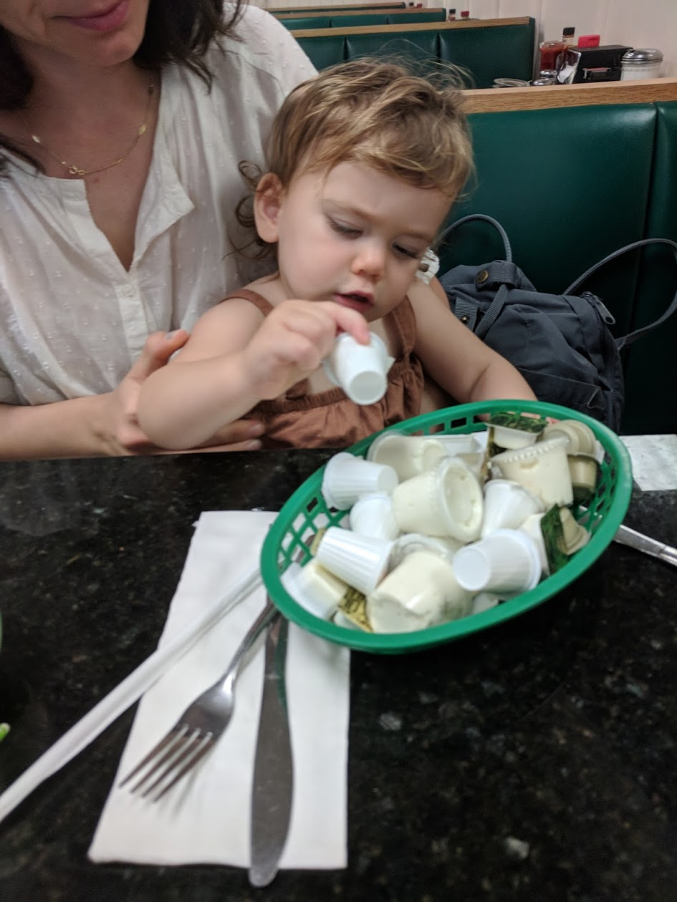

With her speech, I feel differently week by week. Most of the past month I've been worried that she's been plateauing. But this past week or two, in a burst much like the other stop and start developments she's been experiencing, Auri started mimicking and matching sounds to her sign language. The range of sounds she can make are still very restricted, but she's matching the number of syllables a word requires to her attempts. And, last evening they were pretending to be chickens, where imitating animals had seemed out of reach. While we were on vacation she was saying "oh no", not perfectly, but with enough enunciation of the "oh" that she sounded like a different person to me. Every evening we say "nigh nigh" (sometimes more like "na na"), but _occasionally_ it comes out almost perfect.

We're still riding the ups and downs of blood tests, with Auri having her lowest neutrophil count this month since we began treatment. I'm hopeful it resolves itself, but neutropenia is one of the most common side effects of the drug and can cause considerable risk of infection. She's been flirting with neutropenia that usually resolves by follow up, and I hope that means that it will again. We're monitoring monthly now.

#### A Unique Future

Lastly, I spent a bit of time trying to understand the classification systems used to score children and adults with disabilities. This is how the Gross Motor Function Classification System (GMFCS) describes children **under two years of age**. Note that a higher score describes a more severe physical disability.

* LEVEL I: Infants move in and out of sitting and floor sit with both hands free to manipulate objects. Infants crawl on hands and
knees, pull to stand and take steps holding on to furniture. Infants walk between 18 months and 2 years of age without the need for
any assistive mobility device.
* LEVEL II: Infants maintain floor sitting but may need to use their hands for support to maintain balance. Infants creep on their
stomach or crawl on hands and knees. Infants may pull to stand and take steps holding on to furniture.
* LEVEL III: Infants maintain floor sitting when the low back is supported. Infants roll and creep forward on their stomachs.
* LEVEL IV: Infants have head control but trunk support is required for floor sitting. Infants can roll to supine and may roll to prone.
* LEVEL V: Physical impairments limit voluntary control of movement. Infants are unable to maintain antigravity head and trunk
postures in prone and sitting. Infants require adult assistance to roll.

I believe this places Auri in level 3, but on the border with level 4. She has a couple of months to figure it out. Interestingly, the group leading AGS research presented some slides this year detailing these scores across their patients. Remember that a high score is _bad_. You can see that the majority of children with AGS are so disabled that they max out these scoring systems.

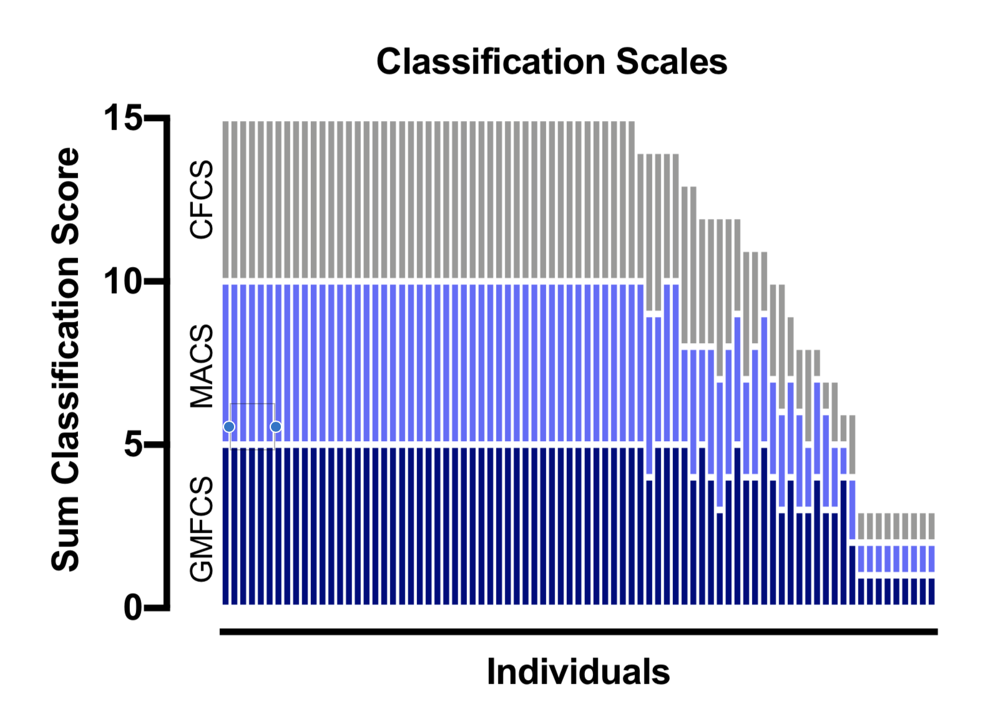

With Auri where I think she is, I believe it places her somewhere in the middle of that slope, in the lucky 25%. The goal will be to help her accelerate her development, if possible, and improve her scores rather than remain on the same growth curve. In my last post I described one possibility, a cellular therapy using mesenchymal stromal cells. Auri's doctor agreed this month to write a proposal and seek FDA approval to make it happen. Forgive me for getting all researchy, but I wanted to show how significant this _could_ be. Chen et al. (2013), using a _slightly_ different method, demonstrated _big_ improvements in gross motor function scores for children with cerebral palsy transplanted with mesenchymal stromal cells.

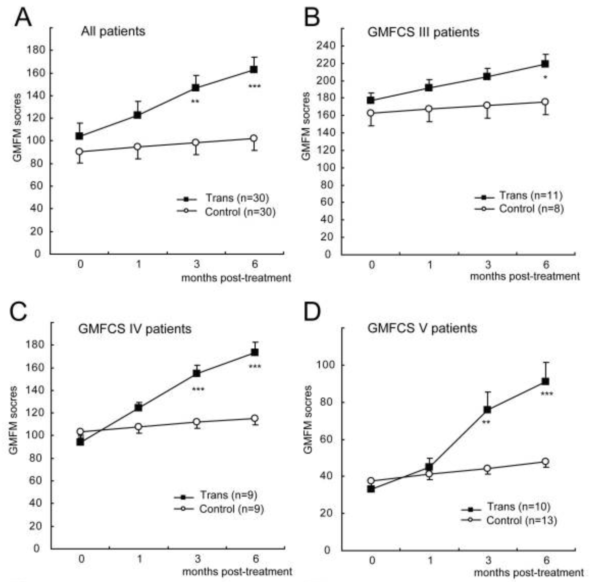

These charts show improvements in motor function scores for children that started in different GMFCS levels. Children that started in level 4, for example, achieved motor function scores that would place them in level 3. Without this treatment, children with CP will develop, but much more slowly. So I hope, perhaps unreasonably, that this will be approved for Auri and change her future for the better. Looking ahead, these are descriptions of GMFCS levels 3 and 4 for children **between their 12th and 18th birthday**. While her future will be unique, the degree of independence that Auri will be able to achieve will rest a lot on what happens in the next year or two.

* Level III: Youth are capable of walking using a hand-held mobility device. Compared to individuals in other levels, youth in Level III
demonstrate more variability in methods of mobility depending on physical ability and environmental and personal factors. When
seated, youth may require a seat belt for pelvic alignment and balance. Sit-to-stand and floor-to-stand transfers require physical
assistance from a person or support surface. At school, youth may self-propel a manual wheelchair or use powered mobility.
Outdoors and in the community, youth are transported in a wheelchair or use powered mobility. Youth may walk up and down stairs
holding onto a railing with supervision or physical assistance. Limitations in walking may necessitate adaptations to enable
participation in physical activities and sports including self-propelling a manual wheelchair or powered mobility.
* Level IV: Youth use wheeled mobility in most settings. Youth require adaptive seating for pelvic and trunk control. Physical
assistance from 1 or 2 persons is required for transfers. Youth may support weight with their legs to assist with standing transfers.
Indoors, youth may walk short distances with physical assistance, use wheeled mobility, or, when positioned, use a body support
walker. Youth are physically capable of operating a powered wheelchair. When a powered wheelchair is not feasible or available,
youth are transported in a manual wheelchair. Limitations in mobility necessitate adaptations to enable participation in physical
activities and sports, including physical assistance and/or powered mobility. 

---

Chen, G., Wang, Y., Xu, Z., Fang, F., Xu, R., Wang, Y., ... & Liu, H. (2013). Neural stem cell-like cells derived from autologous bone mesenchymal stem cells for the treatment of patients with cerebral palsy. Journal of Translational Medicine, 11(1), 21

