I'm feeling like it's time for me to slow down and write fewer posts. I'll admit that I had hoped for more improvement this year and that Auri's steady progress has been slower than I had anticipated. And when it comes to my goal of writing to help others, I realize this had turned into a tool for my own catharsis that hasn't really been working. Natalie's voice has been mostly absent, and I feel like mine has been mostly repetitive. I don't feel like there's much more to say other than how unfair this wild ride has been for my family and daughter. Although I keep reminding myself (and anybody who will listen) how fortunate Auri really is, I'm left with the sad reality that her and our struggles will continue indefinitely. I don't want to keep repeating the ambiguity of it all so I plan to stretch out these posts moving forward. I'll write sooner if there's anything significant to share.

---

Another month and another unexpected hospitalization. Thank god it wasn't Auri, but I'm feeling worn thin by all of the health care navigation this year. My father was sick enough to spend over a week in a hospital bed, and I made the decision to head to New York and help him after a discouraging phone call with his infectious disease specialist. I believe it was the fourth hospital I'd been to in a month, so I'm wracking up experience points at getting attention and answers. I don't know what the hell I'm doing, but fortunately neither does anybody else. The game seems to be about recognizing when you're getting ignored and understanding just enough to trigger a more thoughtful dialogue. You can't really do anything about the shitty system, but you can command a little more attention than you'd be getting otherwise. It sucks, but you can make it a little better for yourself or others by not taking anything for granted. Especially at a hospital, the doctors and nurses are busy, tired, and over-extended. Don't take it for granted that they're giving you the best care. They know what they're saying, but they're tired and work in a high stress environment. A few days ago I came across some notes that worked their way out of some drawer or junk pile of mine. In January, when we had no idea what was going on, I spent sleepless nights researching the long list of spinal fluid tests that were pending for Auri. I was trying to understand what each of them were for, what diseases they might detect, and what the prognosis might be. Of course I didn't solve any mysteries, and I was horrified writing things like "prognosis poor", "few years," "progressive." But, I also wrote things like "HSCT curative if performed early." Would you care to guess how or why I got Auri to doctor Kurtzberg so early? Nobody will advocate for you better than yourself. Stay on top of things. It might be important and make a difference.

Before I dive into family updates, I feel like it's important to share that Natalie had written a blog post while I was away. After talking together about its tone, we decided to not publish it. However, I would be remiss if I didn't explore her thoughts and give them some attention. I don't want her to feel silenced; anybody in her position might feel the same way. She has been in a lot of pain; we both have, on and off throughout the year. Sometimes that pain has been directed outward, toward and against friends or family members, in part because we have nowhere else to direct it. We feel disappointment, some shame, and gratitude for our relationships and interactions. But, when we're feeling anxious, which I'm certain will continue intermittently for a long time, we feel angry. I'm sure that you've attended a funeral. Do you remember the awkwardness of it all? What are you supposed to say? "I'm sorry for your loss," seems to be the standard. But what does it really mean? It means you don't know what to say and you don't know what the other party wants to hear. From my perspective, the distraught probably doesn't even know what they want to hear and it likely changes with their mood. Well, we were the distraught, only recently downgraded to _overwhelmed_. And in all this time, I've wanted lots of sympathy, more than I've received. When I'm at the playground, I actually hope people will ask me about Auri so I can tell them about what's happened. They never do, and then I feel kind of ashamed for wishing it in the first place. The emotions are complicated. I know that Natalie feels complicated; she's always been complicated. So, have you acknowledged how hard she's working? How much acknowledgement is enough? How much is too much? There's this _really_ fine, fuzzy line between celebrating her strength and being sorrowful. And what about Auri? How should you treat her? She's smart and painfully aware of her limitations. Don't talk to her like she's mentally challenged, but don't overdo it either. Maybe it's just too complicated and it's easier to keep your distance. But, we've noticed that too. One of my first thoughts in January, noticing how quiet it got around us, was "do people think we deserve this?" There just probably isn't a right way to handle any of this. As much as we'd like to, we're not going to be getting off this wild ride anytime soon. It's making us a little crazy, so my recommendation would be to try and act normal. Normal is all we've been begging for this year.

---

I'm sharing a lot of videos this month. This is our historical record. 

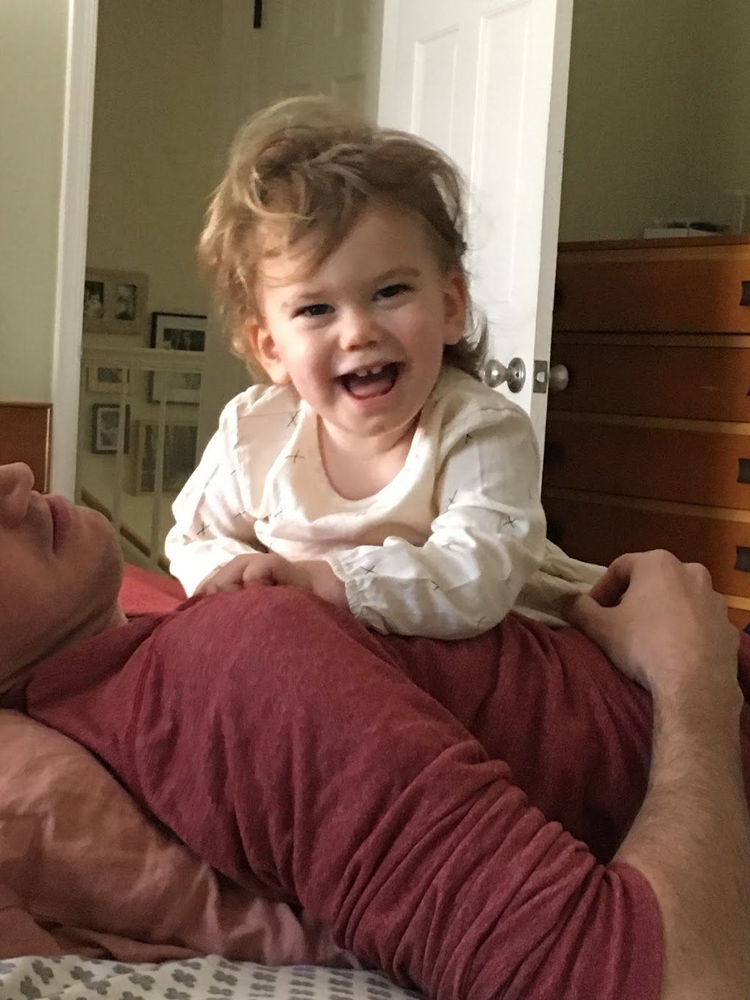

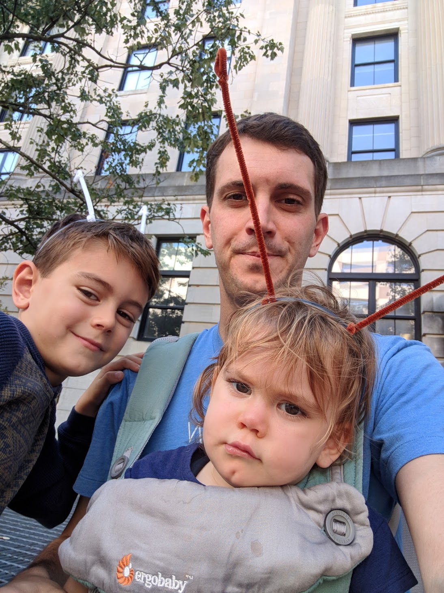

There isn't too much significantly different from last month, but I continue to believe we're watching Auri grow up and catch up. Unfortunately, we received somewhat disappointing news from the dentist. But, just as in many other aspects of all of this, it could have been much worse. Auri's teeth have been coming in correctly and without any obvious problems. But, an X-Ray showed that the roots of her baby teeth are underdeveloped. She'll probably lose them early, maybe a couple years sooner than average. We won't know for years if this will happen to her permanent teeth, but many children with Auri's genotype suffer chronic and serious dental issues. Considering the spectrum of disease severity, this again seems to place Auri in an affected, but relatively lucky category. With any luck, her treatment will protect her developing permanent teeth from insult and her heart and bones from calcium related conditions. We also have to reauthorize the use of her medication with our insurance company. They originally approved it for six months. As I write, we've already submitted the appropriate paperwork and provided clinical notes supporting its benefit. I'm going to guess that it will get approved for another year, but we'll have to keep doing this ad infinitum. Finally, the proposal for her cellular therapy has been submitted to the FDA. She would be the first with her disease to receive this, and I maintain hope that it we'll see considerable benefit.

It seems like I always write these updates after a good, strong week or two that's inevitably followed by a slow and concerning couple of weeks. Auri seems to have this cadence, two strong weeks, three slow ones. It might be that she (or all of us) develop a mild cold. It may be that she's not sleeping well; she's erupting a bunch of teeth at the same time. I'm told by her neurologist that it's fairly normal for people with brain injuries to experience transient fatigue like this. The term is recrudescence. Still, it's hard to watch and takes Natalie and I to the edge of sanity each time. A week after I post a video of her standing and walking with only one arm for support, Auri will be tired and floppy. She was worn out at the start of this month. Last week we were back on track; I felt great. This week I feel myself tensing up again.

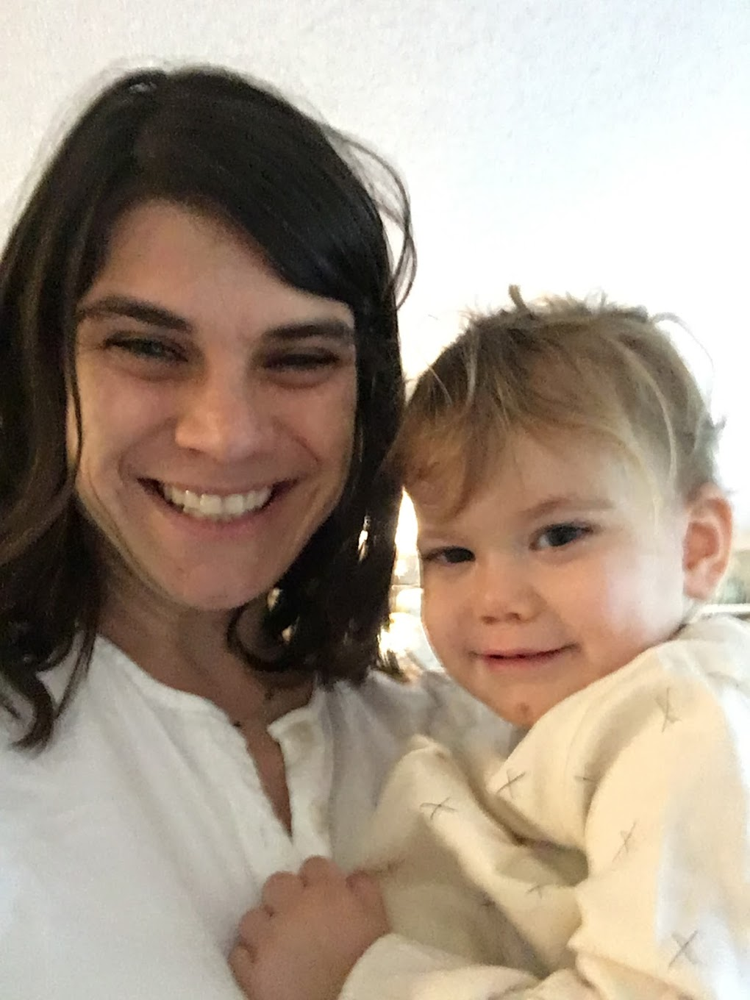

First, I want to commend Natalie for the grueling, frustrating, but necessary work she puts in every day. Natalie gets discouraged with the lack of progress, but she has managed to mostly keep the mindset that this is about putting in the work. For example, she gets Auri in this walker almost every day (video below) and makes her take at least a few steps on her own despite the yelling and protests. Natalie pushes Auri to try, especially in situations that Auri finds difficult, always encouraging her to reach higher. You have to put in the work and "keep plugging away." This is about endurance and persistence. The gains, if any, won't be realized for years; but Natalie keeps the faith and Auri working. We've started to look for intensive therapy programs in a couple of places around the country, too. You typically spend three weeks at a specialized center, with daily, intensive therapies aimed at specific, attainable goals. We already have a lot going on, but we'll swing it somehow, preferably during her cellular therapy to maximize benefit.

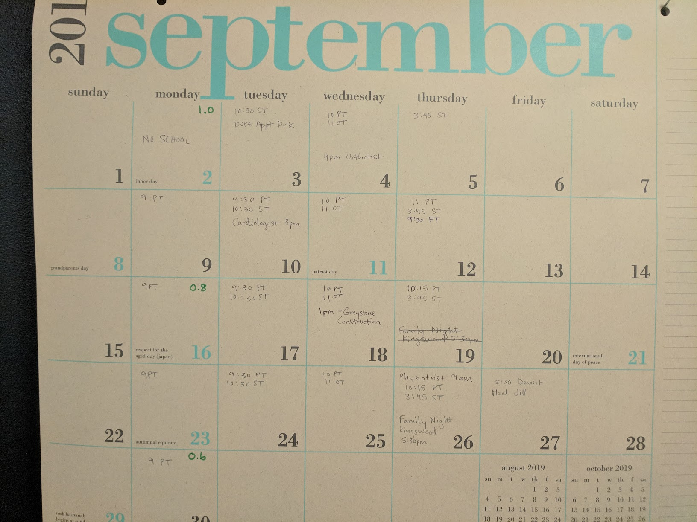

Just take a look at our schedule: physical therapy at least three times a week, speech therapy twice a week, occupational therapy once a week, and doctors, dentists, etc. We recently saw a physiatrist that commended us. "You're doing everything right." Thank goodness, because it never feels like enough.

* [Video: Hard work walking](https://photos.app.goo.gl/2FTRdwRaDV1sziAM8)
* [Video: Crawling board](https://photos.app.goo.gl/9xqDtzU9evheDSUV7)
* [Video: Pendulum swinging](https://photos.app.goo.gl/FTf3EXhfPku9LpwB7)
* [Video: An obstacle course](https://photos.app.goo.gl/GSdwhuUtwFuhTna29)

We had a little bit of a weight scare recently. Auri didn't gain any weight between her August and September appointments. We don't know if it's significant, but the last time this happened things were spiraling out of control. She's getting like 6 teeth at once, though, and she might have been a little sick. She's also getting bigger and it's taking a little longer to feed her. Of concern, she seems to have less of an appetite and gag on food towards the end of a meal. Still, she's able to do a little bit of this on her own now. We can't expect her to eat a plate of food by herself, but she's alright to sit by herself with some snacks. This month, Auri's weight gain seems to be back on track; but we're in a holding pattern to see if these feeding issues are new or dangerous developments.

* [Video: Feeding herself](https://photos.app.goo.gl/PR8jRs6Joqv7xkpq6)
* [Video: Snacking in a chair without support](https://photos.app.goo.gl/4DrwpULckh3yD1ae8)

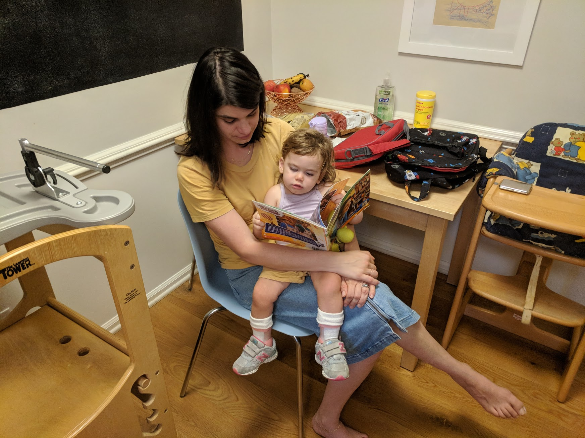

Finally, Auri struggles to sit up straight or move things around in her hands; but I think she's developing a bit more coordination. You can see her sitting forward without shoulder straps or a tray and watch her trying to spin and rotate Natalie's phone with her hands in bed.

* [Video: Sitting forward](https://photos.app.goo.gl/prCsP3xifiWYxwr28)
* [Video: Rotating phone](https://photos.app.goo.gl/7sd9i1KEyoPi3Hue7)

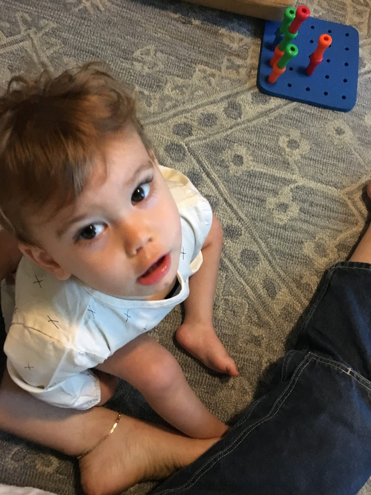

Auri has also been trying to tell jokes and be surprisingly silly recently. It's an obvious sign to us that she's all there mentally. She might need a little development and maturation of her humor, but here's a sense of what she's been doing. Sitting on the porch with Natalie during the day, Auri was asked "where's Lennox?" Natalie was trying to get her to practice new sign language, "school" and "work"; and Auri answered (with her hands), "work." "Do you mean school?" Natalie asked. Auri shook her head no, "work. work. work. work." "Lennox is at work?" Natalie questioned, and Auri broke into a huge giggle. "Noooooo;" she was just being silly and getting a kick out of herself. This morning, while I was feeding her breakfast, I was engaging this dancing, spooky halloween tree toy my mom gave us. Auri liked the song it sang but I turned it around because she was a little nervous about the moving face. We kept playing the song while she ate, and at one point I asked her if she wanted me to play it again. "No. No. No." she kept shaking her head and muttering. "You don't want me to play it?" "No." "Are you kidding?" And, then she broke into laughter, "yes." She was kidding and thrilled with herself at the misdirection.

We're trying to get an evaluation by the neuropsychology group soon to figure out the exact extent of Auri's developmental delays. I think they usually do this for children with autism or behavioral issues, but they can evaluate her mentally, physically, emotionally, etc. I had to fill out a big questionnaire that was mostly irrelevant for her age, but I did this word list where I circled the words that she _uses_ (not just understands). It's complicated because a lot of her noises and signs are far from complete or recognizable, but I circled those that she tries to use and that she connects correctly. Her therapists often comment about how smart she is, which is a welcome observation. If she's going to have difficulty speaking, we feel confident that it won't be for lack of understanding.

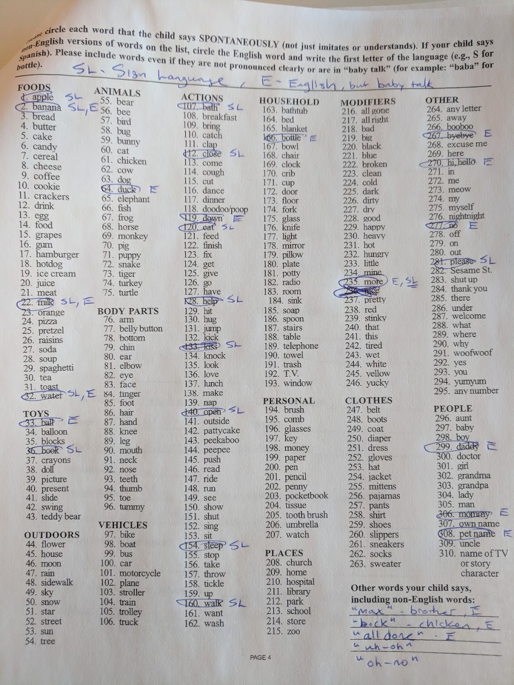

---

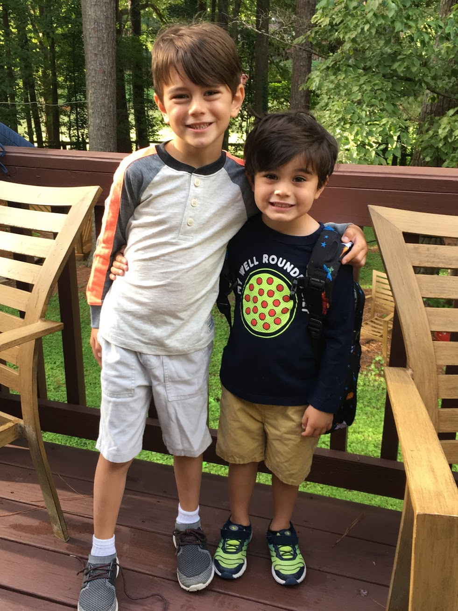

I don't feel like I have it in me this month to talk enough about Max and Lennox. I recently took Max to an ENT for the third time this year to follow up about an enlarged lymph node in his neck. After finding out he's dropped to the 5th percentile in weight over the course of a year, I've been more than stressed. I'm assured that there's nothing concerning about the lymph node and that there are other explanations for his poor weight gain. It's possible that he and Lennox have been experiencing their own kind of stress. Which brings me to Lennox, my clever and courageous child happens to be my most headstrong. He started elementary school recently, and I'm glad that he's enjoying it so much. I was afraid it would be another source of conflict because we seem to already have so many. I think it's obvious from the content of this blog that they don't get enough attention. Auri still commands the vast majority of my waking thoughts, but I'm working on it.

* [Video: Max and Lennox playing outside](https://photos.app.goo.gl/UcMJNMACkf1VBt449). Make sure to check out Lennox's "wobbly wobbly dance" at 2:10.

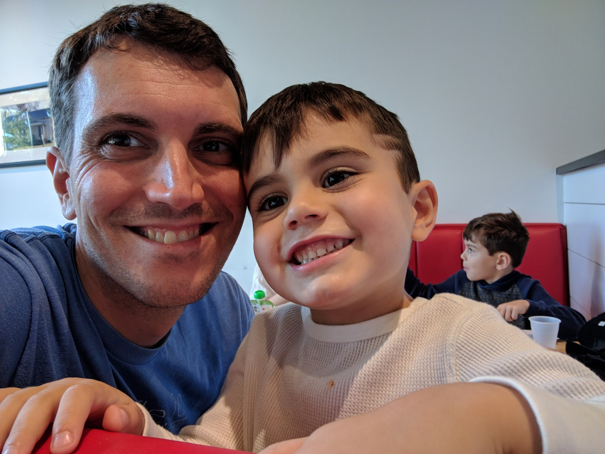

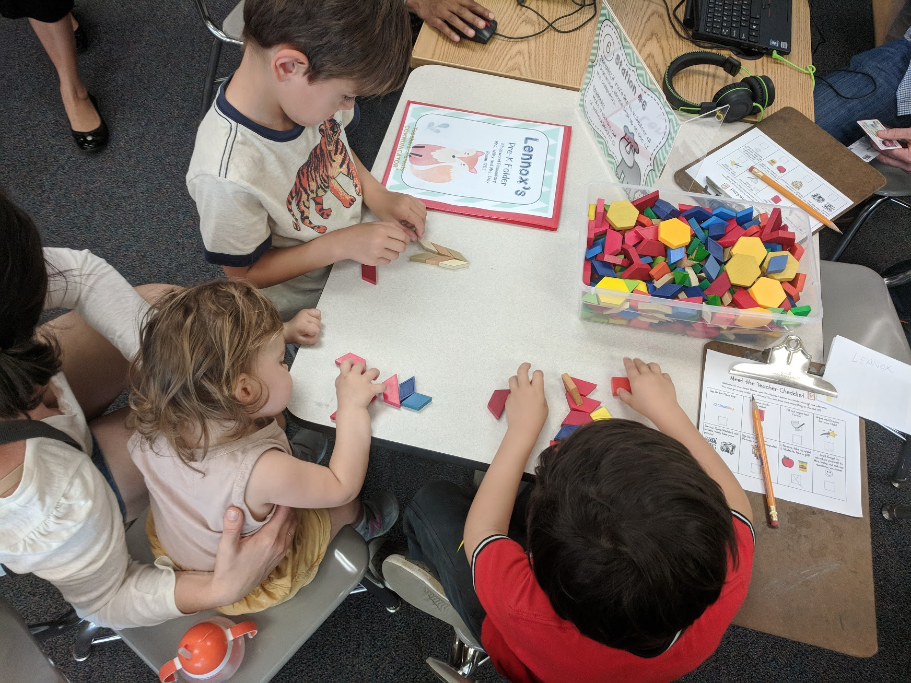

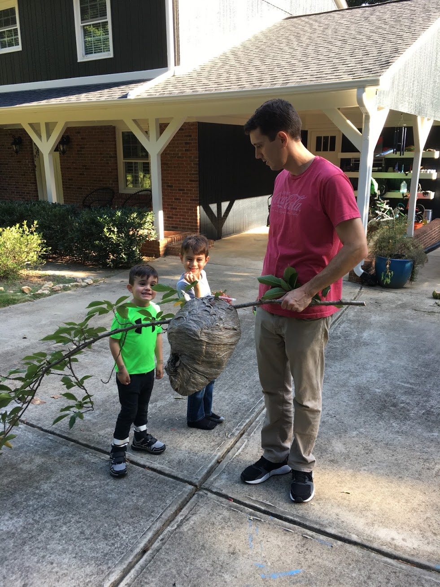
