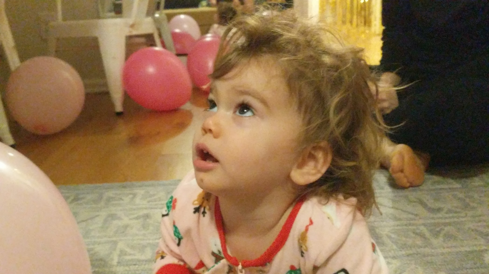
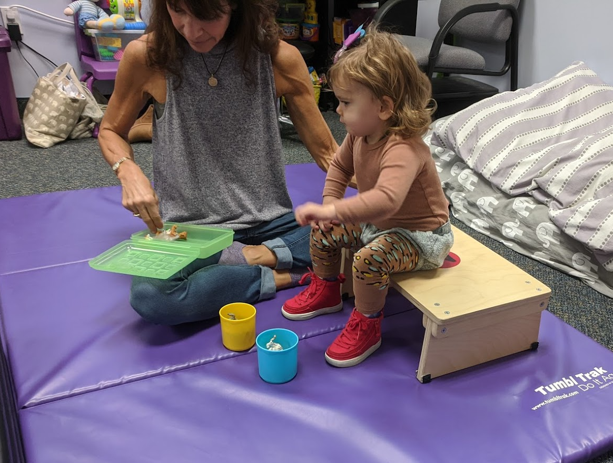

We're excitedly celebrating Aurelia's second birthday today, and we trust that the years to come will be kinder than what has passed. We turn the page on _One_, but we find an empty book and an uncertain future. Her unwritten story will be unique and full of joy and accomplishments, and I can't wait to read it. Auri's already [rolling over](https://photos.app.goo.gl/Rd4A629fRqjSeHkc8), [making silly faces](https://photos.app.goo.gl/feHNKGQZMejpmvTLA), and [feeding herself](https://photos.app.goo.gl/eZmPhG5ihmuGwTgk8). She's the kind of child that proudly writes her own narrative and defies her limitations. We're thrilled for this terrific two!

