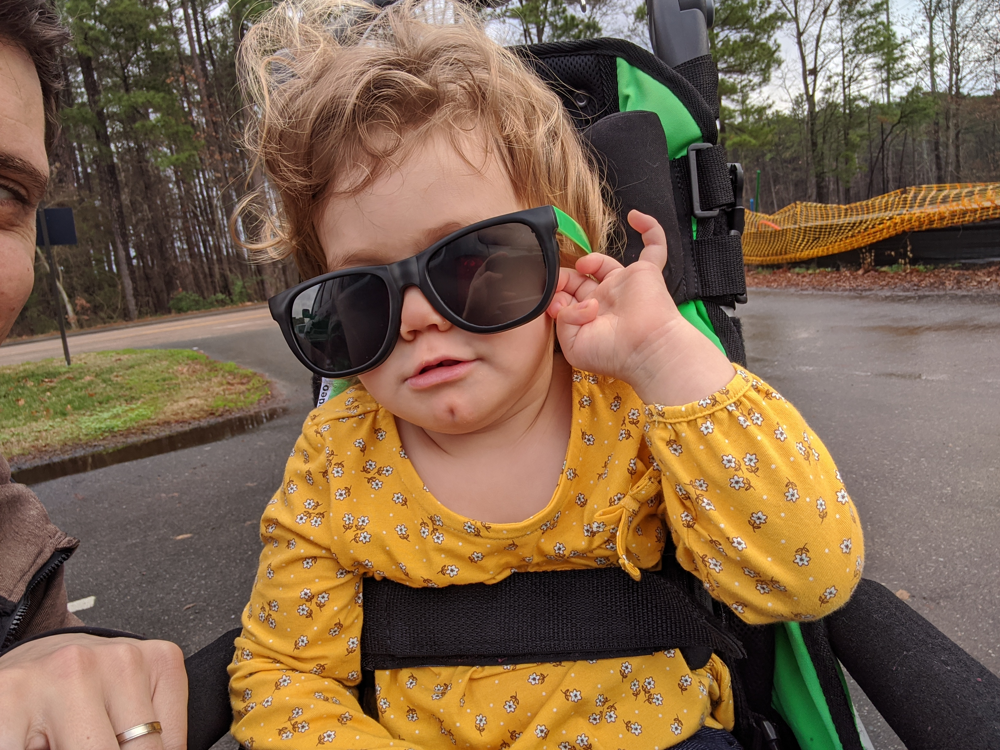
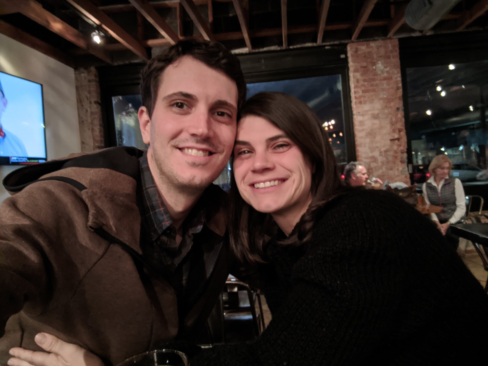

We made a mistake yesterday, a small one that won't have any real consequences; but it has me thinking about the pressure we've put ourselves under over the last 12 months. We're still eagerly anticipating a stem cell therapy for Auri this year, and, in order to measure its effects, Auri will needs baseline and post-treatment MRIs of her brain. We expect FDA approval soon. Unfortunately, we had to reschedule the baseline MRI in December due to the illness I previously wrote about and yesterday because we let Auri drink an ounce of apple juice 30 minutes after the cutoff time. So, to the mistake and consequences. The mistake seems so minor an innocent. We focused on the need to stop eating many hours beforehand, but failed to internalize the stop time for fluids. The consequence may be a delay in this therapy that we have hopes for. The odds seem high that she'll be sick again in two weeks when we retry and that we'll have to reschedule and delay again. We have no idea if any of this will be of consequence, but we're both really angry at ourselves for the mistake. In this and in other ways, Natalie and I place ourselves under an extreme amount of pressure to maximize Auri's therapy and recovery. And, in this and in other ways, we have little to no understanding of how consequential our efforts will be. The pressure has resulted in, for me at least, an emotional bankruptcy that requires a restructuring. Out of necessity, I'm forced to start adjusting how I think about Auri and her future. The bottom line is that Auri has been remarkably stable and consistent. She's developing; not as quickly as we had hoped, but straightforwardly like a child with cerebral palsy of similar severity. This year will have to be different for us, in that we need to stop sprinting and start training for the marathon. We're raising a child with disabilities, and we'll need to develop more endurance to maintain a happy and healthy family.

## Updates

The past few weeks have been a little tricky but everything has been mostly good since my last big update in October. Since then, Auri started rolling and army crawling (if we force her to). In November, she started showing more strength and ability in her gait trainer. Through all of this, she's communicating more verbally. She still has significantly delayed and impaired speech, but she's been using new words and putting new sounds together. She has graced us with new words like "Elmo," "let it go," "walk," "door," "floor," "knock knock," "Olaf," "uh huh" (for yes). She works hard at finding ways to ask for what she wants, and I'm happy to see her getting better at it.

Unfortunately, we wrapped up the year in a bit of distress. On Christmas, Natalie and I sent our boys alone with my mom because we had to miss dinner. Auri had a terrible cough that came on after getting past an unrelated, back to back febrile illness. It had really upsetting echoes of how this all began last year and came literally on the same dates. I was a real party pooper on New Year's Eve, but I was just too drained to enjoy myself. The next day we moved to our temporary home (I'll explain later) after struggling to pack up our house in time, and by the end of the week I found another large tumor on our dog Misha. It was removed, thankfully benign; but it set the tone for the year. A few days later I had a surprise birthday party for Natalie, found that Auri's front teeth are loosening; and the carousel ride continued. We're also fighting insurance limits and denials for the large number of physical and occupational therapy appointments we maintain, floating a lot of bills until we know what to do. I have a lot more to say about that now that we're big spenders in the health care system, but I'll keep it short. To hell with it all.

## Recap of the Last 12 Months
It has been about 12 months now, since our lives changed. The really acute, terrifying events of last year occurred between December 2018 and February 2019. That period was traumatizing, and it has had lasting and serious effects on our emotional well being (something I constantly reflect on). The heavy stuff went as follows:

- October 2018, we thought Auri might have an orthopedic problem with her ankle.
- December 2018, Auri never really recovered from an extended illness at Christmas time. We began to worry. She was tired and slow.
- January 3rd, 2018, on her birthday, Natalie took Auri to the pediatrician who decided to call Duke Neurology. They suggested we bring her to the emergency room rather than wait for an out-patient consultation.
- January 7th-8th 2019, Auri had extensive workup at the hospital, including an MRI that suggested a leukodystrophy. The vast majority of these diseases are terminal, and it was my understanding that it would take her life within the year. And, to make matters worse, the inheritance of these diseases put the odds of Max or Lennox having the same close to 50%.
- January 23rd 2019, the last day that Auri crawled on her own.
- January 24th 2019, we received a diagnosis from genetic testing and talked with Auri's neurologist about the lack of treatment options. There was some suggestion in the literature that a particular drug could be helpful, but it wasn't well documented and there wasn't an open clinical trial to join. The literature also gave the impression that, with luck, Auri's regression might stop without taking her life early, although she would be "devastatingly" disabled.
- February 7th 2019, we were told that the drug wasn't an option and that we would have to simply hope for the best.
- February 8th 2019, I freaked the fuck out after a scary week and a particularly bad night of Auri not sleeping, crying all the time, and choking while eating and drinking. I contacted everyone I could and starting making demands. I labored over my words and writing, thinking that I would get only one e-mail or call, one shot at making it happen.
- February 14th 2019, day one of her drug therapy 😀.
- March 2019 2019, we travelled to Philadelphia where they've been doing clinical trials. We couldn't do more than guess based on their experiences, but I left with the impression that this therapy could work.

Frankly, after all that, it's just been a series of over reactions and panic. We've been terrified by every cold, cough, and fever. We've scrutinized every movement, changes in Auri's strength, and all the little details inherent in her treatment and trajectory. After starting the drug, Auri began babbling again almost immediately, she began sleeping better, and she more than made up for the weight she had lost. Where in February she had zero strength when carried, after the drug she began to hold herself upright. We observed a significant, immediate rebound in the first weeks followed by a slower development more natural for someone with disabilities. I've often answered questions about how Auri's doing with, "she's doing much better than we are." Everyone has been quick to remind me that she seems bigger, stronger, and more mature with every week and month. You've all been right. We (or maybe just I) have been living most of the year with our heads and hearts stuck in the above.

## The Present and the Coming Year

Auri has grown and matured considerably since March. She's no longer a baby and pretty clear about what she wants. She loves to listen to music, especially songs from the Frozen movies. She has Elmo, Olaf, Anna, and Elsa dolls that have to go everywhere with her. She's _always_ asking to walk and loves to explore every room and corner. [She loves to dip her french fries in ketchup](https://photos.app.goo.gl/UHfYJynDqenABfFSA). She's a funny little girl, and we're able to do just about everything together.

### Play and Exercise Are One and the Same

Playing looks a lot like [rolling around and singing songs](https://photos.app.goo.gl/njMPgxqnsfmb1nFE6) and constant [exercise](https://photos.app.goo.gl/DEBycDe71ZN5U3KH9). At Christmas, [Auri practiced hard in her gait trainer](https://photos.app.goo.gl/mnwFMATLRUEf92ux7). She wants to walk constantly, which requires us to hold her hands for support (I'm hoping to get her somewhat independent in her gait trainer soon, because our backs are killing us). She's come a long way since the summer. I remember telling a physical therapist then how proud I was that Auri walked (with my support) "at least 20 steps around the playground." At the time, we were still holding most of her weight with our hands under her armpits. Now we hold her hands or wrists. She still needs a lot of support and correction, but she's holding herself and carrying all of her weight in her legs. We can walk around the house or playground for an hour, easily over 100 steps though I've never counted by how much. In the past month, we all (including the professionals) have noticed smoother stepping. At times, Auri's sort of holding it all together a little better, leaning on us less and taking more natural steps. She has a long way to go, but she still seems determined to get there.

Many days we'd love to just plop her in a chair in front of the television, but who are we to deprive her? She's a two year old that wants to explore, and we feel like it's our responsibility to say yes as much as possible. She's dependent on us, and we're determined to give her every opportunity. The therapists all say, "life is the best therapy;" and a physiatrist recently told me that being on her feet is better than stretching at helping Auri avoid muscle and joint problems associated with disability. More than once I've been given the soft advice to take it easy or give ourselves a break. We simply can't. Everyone probably feels like they'd do anything for their children, but we've been called to task. Natalie and I try to tag in and out as best as possible, but we still burn out. Thank you to everyone that assists with other things in our lives because it helps us maintain enough energy to keep this up. This is just something I'm not yet ready to adjust or give up on.

### Home Remodel

Right now we're living at my mother's house while our house gets destroyed. For years we've delayed home renovations due to unexpected events and expenses. It feels a little like it doesn't matter anymore. The future isn't going to look anything like I thought it would, so we're going to try and focus as much as possible on the present. We couldn't really afford to build Auri an accessible addition, so we're doing what we can to open the space up for her whether she's in a walker or a wheel chair. Years from now we may have to revisit all this if it's too difficult and we're carrying her up and down the stairs, but we're going to buy some time with some added conveniences. We expect to be back in our home before the spring.

### Health and Well Being

Our family has greatly improved in this regard. Max and Lennox seem to be a bit happier, and Natalie and I have been more present and patient. Max and Lennox have demonstrated small but significant adjustments, like playing with Auri and generally being more helpful. I think they're happier because Natalie and I have been more engaged. There's a positive feedback loop, too. The more fun we have together, the more patient we all are with each other. That patience is what has made the difference. Everyone here was in a lot of pain last year.

As for Natalie and I, we're a bit up and down and in and out. I find myself benefiting a great deal from regular appointments with a counselor. It might sound a little silly, but it's a big deal to me and the family that I was able to start cooking again. We still fall behind on a lot of chores, but less and less its because of outright depression. Although we're both oscillating, we rarely find ourselves struggling at the same time. More likely, one of us picks up the slack for the other. The self-pity has been fading away, and the fatigue (emotional and physical) has been easier to overcome. Still, we're overdue for a date night.

I don't think that Natalie would be forthcoming about this with many, but it's all true. I don't feel particularly vulnerable about sharing. Rather, I hope that my honesty brings us (and others) some understanding or empathy. This trauma that we've experienced and the difficulty that lies ahead is very isolating. We're wounded, in a way, and asking for help sometimes feels like debasing ourselves further. I don't really want to ask anybody for anything, and I'm really grateful when I don't have to.

### The Window of Opportunity

At the end of April, Natalie will be taking Auri to an intensive, 3-week, many hour a day physical therapy center in Boston. On the advice of our new physiatrist, I'm going to pursue insurance approval for a similar inpatient rehabilitation program given that it appears Auri has suffered a one time neurological injury. Maybe we can pack two of these into this year. I have a sense that the window of opportunity has been closing, and, while it will never close entirely, the speed at which Auri develops and the ultimate limits she'll encounter will be largely defined within the first two years of her recovery. For this reason, I've continued to be a bit obsessive about learning and understanding everything I can. It's impossible for me to know whether any of it will make a difference, but now is the time that it will count the most. It's great, then, that we have plans this year and a doctor working on something unprecedented. While I don't believe we can accelerate Auri's development much, I hope that we can keep it from slowing down for as long as possible. For now, we have to emphasize her trunk strength and posture. Everything that comes next depends on her ability to stabilize herself, and, in my assessment, she's been toeing the line. We'll continue to do everything we can to help her cross it and keep going.

## What Lies Ahead

While this is very difficult to predict, I have much more knowledge than I had for most of the last year. It's clear that Auri will be challenged by disability. Less clear is whether her disease will present new or serious issues. I believe that we'll be using cerebral palsy as a model for her development and care, focusing on her disabilities and function more than her disease. I can compare Auri to the development curves for children with CP, and, while I don't like what I see, it's not unreasonable to think she could outperform them. Auri had a developmental head start, and her injury is still fresh; she may be given more time to keep going. Regardless, I expect her to be in need of a wheel chair and special education. The degree to which she'll be able to communicate or manage independence is what remains unclear. She's smart, though; and I expect her to make the most of it in whatever challenges she's facing.

This is all still a very good and a successful outcome. In the most profound sense, my pleas in January were granted; and I recognize how fortunate Auri is now. That sentiment will feel like a load of bullshit to her when she gets older, but she won't have held a sick and prostrate infant in her arms.

Auri's now favorite song is the best way I can think to describe my changing perspective on what has passed and what lies ahead. Listen to it on repeat, because it makes me laugh a little harder every time I hear it. [One day, when I'm old and wise, I'll think back and realize that these were all completely normal events!](https://www.youtube.com/watch?v=MJV4vjlziNI)
