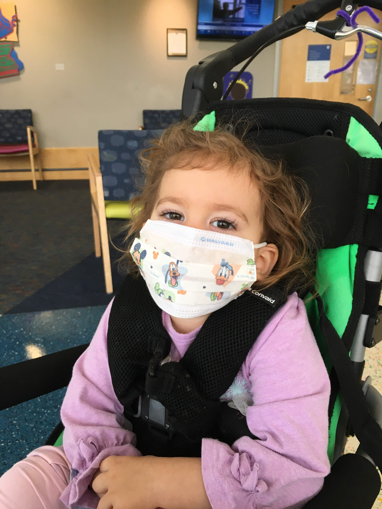
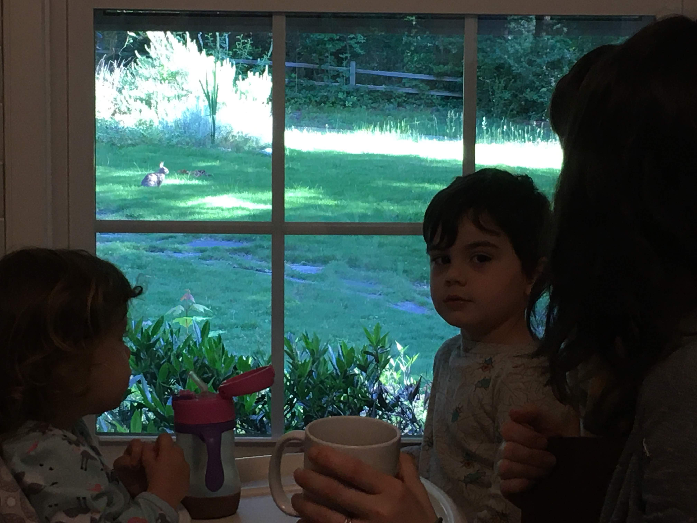
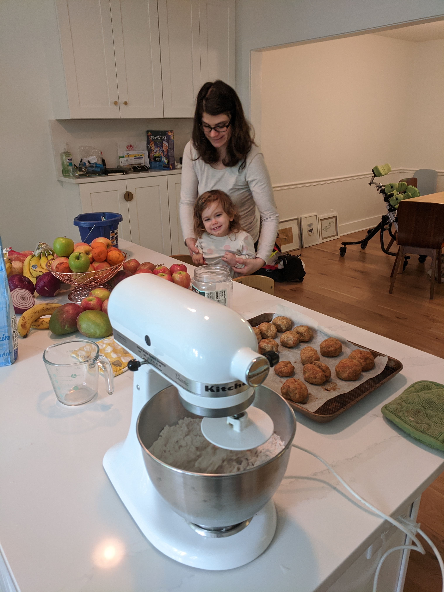
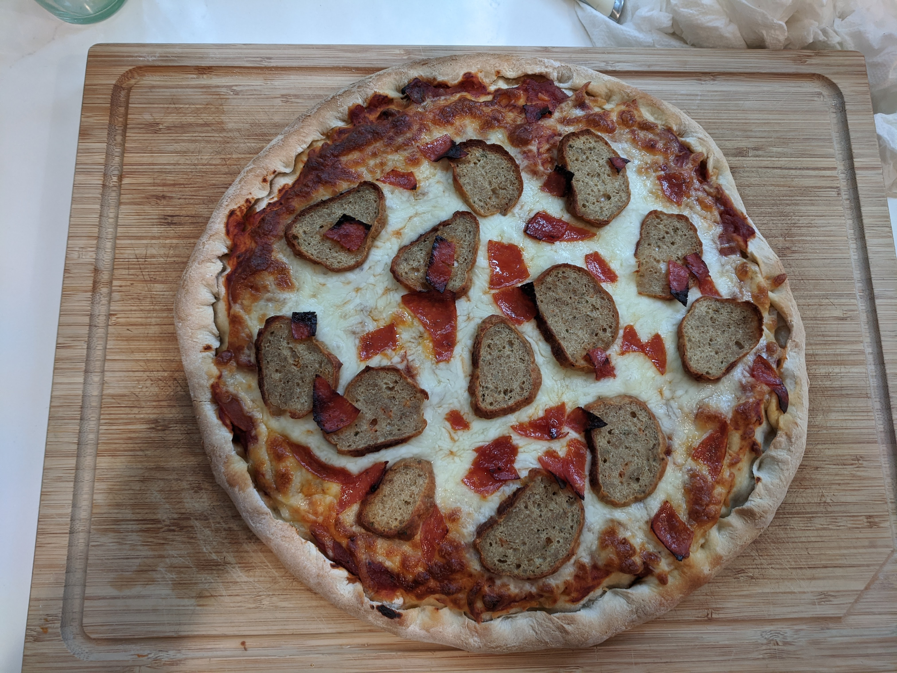
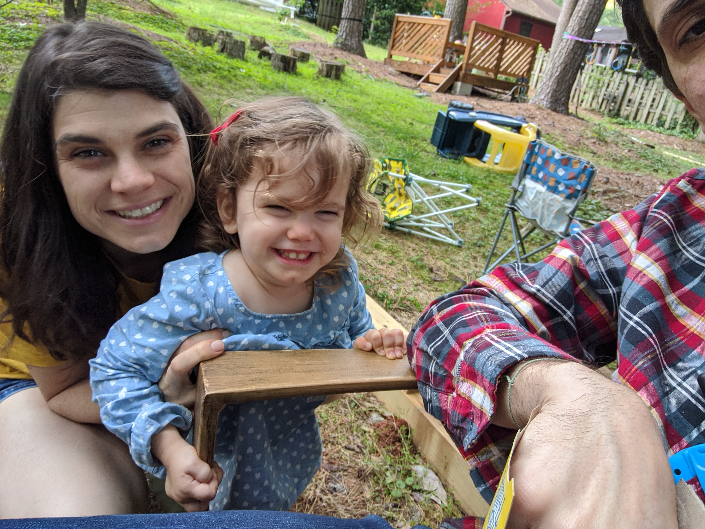
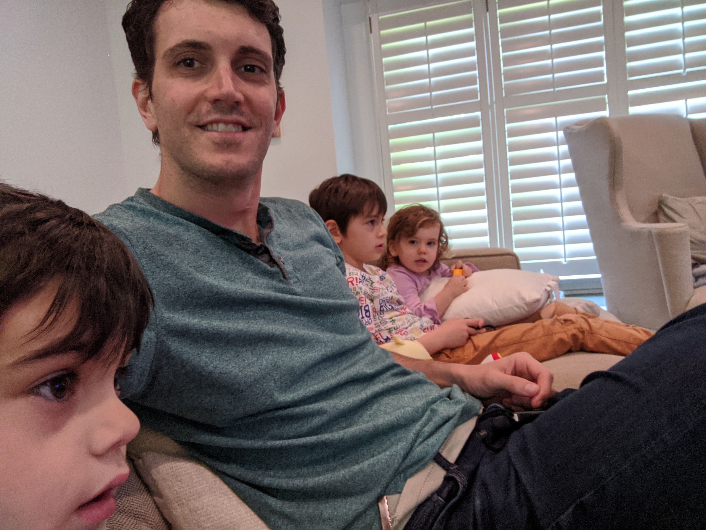
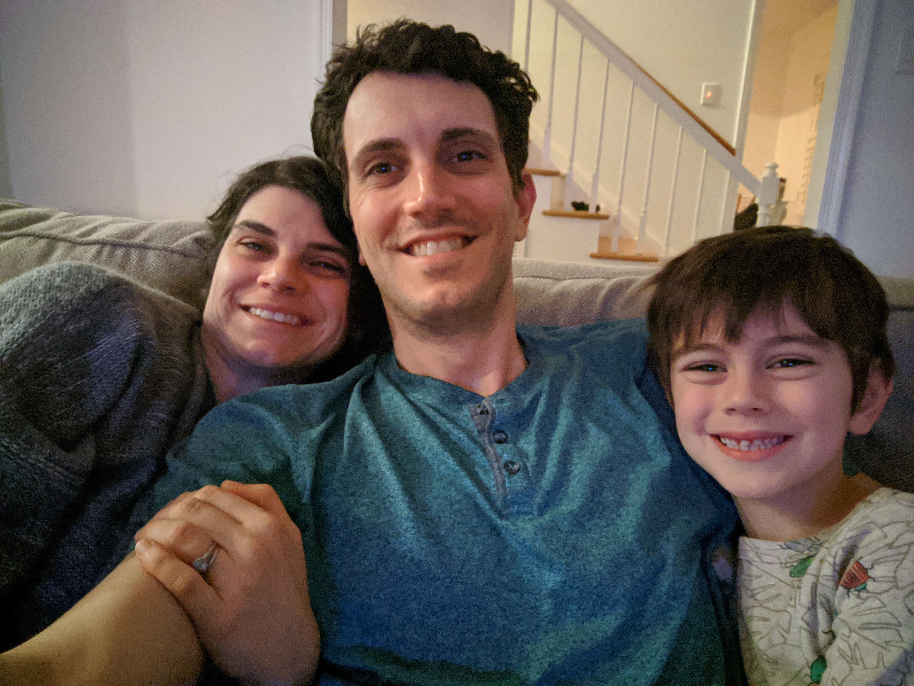
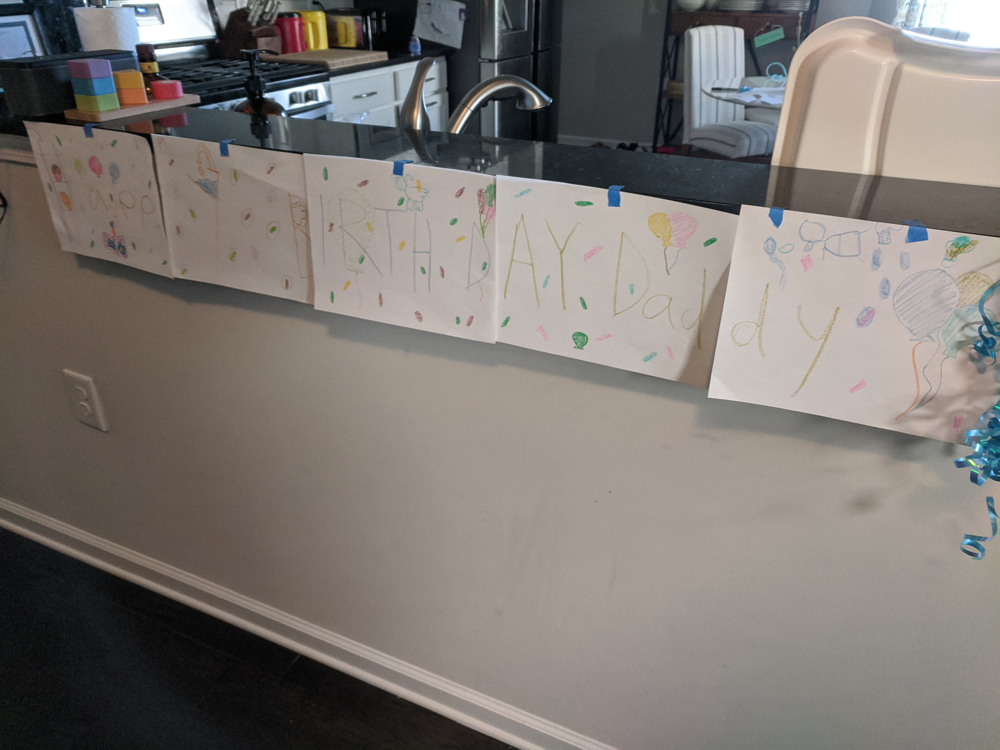
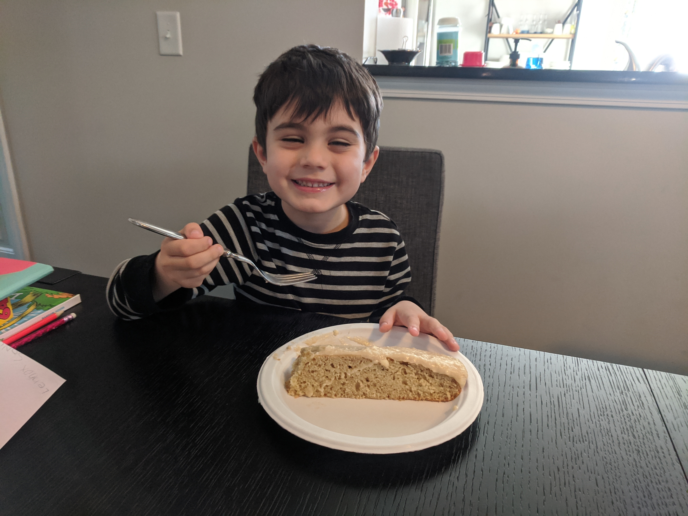
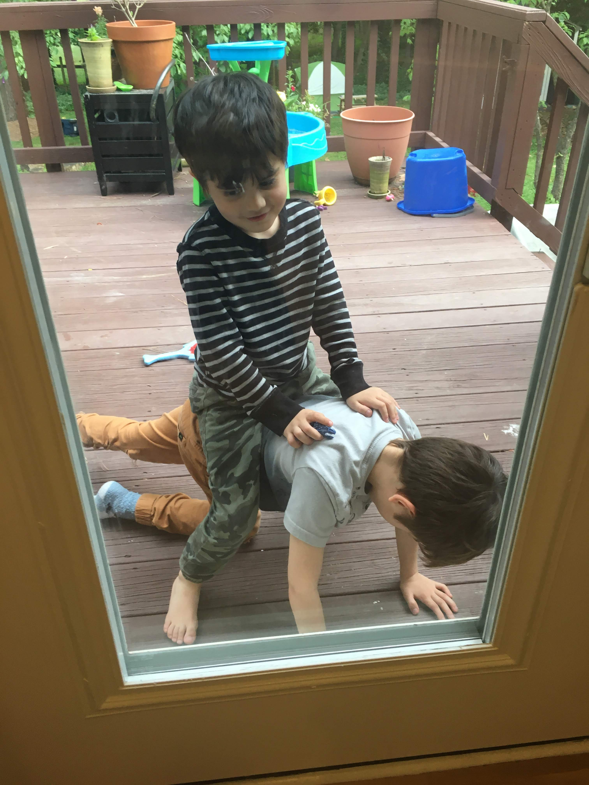

There's no place like home, which is great because we're back in ours and going to be spending a lot of time here. We've made the decision to keep our isolation going for as long as it takes or as long as we're emotionally and mentally able. I wish there was some acceptable middle ground, but I'm afraid that there's no way for us to calculate the risk of going out. Last year we almost lost a child, and, having spent many weeks without hope, I feel like it's our responsibility to protect what fortune granted. If schools re-open in the Fall, our boys will remain at home. We're picking up groceries once a month. And, we're holding all therapies over video. This adds additional burden to our already tired and stressed family, but I'm confident that we're all willing and able to do this for each other. At the moment, I'm actually writing from isolation in my house. I developed a cough, headache, and some symptoms after we were forced to let workers back in, despite having taken precautions. Thankfully, I started keeping my distance from Auri more than a few days ago when I noticed something felt off, but the persistent cough and low fever yesterday has pushed me over the edge and into in-home quarantine. This immediate situation feels outrageous, but it underscores how little it would take to bring down our house of cards. I recently read that people who have suffered trauma maintain anxiety to protect themselves from freaking out when something else goes wrong. That's my superpower! I had our fridge, freezer, and attic stocked before the first coronavirus case in North Carolina. We were primed for this last year and have had a lot of unique practice with stress. We'll be alright. We won't let this break us.

So, we're back home, spending time outside, building things, and enjoying our space and nature again. We got caught with our pants down trying to quarantine at my mother's house. We didn't have the outdoor space that we all missed so much. Now we're spying on bunnies during breakfast (who ate up my garden by the way), and today I got to watch my neighbors try and catch an escaped chicken. Enjoying the fresh air, a couple of weeks ago we were [working together to finish our garden.](https://photos.app.goo.gl/QFScADX7cFHF1bpV7) Simply said, we're relieved to be here; and, if I had to lock-in for a couple of years, this is where I would want to be. We still have junk everywhere and can't find time or energy to deal with it, but it's our junk! [Here's the tour](https://photos.app.goo.gl/MhF2FD7z9Hr1M5X29). I feel validated that we've spent so much time learning how to be as self sufficient as possible. When our water heater blew a hose, I replaced it. When it started shorting because the crawlspace was flooded, I replaced a faulty circuit breaker and repaired the connections. We make our own bread, yogurt, pizza, pasta; and we cook a ton. We're already collecting black berries, growing fruits and vegetables, baking scones and pies, etc. We're well prepared for the coming year in that we have all the skills necessary to handle what might come up and to inject some fun and variety into our isolation.

Everybody wants to know about Auri, of course. I don't have anything significant to share. I really wish that she were able to get to more independence, but she still has a long road to travel. With more time and perspective, we're able to understand how insanely difficult it is to stand up, walk, or crawl when your brain can't quickly get the signals to your extremities. Auri's already able to do a lot with assistance, and now we're trying to practice on finding her own balance and adjustments. I rigged our old kid's tower with a Jolly Jumper so she can practice side stepping and doing [the Elmo slide](https://photos.app.goo.gl/QFScADX7cFHF1bpV7). She's showing us that's she's able to compensate and [make meaningful use of her hands and fingers](https://photos.app.goo.gl/8SEyVFuApvjknj6z7). She has a lot of difficulty still, but there's function and progress nonetheless. While she [plays with Snow White](https://photos.app.goo.gl/Y9HqHdsrmfxyw8dj8), you can see that she keeps her right arm planted firmly on the table. She's supporting her trunk, and her difficulty with holding herself steady and raising arms makes it hard for her to perform bimanual tasks. It all comes back to her core. If she can get it, a lot of other things will start to fall in place. Unfortunately, it's a neurological issue and not simply a matter of strength. We keep working, waiting, and hoping that it will continue to improve and come together. But hope is not a strategy, so we've stepped it up at home with physical therapy. We're doing a lot more [bench sitting and reaching](https://photos.app.goo.gl/YRxoBNSi6A56cMoX7), which, by the way, I don't think was really possible six months ago. We're also trying to make a habit of [walking with a broom](https://photos.app.goo.gl/g5mT4oE6tUZTf5sG7). The video is a month old, and she's getting a little better at it already. Auri has been walking with our hands well enough for a long time, but we hold her wrists and help her balance and weight shift. The broom really turns the difficulty up many fold. All of this is aimed at making it possible for her to independently use a walker or to transfer herself in and out of a wheelchair independently. And even when we're playing, we're tricking her into therapy, such as [at-home hippotherapy](https://photos.app.goo.gl/Vp54bYX79NfunoES9). With the exception of the occasional day of parental burn out, we're keeping this up day in, day out. To give credit where it's due, __*Natalie*__ bears this burden almost entirely on her own and she does it with grace and strength.

In May, Natalie and I celebrated ten years of marriage watching Coraline (it reminds us of our engagement). We reflected on the whirlwind decade, of those we lost and gained. We wanted adventure when we were young, and we certainly found it. Since my last update, all of us boys have [celebrated birthdays](https://photos.app.goo.gl/KsaScArfuSA1oDQj9). 

We would have preferred to celebrate these days with all of you, but perhaps there was something prescient in Natalie's big party. In January we got to see a number of friends that time and circumstance have distanced us from. I'm happy that we had that opportunity because I'm seriously doubting that we ever return to pre-2019 normal. We're truly living in the land of Oz now, and I feel less and less able to relate to my old self. By rough count, I estimate we've taken our daughter to see the good witch Glinda at Duke Children's Hospital over thirty times in the last year and a half, with Auri screaming each visit while giving a vials of blood. Along the way we've had our intelligence, compassion, and courage tested. Our journey leads us somewhere new; we know that the Emerald City is a fantasy, the wizard would have nothing to offer us. But though we're already home, we still follow the yellow brick road. It's just the five of us on this journey now, and there's no place like home because home is wherever we're together.