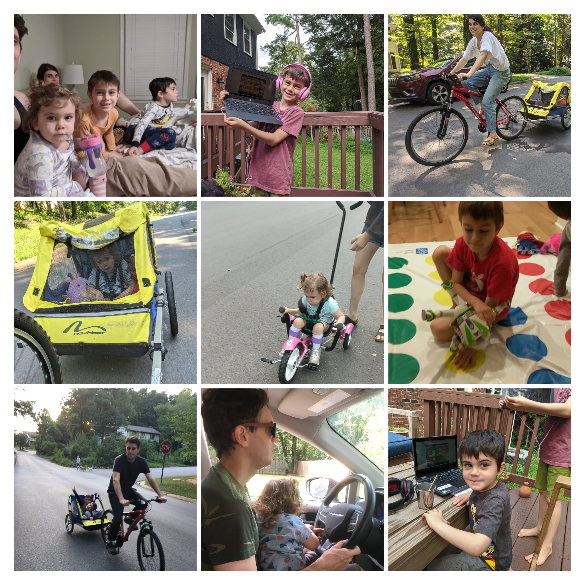
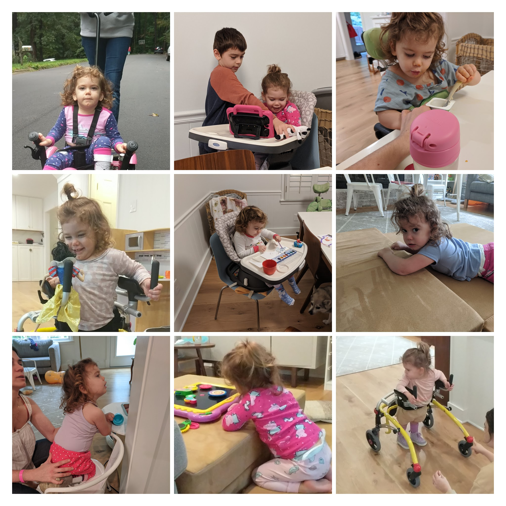
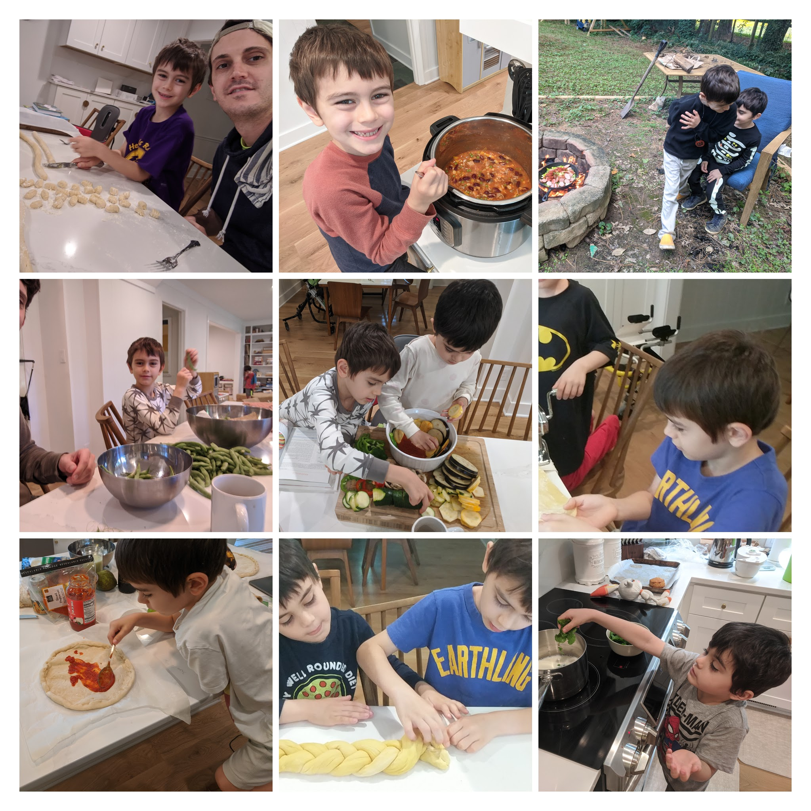
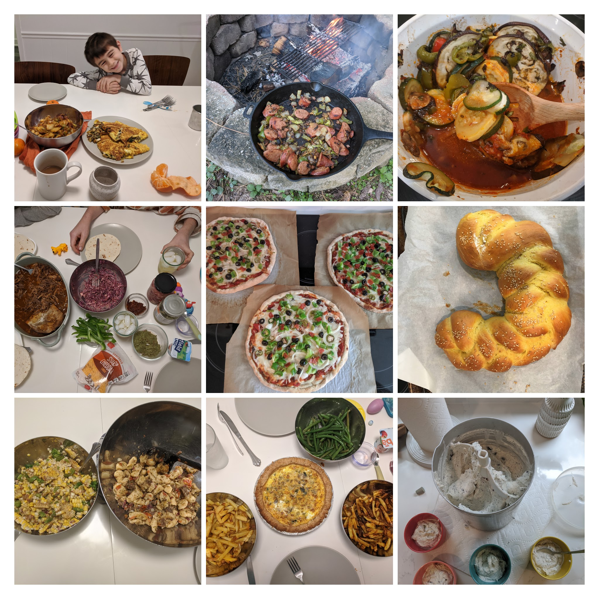
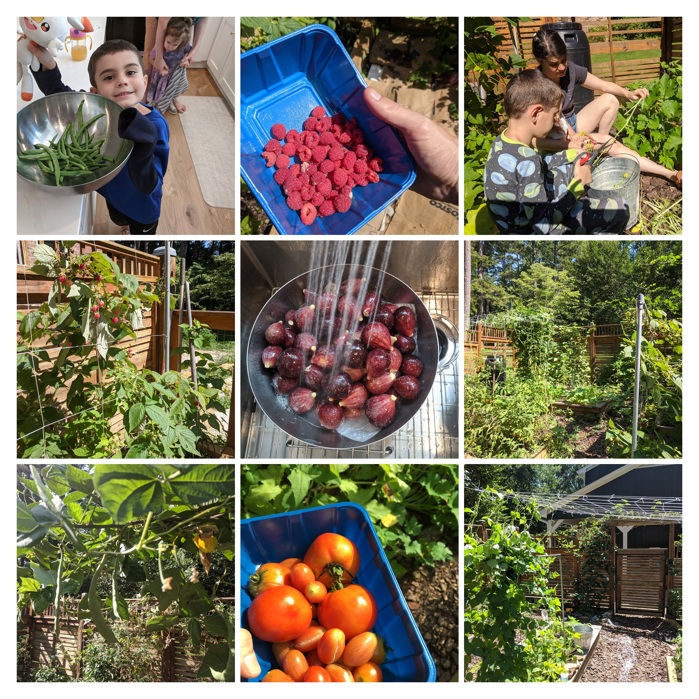
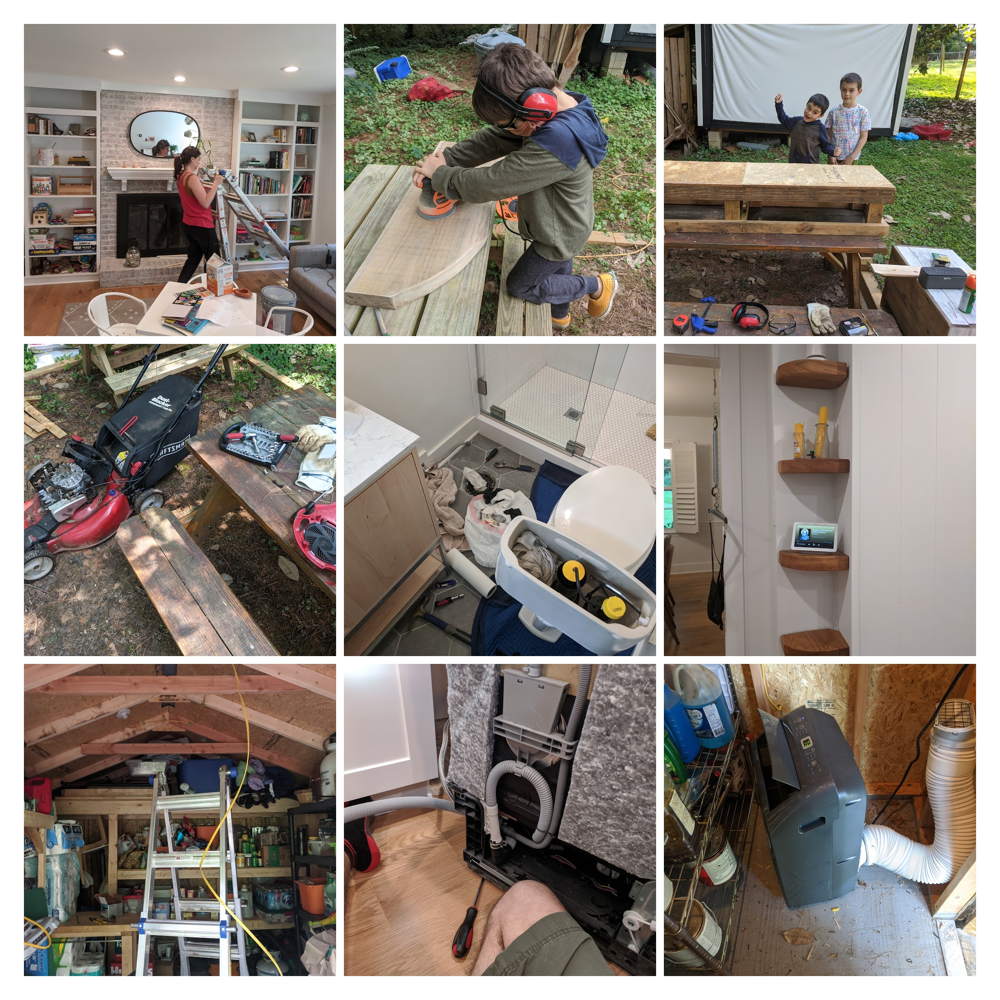
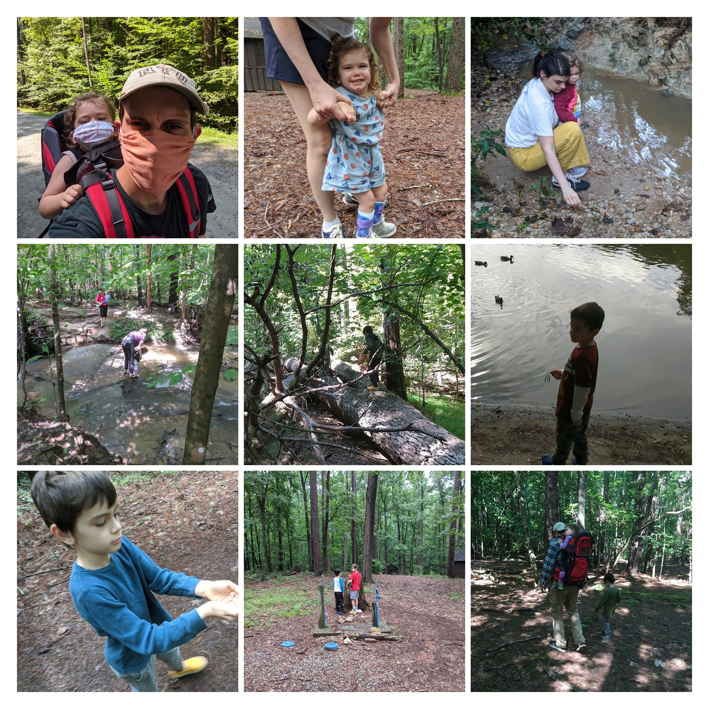

Quite a few times recently, I've been reminded that many of our readers don't follow Natalie or I on Facebook or Instagram. I've begun to share a lot more regularly across those platforms. If you follow me on Instagram (IG [@pcw216](https://www.instagram.com/pcw216/)) you can basically watch us in real time. I'm also trying something new with photo collages, and, while perusing our photos of the last few months, I'm amazed at how busy we've been. Most of these pictures were taken in the last month, where we've gone one regular hikes, bike rides, and cooked and baked a ton. I won't pretend like everything has been perfect, but I'm proud of our family and how active we are together.

Starting on a serious note, I've recognized something I've been doing lately that I haven't been too proud of. It's a sign, I believe, that I carry a good deal of resentment about our heavy responsibilities. It has been driving me crazy to hear people complain about how hard it is to be at home with the kids or to adjust their lives to the pandemic. I have this compulsion to remind everyone how we had just a little bit of practice last year and how we have been able to take this in stride. While it's mostly true, I'm probably only saying it to make myself feel better and (possibly) to make you be quiet. I really don't want to hear you complain about it. Yes, I have some sympathy for everyone because I know what it's like to have your life upended and control taken away. But, there's so much selfishness on display right now that it makes me angry. If you don't need to have your kids in daycare, if you don't need to go shopping right now, if you don't feel the need to wear a mask; sit your ass at home. Spend more time with your kids, read a book, learn to cook for yourself. You're screwing people that have to work, that are _forced_ into it by the lack of options our society gives them. You're screwing people that have medical conditions, vulnerabilities. Stop going to the gym you selfish bastards. Okay, it's out and I feel better. I don't know how I would behave if our circumstances were different, but I'd probably take the opportunity to reflect on my life and choices. If you're complaining about more time at home with your family, maybe you've made the wrong ones?

I, however, feel fortunate and fulfilled in this moment. So many accidents and so much happenstance in the moments that have led to it have been counterbalanced by intention, love, and hard work. Natalie and I have seized opportunities and challenged ourselves for years to stay present and focused on our core values. I'm probably going to head inside soon and have a mini mental breakdown trying to transition between work and family, but I _never_ doubt whether I want to be in there. There's never been a challenge more important than building a happy home and setting a positive example for our children. After all, home where one starts from. It shapes who you become and points you in the direction you're headed.

Aurelia, my love, has grown into quite the plucky and clever little child. Without her limitations, she would be on fire, dazzling. Her time will come, perhaps just a bit later than for the rest of us. With her limitations, she amazes and astounds her helpers with her intelligence and perseverance. When she finds her voice, she will be a person to be listened to and understood. I will put nothing past her. For that reason, we don't want to take any opportunity away from her either. A few weeks ago we resumed some in-person physical therapy, this time with therapists at Duke Children's Hospital. After a visit in June to their multidisciplinary CP clinic, we decided that we need to get Auri back to work. My hope is that having all her care and activities in the same system will give her a boost. With a new gait trainer at home, we brought Auri to a new physical therapist that had communicated a lot of excitement and desire to work with her. Recently, Auri has graduated to a more complicated and difficult walker, more challenging foot/ankle orthotic, and continues to slowly demonstrate increased strength and ability. It's difficult; there are rarely breakthroughs. Rather, she sits upright a little longer, maybe takes some straighter steps, or _feels_ stronger (though I can't explain it). She's still moving forward physically and getting chattier day by day.

Max loves to cook. I've been able to involve him more regularly, and he finds as much fulfillment in the work as I do. His commitment to completing a task wavers like it should at seven, but he's generally helpful and grateful to work with me. It's fun to watch both Max and Lennox learn from this process. They're clearly gathering the value of hard work and making things for yourself, but (more importantly) they're learning the value of others' work. By making so much from scratch, we're teaching them to appreciate the value of anothers' time and product. It doesn't hurt that we want for nothing in isolation.

Lennox does not like to eat. Even though we have all of this amazing food to enjoy! We're churning out amazing pizzas, quiche, **ratatoullie**, soups, bread, tacos, you name it! All homemade! He'd rather have peanut butter crackers.  Fortunately, what Lennox lacks Natalie has in spades. I cook for her, mostly. And she's happy 😀. She's been rolling out the sourdough bread, and we're feeling heavier with joyful satisfaction.

Our garden was a major feature of the summer. At the height of it all, we scooped up tomatoes, cucumbers, peppers, green beans, blackberries, and raspberries with gusto. We harvested peaches, figs, and now pomegranates from our trees. Hopefully we'll get more than a single pear from our juvenile apple and pear next year, but we're reaping the fruits (literally) of previous years' labor. Now that the garden has calmed down in the colder weather, I really miss it. I've made a goal for myself to expand it this fall/winter, and I'm shooting to build a little farm stand or join the Cary farmer's market in the Spring. I made a list of the food, relishes, snacks and so on that we can sell alongside some fresh produce. I think it will be fun and that our children will enjoy it.

Things still need fixing, like three leaking toilets, a broken mower, a seized drill chuck, a dishwasher flood. Somehow I managed to also build a skateboard grind box for my neighbor, wire electricity in my shed, build some solid oak shelves and benches, and whatever other crazy stuff I came up with. We've been _busy_ this summer, just how I like it.

And, finally, we've resolved to become a camping family. We look at virtual school and remote work as an opportunity to become more mobile. There are quite a few steps to making this happen, but we want get a camper that we can travel with. For now, we've taken to hiking the parks or woods regularly. I purchased a hiking pack to trek with Auri, and we're getting out more. We still have to step off trails all while walking, but we feel alright about it. After my dad came for a visit, we relaxed a bit and got out of the house more. We even order takeout once a week 😉.

That's it. Take care of yourselves, and please go vote the cheeto, the turtle, and their enablers out of office.
