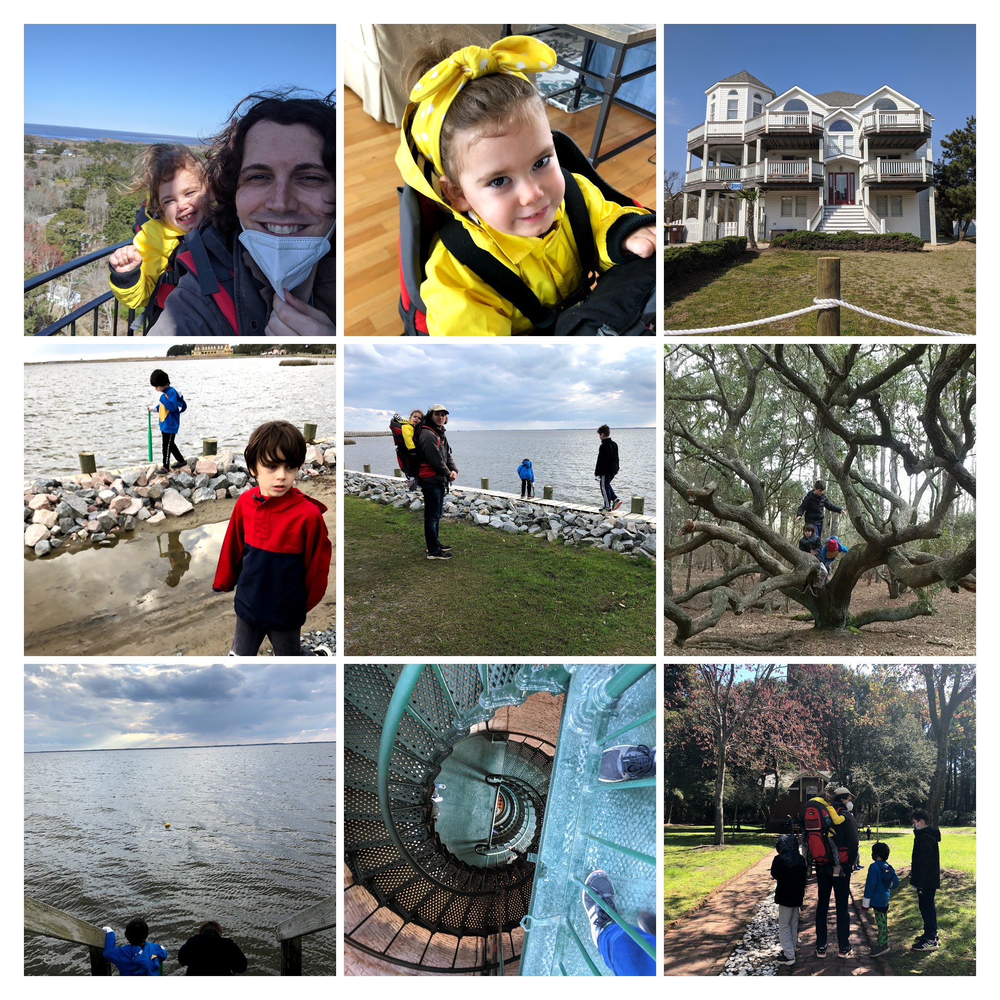

Although Auri commands a lot of our time and attention, it's important for me to highlight Lennox, Max, and some of our other activities. Spring has started, and we've been _really_ busy getting ready. Additionally, we found time to take a couple vacations, the first in a long time, back to back. Most importantly, though, today we celebrate Lennox's sixth birthday.

## A Big Boy With Big Personality

Lennox turns six today, and we're having a little pizza in the backyard with cousins and gradmas. For all that he's been put through as middle child, he has a deep and sincere ability to love. I imagine that it has been difficult for him, with all that his sister's need for attention and an anti-social pandemic has caused him. Still, he's terribly smart, enthusiastic, funny, and most likely of our children to shoot for the moon. He's at the most difficult age to process complicated situations and emotions, but I'm proud of his ability to stay flexible. Sometimes he needs a little extra attention, but it's deserved and usually capitalized on. He's a wonderful and lovable child.

## Beaching

Friends of ours were kind enough to invite us to the outer banks and to offer to isolate beforehand so that we could take a trip together. We stayed in Corolla for a few days, playing UNO, board games, etc. It was great to see the kids play together because they've been suffering the lack of socialization the most. The weather was a little chilly, but we took some walks on the beach, flew a fighter kite, and plopped into the hot tub most days. It was a great time.

## Camping

When we received word that Auri would actually be starting her research trial, I realized we weren't going to have another opportunity to go camping for awhile. It may have been a knee jerk reaction, but I rented an RV and forced everyone to visit Grandfather mountain with me. I mostly wanted to prove to Natalie that we _could_ do it, not that we _should_. Neither of us have any experience with this kind of thing, but it seems like an interesting way to travel. We expect our boys will be returning to in-person instruction next school year, but I'm officially a remote employee and can work from anywhere. We may have a unique opportunity while everyone is younger to road trip around the country and see the sights.

## Normalcy

Since Natalie and I completed vaccination in March, we've been able to find a little more normalcy. In all seriousness, neither of us had entered a building (with the exception of the children's hospital) for over a year. We would not have felt comfortable driving/traveling anywhere without the ability to deal with the unexpected. I can do just about anything now without worrying, and it has brought a much needed dose of normalcy into our lives. We're still living differently, with extra cautious; but we're finding ways to use our freedom to make more for the kids.

## Projects

In my February post I said I might try to build a treehouse. I built a treehouse. Once I mostly finished the green house and garden expansion, Natalie gave me the green light. Auri is getting a wheelchair ramp from the garden up into the treehouse, and it's surrounded by windows on all sides so we can keep an eye on the kids. We also remembered that above ground pools sold out last year so we decided to grab one early. I'm undecided about whether it's a good idea to run a zip line from the tree into the pool, but we're definitely going to add some features. Once we wrap everything up, we'll have the backyard I always wanted for the kids: fire pit, outdoor movie theater, tree house, pool, garden, swings, mud kitchen, slide. We're all suffering a bit for this work, I've developed arthritis and Natalie has had to pickup a lot of domestic responsibilities. But, I think it's going to be worth it. Auri will benefit greatly from an at home pool and the treehouse will serve as a private play space for the kids. Basically, I wanted to prepare in case we have to ride out another summer in isolation.

## Painting

I've noticed that Natalie has really stepped up her work, painting more and painting some things I really like. Check out her stuff. She has my respect because it's incredibly difficult to find time with so much going on here. She shoulders most if not all of the responsibility of caring for Auri, and I can assure you that it's as mentally and emotionally exhausting as it is physically. She's putting a lot of effort into this, and I know it brings her a lot of joy.

https://www.natalielovewinters.com/

https://www.instagram.com/nataliewinters__/

## Stem Cells

Fnally, stem cells. So far Auri has received two infusions, and it has gone well. The day after her first, Natalie and I noticed some extra energy and strength that we assumed was wishful thinking. But in the following couple of days it kept up and was noticed by therapists. The only explanation I can come up with is that it's improving the auto-immune or auto-inflammatory aspect of her disease. I didn't think she had a lot of disease activity, but she must have something chronic and rheumatic that this has helped her with. This is anecdotal and early, of course. Only time will tell if she's just having a good week or if this is something better. But it's a good start.

