For posterity, I've tried to write down and date everything that happened and led to diagnosing and treating Aurelia. This is a _long_, three or four part post, mostly for me and my family; but I've wondered if it would help others that have or have gone through something similar. Since January 7th, 2019, we've been through a whirlwind of events and emotions that I have found difficult to digest. There were so many little details that I've probably lost memory of, but I've tried my best to reconstruct the timeline and include my thought process through it all. During much of this, I distanced myself from my family, focusing on research and correspondence. I tried to stay ahead of what was unfolding as much as possible. I know that Natalie must have had a similar but entirely unique perspective.

---

## Act One

### Mostly Normal Development

I can't recall when it started, but Natalie and I have had concerns about Auri for a long time. I think we always felt sensitive about how different she developed from her brothers. If Max and Lennox had learned something early, Auri had learned it a month or two later. She always gained skills just in time, before it seemed prudent to have concerns. If we brought it up, somebody would remind us that "girls are just different." They might have been right. We'll never know. It's unclear whether she experienced disease related issues at an early age, and if she had, they weren't severe enough to notice. However, Natalie had directly voiced concerns about Auri's developmental to a friend as early as October.

### Something's Up - November 13th - December 22nd

However, something felt different around her first birthday. Auri had been pulling up, but not really scooting. She stood on one of her ankles funny, and Natalie and I discussed bringing it up at her one year checkup with the pediatrician. Coincidentally, at that appointment in the middle of November our doctor shared that she scored low on a parent questionnaire about her gross motor development. In fact, she _failed_ it. It was concerning, but we were assured that it happens sometimes. Given that everything else seemed to be continuing alright, we left hoping that it might be a fluke. We had given voice to our concerns, at least; and the pediatrician assured us that she sees more false positives than genuine issues with these questionnaires.

During this period, tensions seemed to be really high in our marriage. In retrospect,  I think we were registering that something wasn't going well. At the time, I felt like Natalie and I weren't on the same page. Auri was constantly complaining to be picked up, and we must have had a hundred arguments about training her to be more independent. After a year of doing everything for a baby, I know that we were both hoping that things would get easier. Auri could and would crawl to play by herself,  but I think that she started demanding more of us. We didn't realize that she was beginning to struggle. Though she was crawling and sitting up on her knees, I can't remember seeing her sit up on her butt. On her birthday, she was crawling on my bed and having a good time.

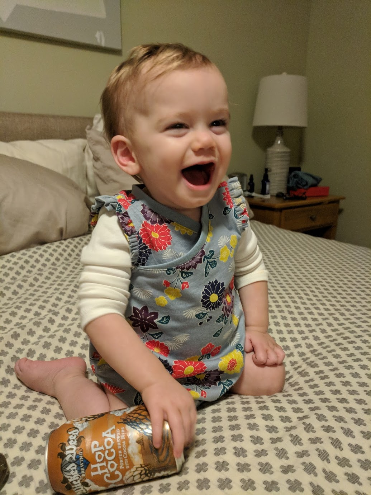

Adding more stress to this period, I was in the process of switching jobs. Throughout the summer and fall, I had been working through a great deal of frustration with my employer. I had been given too much responsibility, too few resources, and high expectations. When I successfully delivered despite the difficulties, I wasn't recognized at all. I resolved to leave in October, and started my new position just before Thanksgiving. All of this, and my prior over focus on work, added fuel to the fire.

### The Event? - December 23rd - December 25th

Two days before Christmas, on December 23rd, Auri woke up with a reasonably high fever (I think it was > 102). She had slept through the night, but we could tell she wasn't feeling well. I sat in bed that morning and played her some music. She sat patiently, but looked distracted and disinterested. I remember being surprised that she wasn't more thrilled. She had always danced and really enjoyed music.

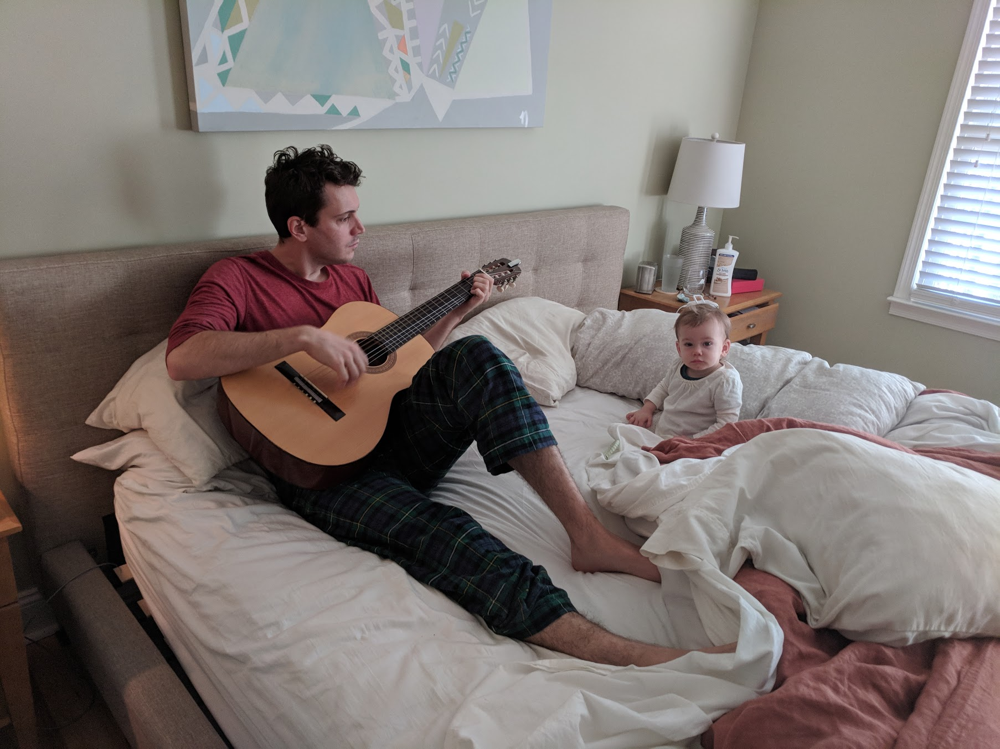

By Christmas morning, we all fell ill. It was a subdued morning, and Natalie and I probably just phoned it in a bit. The kids were excited, but even they lacked a whole lot of enthusiasm. I remember feeling _drained_, and you can see it in this picture of Auri. We didn't know it at the time, but we now think this illness precipitated what came next.

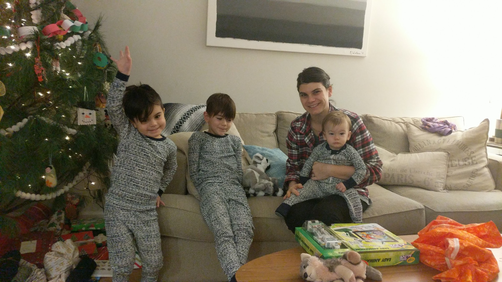

### Something Wasn't Right - December 26th - January 7th

Around this time, we visited friends that have a daughter close in age to Auri. I remember feeling like something was wrong, but not knowing how acute it was until seeing their daughter (a few months older) run around and chase the boys. Auri could barely crawl around and play with toys. Something wasn't right, and Natalie and I both knew it. By the week of January 1st, we felt like something was seriously wrong and we had to take action. Natalie phoned our pediatrician and asked for an immediate followup. During the visit, Auri weighed in at _exactly_ the same weight that she had been a month and have prior, and her "slowness" as the doctor described it prompted a call to Duke pediatric neurology for advice. The neurologist on call _strongly_ recommended we bring her to the emergency room to expedite testing. A normal appointment and consultation might take weeks. We really weren't sure what to do, nor did we have any idea how serious it was. On Saturday night, Natalie and I went rollerskating on a date. We had a good time and didn't talk about Auri much. We didn't think it could be _that_ serious, and we were trying to turn a corner and focus on being more positive together and at home.

[Roller Skating](./roller_skating.jpg)

On Sunday, we wrestled with the idea of waiting to make an appointment. But after reviewing old pictures and videos that night, we realized that what had thought was some kind of delay had unequivocally become developmental regression. We had been so focused on Auri's standing and attempts at walking that we completely missed her struggling to crawl and sit up. We made plans to take her first thing Monday morning, and I drafted notes to provide to the doctors with dates, milestones, and lost skills. At this point, she could barely sit up and we hadn't really acknowledged how drastic her changes had been. In August, she was crawling around and sitting to play with her cousins at the beach. So much had changed so fast.

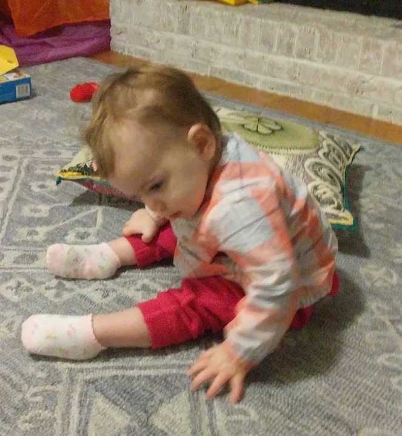

### An Emergency Room Visit - January 7th

Natalie hopped in the van with Auri just as soon as she woke up Monday morning and rushed to Duke. I had to take Max to school, and since Lennox was off from preschool, I took him with me to meet them.

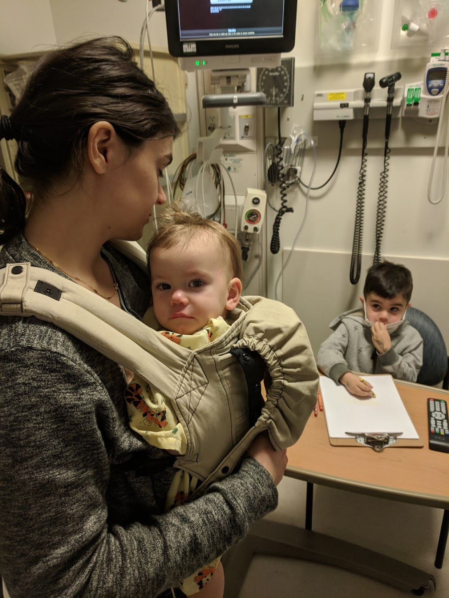

What followed felt somewhat like a blur to me. I had fears that Auri might be suffering muscular dystrophy, and I kept asking about certain tests. I was so terrified that she would have a degenerative disease, but the markers I was concerned about came back normal. We didn't get any answers that morning, and I was forced to leave Natalie behind and head home to pick up Max. Still at the hospital, Natalie had to manage entertaining an infant through all the commotion. Without remembering the exact details of what happened, I know that they scheduled her for an MRI and a lot of blood work.

I don't remember who helped put Max and Lennox to bed that night (it might have been Dan), but  after getting them ready, I hopped back into the car to drive to the hospital. On the way, Natalie sent me a "where are you, hurry up" kind of message. I just knew it meant she had something to share and I called her back. Somehow, one of the residents had committed a faux pas and read Natalie an excerpt of the preliminary MRI report. Natalie told me that they thought it was a leukodystrophy. I didn't know what that meant, and I almost crashed my car after I looked it up on the highway. Everything went dark.

## Act Two - Shit Hits the Fan

### Dark Hallways - January 7th - January 8th
As I stumbled through the hospital trying to make it back to Natalie and Auri, I had to stop and compose myself multiple times. I kept fearing I was going to faint, and my knees were so weak that I kind of awkwardly fell through the hallways. On the verge of a breakdown, I spotted Natalie's sister in front of me and barely choked out her name. A somber hug and an almost run to the hospital room brought me to them unbearably slowly. Natalie sat on the bed, trying to keep Auri calm. It just didn't look much different than earlier that day, except that they were both exhausted. Auri had to be sedated for her MRI, and she had been poked and prodded and was not making anything easy. As tired as she might have been, both Natale and I knew that she wasn't going to sleep well that night. I had to say goodbye knowing that Natalie had the worst of it and wouldn't get any rest. Unfortunately, I don't remember much about that night. I can't remember how I got home or what I did when I got there. All I'm certain of is that I took a few Tylenol PM because I did so every night for the next month.

After a restless night at home and the emotional struggle of delivering Max and Lennox to school the next day, I found myself struggling through the halls of the hospital again. When I reached the Auri's room, I found that she and Natalie had been taken to prep for a lumbar puncture to draw cerebral spinal fluid (CSF) for testing. Two nurses offered to walk me to them, but I really needed a few more to carry me. I had to stop foor multiple panic attacks before finding Natalie in the procedure room, with Auri on a table about to get a needle in her spine. This was the last of tests before we demanded to leave. They'd have what they needed to try and figure it out. We just wanted to go home. If I had no energy, I can't imagine how Natalie felt after two days in a hospital with an infant.

### Discharge - January 8th
On what I believe was the same day, Auri's neurologist spoke with us before discharge and read us that the MRI indicated "abnormal white matter changes concerning for leukodystrophy of unknown etiology." In what was my first brush with seemingly paradoxical statements about Auri's health, she told us that it was a good catch by the resident radiologist because the abnormalities were subtle and hard to spot. It meant that we caught it early. Something about how that was phrased seemed absurd to me, but I still had at least one foot out the door and a toe dipped in denial. How could I accept what I was being told? I couldn't really process what was happening, and everything I was hearing was terrifying. As Natalie got Auri ready to leave, I spoke with the ER residents and attending about discharge instructions. It was another moment in a month of absurdities. As I sat in a chair in the hallway, they asked me if I understood what was happening and what our next steps were. I calmly explained that I understood that my daughter was dying, and that we were to keep her comfortable and enjoy whatever time with her that we had left. I can remember the pain in their faces and their uncertainty about how to end the conversation. As far as they knew, that was exactly what was happening. At least one looked like she wanted to give me a hug but she must have thought twice about it because they left with that sort of awkward, backward shuffle that people do when they want to get away from a difficult situation. One doctor lingered, but I felt so far from reality. I didn't want her sympathy. I left in a blur to pick up Max from school, relieved that Natalie was on my heels with Auri.

### Maybe It's Nothing - January 9th
"Maybe it's nothing," I kept telling myself. Everyone I spoke with tried to remind me to remain positive and hopeful. "Maybe it's nothing," I lied to myself. The day after we left the hospital, we actually took everyone to Dave and Buster's. I had been taking the boys there somewhat regularly as a treat for good behavior. Natalie and I wanted to do something as a family, and since Auri had never been, we thought it might be the perfect activity.

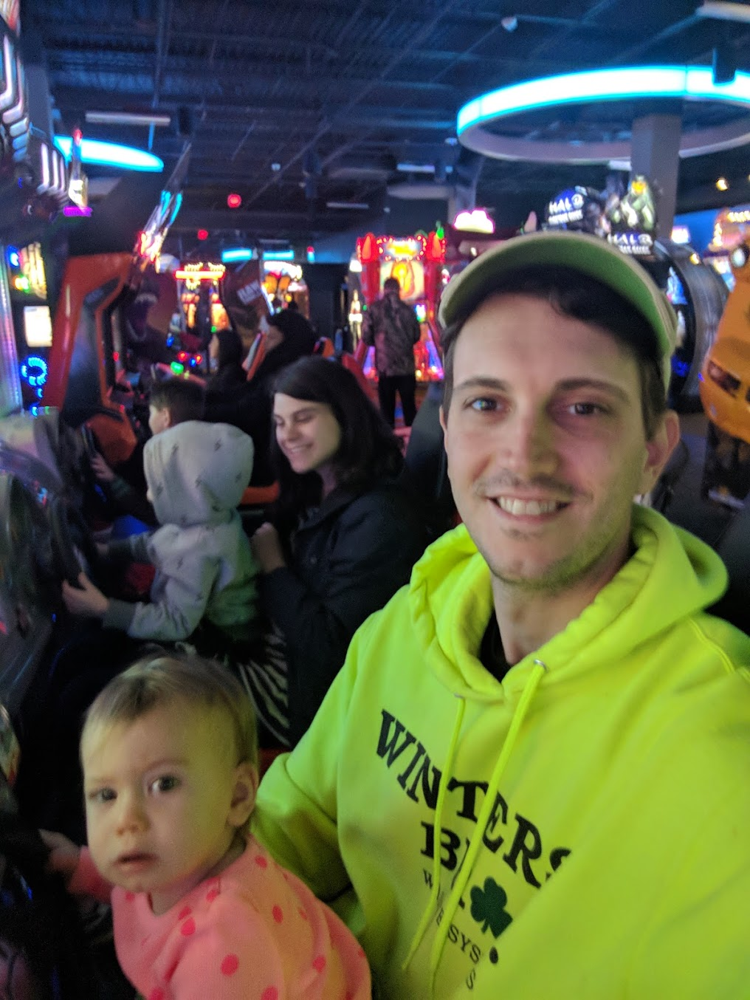

Given the insanity of the previous few days, we found relief and had a lot of fun. I thought that if we could do stuff like this together, it might not be so bad. "Maybe it's nothing," I thought again. Or, if it _was_ something, maybe it would turn out alright. If I allowed myself to think this was real, I had to acknowledge that either Max or Lennox stood a large chance of having the same thing happen to them. Most leukodystrophies are genetically recessive, and the math worked out to a 44% chance that one of them might have inherited the same thing. I couldn't face that.

### It Definitely Looks like Something - January 10th - January 15th

#### An Eye Test - January 10th
We were referred to follow up with a neuro-ophthalmologist to determine if Auri had any damage to her optic nerve that might help with a differential diagnosis. With a clap and a proclamation of "good news" she told us that Auri's optic nerve looked fine. It was _good news_ because damage might have been a sign of "one of the bad ones," she was referring to leukodystrophies. That struck me in such an awkwardly painful way that I stared to tear up. "Is there a good leukodystrophy?" I wondered. "Are you okay, sir?" she asked and actually handed me a lollipop. "Am I okay?" It was such a strange thought to think that there was good news, or that she had just given me some. It was what I came to understand (and later describe) as a relativism that continued and grew stranger with every appointment. However, the lollipop did make me feel better.

In the waiting room, Auri was [eating a banana](https://photos.app.goo.gl/bWVydTzLdPVCQdFc6) and playing with toys. She was sitting up in Natalie's lap. I couldn't make sense of anything.

#### Reaching Out - January 11th

The next day, on Friday, January 11th, I sent an e-mail to Dr. Joanne Kurtzberg about her [clinical trial](https://clinicaltrials.gov/ct2/show/NCT02254863) introducing umbilical cord blood as an advance and adjunctive therapy to bone marrow transplantation. I had hoped that we could get Auri prepared for whatever might be necessary by finding the right contact. A portion of what I wrote her:

> "If we receive confirmation that Auri is experiencing the onset of a late infantile leukodystrophy, I would like to be in a position to offer her options. I'm sure you know that the rate of progression of these diseases in infants can make HSCT inadvisable, and I'm hopeful that your trial may provide an avenue for treatment."

#### Meeting Dr. Kurtzberg - January 15th

To my surprise, Dr K. replied over the weekend and asked to take a look at Auri's case. By the end of Saturday, she had scheduled us to meet in clinic the following week. On Tuesday, the 15th, we drew some blood samples to do HLA typing (to find a donor match). From what I remember as an afterthought, she suggested we order Whole Exome Sequencing (WES). The results of some of the blood and spinal fluid tests had already ruled out some of the more common leukodystrophies, and Dr. K. said something to the effect of "whatever this is, WES will tell us faster than anything else." She and her team were to see about getting it rushed. This meeting and that decision proved to be _critical_ to our story. At the time, I worried that Dr. K wouldn't be able to help us. I asked her what would exclude Auri from bone marrow transplantation as a treatment. She told me that it can take up to six months before it has an effect, and that further regression and increased spasticity would rule it out. My understanding of how fast leukodystrophies progress meant that even if the treatment proved to be an option, Auri might not survive long enough or be in a good enough condition to make it advisable. With tremendous difficulty, I asked her point blank if she thought this was a leukodystrophy. She didn't mince words. In her opinion and experience, it _looked classically so_. Confusingly, the nurses and aides in the room kept remarking to each other how remarkable it was that Auri still had "so much function." They seemed genuinely surprised to see a child with what appeared to be such an early and rapid diagnosis. This gave me some hope, but it also made me begin to wonder.

### What's Actually Going On? - January 16th - January 24th
By this point, we were over a week into this tragedy and the stress had already taken its toll. I don't remember eating anything but a handful of crackers and a lollipop after checking Auri into the hospital. I weighed myself, and I had lost over ten pounds. When I shared this with Natalie, she had lost the same. Between us, we weren't sleeping or eating; and I hadn't shown up for work in over a week. I wish I could say that this was my lowest point in this story, but it continued to get worse. We still tried to maintain composure and do things like meet Max at his elementary school for lunch and go to the park or kid's museum.

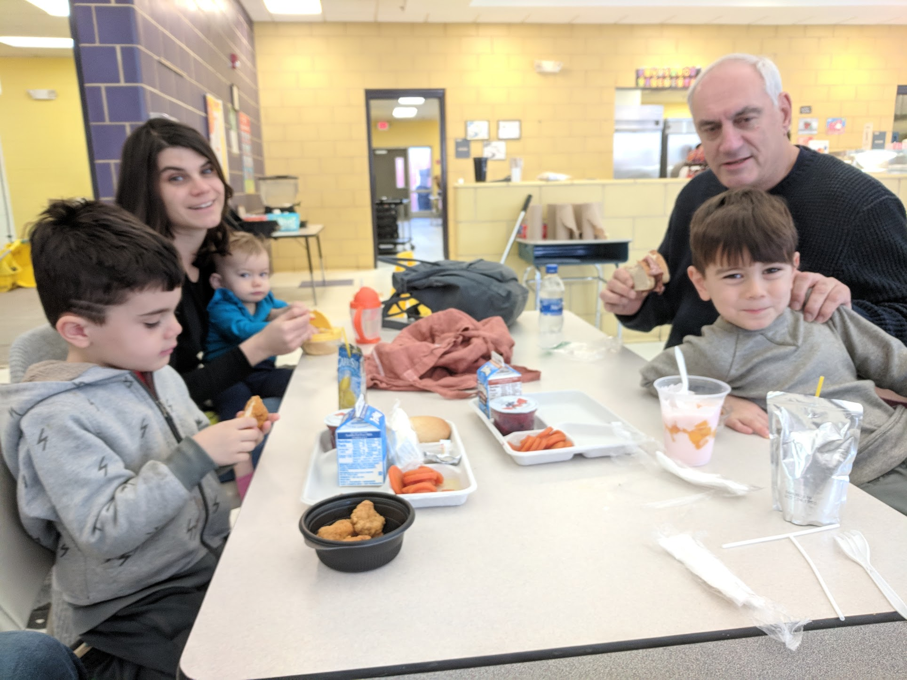

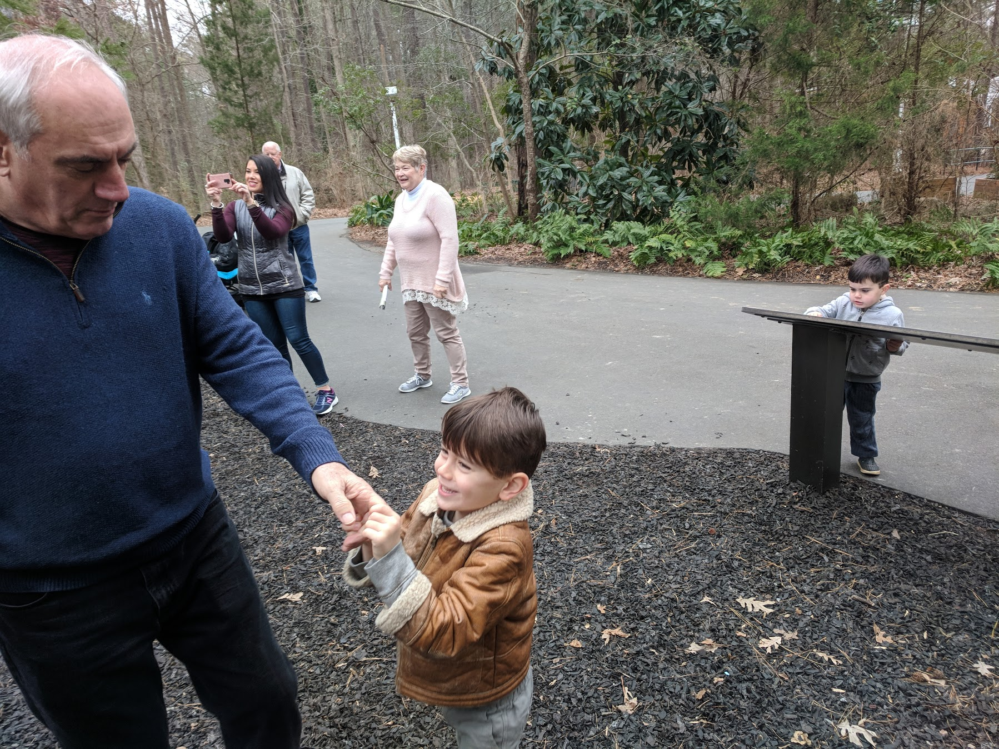

On January 20th, Auri was clearly [struggling to crawl](https://photos.app.goo.gl/1b6H3dnPpzMUzDAh6), but the changes still seemed slow. I don't have a picture or video of it, but Natalie remembers January 23rd as the last day she was able to do so.

#### Follow-Up with Neurology - January 17th
Ten days after entering the hospital, we had a follow up with our neurologist that gave us more questions than answers. The comprehensive set of CSF and blood tests were inconclusive. Mostly, they ruled things out. It was unclear what to try next. So, if I remember correctly, the doctor said that we were going to go "old school," and tests for things, however unlikely, that might be immediately treatable. This included checking for (among others) vitamin deficiencies, heavy metal poisoning, and thyroid problems. To me, it seemed like Auri might have avoided the really terrible diseases; and I hoped that there was a simpler explanation. I _clearly_ remember examining the concentration of zinc in her diaper rash cream and researching the levels need to induce toxicity. What an outrageously naive thing to think, but we had no idea. 

#### More Research and Attempts to Contact - January 18th
At the same time, I began contacting others. I had a particular fear of Vanishing White Matter disease, and I tried writing a handful of clinical researchers to get advice. Even though I wasn't getting any responses, I didn't really have any other idea what to do. In hindsight, I was at least practicing my communication skills. I had written so many e-mails about Auri's condition that I had a template that read like a medical summary. In the weeks to come, I think that practice helped me to demonstrate, when it counted, that I had a reasonable grasp on what I was asking for.

#### It Wasn't Adding Up - January 18th - 24th
Something didn't quite add up for me at this point. I had read about leukodystrophies, and so many of them moved terrifyingly quickly. While Auri had lost skills and was struggling, she was still _kind_ of hanging on to things. On January 20th, she was still crawling a little and getting into a kneeling position to play.

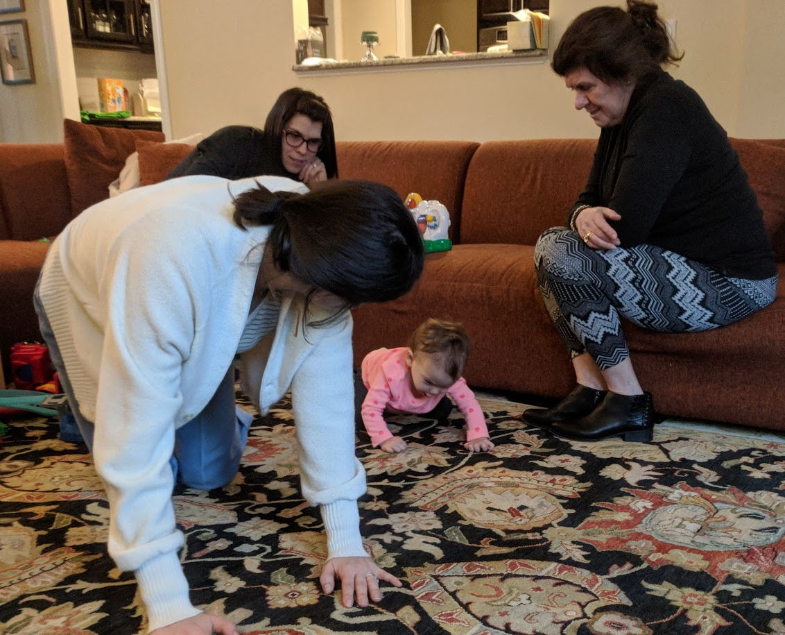

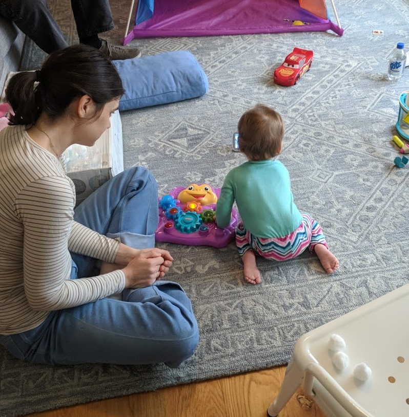

For a leukodystrophy, this didn't seem to add up. I began to wonder if there was something else going wrong. It was still possible that something fixable was occurring. Auri was still trying to do so much. We tried to spend time together as a family, and we had some visitors. I kept reading about leukodystrophies and sent a number of questions to our neurologist. In one e-mail on January 22nd, I _kind of_ hit on the idea that the brain damage we were witnessing was secondary to some other process. In a roundabout way, it turned out to be true.

> "Could inflammation markers (sedimentation rate and vWF antigen) indicate inflammation in the MRI as a secondary effect of some metabolic disorder rather than a primarily demyelinating disease? I've been trying my hardest to research and follow along, and I'm curious if you think it could be helpful to consult with any other specialists. I'm under the impression that Auri's case may be unfolding in a unique way."

### The WES Report - January 24th
The preliminary genetic report was made available to our neurologist relatively soon after we sent for it. It had taken less than two weeks from our appointment with Dr. K. I knew when the results were available because I had been in contact with the laboratory, but when I tried to get information from our doctor, she requested that we meet her the following day. Obviously, I couldn't sleep that night. I was _pissed_ then and now that we were made to wait, but I think our doctor needed the time to do research. Aicardi-Goutieres Syndrome (AGS) is rare, and I can't imagine she felt comfortable discussing it with us without having time to figure out what it meant and what our options were. When we finally did meet, it was clear that there really weren't any. But I was handed a few research articles that I devoured on the way home that gave me some hope. There was at least one clinical trial that had been run for a few years, and researchers had speculated in the past about treatments and favorable outcomes:

>[Observations about the natural history of AGS] are important because they suggest that:
> 1. Treatment in the early stages of the disease might result in attenuation of the associated inflammation and consequent tissue damage
> 2. It might be possible to discontinue treatments after the subacute encephalopathic period subsides

> ["Therapies in Aicardi–Goutières syndrome"](https://www.ncbi.nlm.nih.gov/pmc/articles/PMC3898548/) Y J Crow, A Vanderver, S Orcesi, T W Kuijpers, and G I Rice. 2013

Additionally, we were made aware of a clinical research trial in Philadelphia that had just closed. We planned to contact the Children's Hospital there (CHOP) as soon as possible and see if they could provide any recommendations or assistance. We were to meet back with our neurologist in no longer than two weeks to build a plan and discuss what she could dig up.

I was devastated. There's no pretending otherwise. But, I had _something_ to direct my energy towards. I had been given a name of what I knew only as fear. It was a relief in some ways, another paradox.

#### Frantic Research - January 24th - January 25th
I didn't sleep that nigh either, not because I was sad or nervous but because I couldn't stop researching. I began reading everything I could about AGS, and a particular name kept popping up. Yanick Crow seemed to be an author on every important paper. He had penned a lot of comprehensive overviews of the disease and even coined the term "interferonopathies" to describe a category of diseases with a similar pathology. The next morning, I found his e-mail address and wrote him. A portion follows:

> "I'm reaching out in hopes of learning about early indications of efficacy within your RTI trial for AGS patients. We need to develop a plan of therapy (or understand the necessity of a trial) as soon as possible in the hopes of arresting or reducing [Auri's] neurological decline. I understand that these trials likely monitor interferon alpha levels in patients after their acute neurologic episode, but with very little in the literature about other scenarios we're looking to understand and try anything of use."

Fortunately, he replied quickly and provided me with the clinical research he had been involved in with JAK inhibitors.

> "We and others are trying to work out if the drugs that are currently available make a difference at the neurological level (I attach the papers that we have published on JAK inhibition), but I have to admit that it is not completely straightforward to know that (it is one thing to see an effect at, say, the level of the skin, another matter in regards to the brain)."

I had already read a ton the night before and had some context for his constraint. At least a handful of papers had discussed the theory behind JAK inhibition, and it seemed like it had been guessed to be a potential therapy for AGS. I blew past his warnings, thrilled at least that I had received a response and been on to something. Encouragingly, I also had success contacting CHOP and began the process of authorizing medical record release and signing up for their research studies. I started to feel some relief that we not only knew what we were dealing with, but there seemed to be experts and options. Surely we'd find something.

#### Making Contacts - January 25th - January 29th
On the 25th, after speaking with CHOP's research coordinator, I put together a bunch  of pictures and videos of Auri. I had hoped to demonstrate to them how early we had intervened in Auri's disease, so that they might register the importance of acting quickly. I shared videos of her eating, playing, and standing. It felt like we were getting connected to the team that we needed the most.

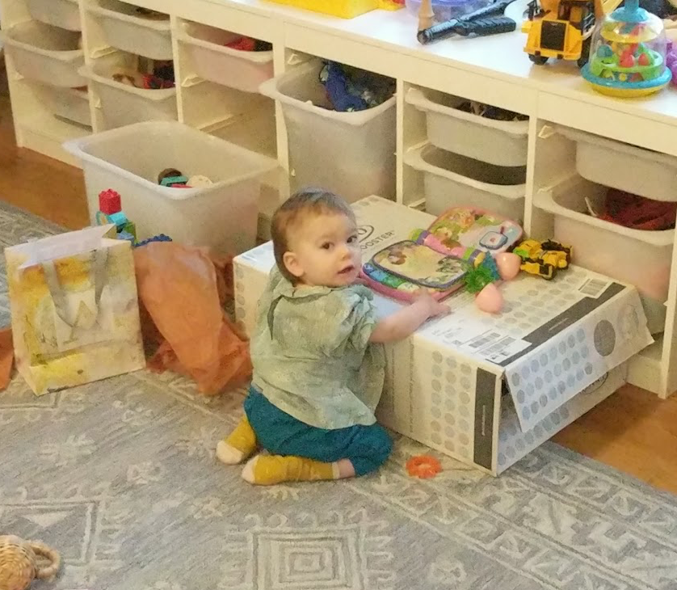

On January 27th, our neurologist received word from CHOP that made me simultaneously hopeful and frustrated. It seemed to confirm that JAK inhibition, which had been tried with success by Dr. Crow, had been working in their clinical trial. Unfortunately, the trial was closed.

> "We expect to re-open our trial of baricitib soon, though we are not enrolling yet. It is a janus kinase inhibitor, and we think blocks the IFN mediated end organ damage. We see moderate success, in particular for these kids with later onset."

#### January 29th - February 4th
I had some confusion about the state of things, and I spoke with a college friend of mine, an M.D. that works in the University fo Colorado hospital. He assured me that since baricitinib had been approved by the FDA for rheumatoid arthritis, it _could_ be prescribed for any other reason. It was just a matter of finding a doctor that would prescribe "off-label." Our doctor assured me, "I'm in agreement with your sense of timing needing to move quickly. I am going to get pieces in place for JAK meds if we need to do them here."

This looked difficult, though. The drug hasn't been studied well for this use, and barely at all in children. What's more, Auri's situation was unique. My research had confirmed what our neurologist shared:

> "In general- the treated people I can find have not been in a clinical situation similar to Auri, so we are in very very uncharted waters here as far as effects of treatment."

As far as I could tell, there hadn't been a single child with AGS that had undergone this treatment at this stage of the disease. It was simply unknown whether it could halt the neurological damage, and everyone I spoke with offered caution about jumping to conclusions. (I later found out that this was not entirely true, but the group could still be counted on one hand.) Still, the rationale in research seemed strong; and it didn't seem surprising that it hadn't been tried like this yet with such a rare disease. Auri had been diagnosed remarkably quickly. I couldn't help but assume that everyone would be jumping at the opportunity to help her.

### All Out of Options - February 5th
I had a phone call with our neurologist on February 5th that destroyed my hopes for treatment. The team at Duke simply didn't have enough experience, evidence, or research to make this happen. And, CHOP either couldn't or wouldn't participate. To some extent I can understand why CHOP would need to prioritize their clinical trial, but when one of their nurse practicioners described the situation as a "catch-22" for them, I couldn't help but be angry. They had a responsibility to establish evidence of this therapy working in AGS before participating in treatment of children. But, if they knew through their research that it was working and that they could not re-open their clinical trial in time, I couldn't understand why they would  not assist.

#### I Might as Well Try - February 5th
It seemed like every door had closed, but their was still one loose thread. Dr. Rafaela Goldbach-Manksy and her group at the NIH had originally established the treatment and monitoring protocol that was being used. I didn't know this at the time, but I was aware that my doctor had attempted and failed to make contact with her. I thought that I might as well try to reach out. Maybe I could still make something happen. I recently wrote her a thank you, and I'll just let it tell how I had felt.

> "The first of kindnesses on your part, simply returning my phone call, gave me renewed hope on the very day that I had lost it. I had just navigated an entire month of grief, panic, and fear that included a humbling acknowledgement of a problem in my previously healthy child, a terrifying suggestion of a likely fatal leukodystrophy, panic that my other children might meet the same fate, the paradoxical relief and devastation of a rapid genetic diagnosis of a de-novo mutation for AGS, the hope of promising clinical trials, and finally the somber disillusionment that said treatment would be inaccessible to Auri when she needed it. Throughout most of January, I sat helpless while my daughter turned to sand and began slipping faster and faster through my fingers. As soon as I received Auri’s genetic report, I got to work on research. As a graduate student of computer science, I worked for Richard Bonneau at NYU’s Center for Genomics and Systems Biology. I felt uncommonly prepared to ensure that my daughter had the best options. I read so much. I took notes. I contacted PI’s. Within a few days, I became convinced that JAK blockade represented an astounding and perhaps unprecedented opportunity for Auri. Unfortunately, I quickly found myself helpless again. Our neurologist shared my eagerness to treat Auri promptly but was unable to garner the necessary support, neither in nor outside of Duke. We would have to wait until CHOP began enrolling in a follow-up trial. Auri’s doctor and I had a difficult conversation that ended with something to the effect of “good luck,” knowing full well that Auri faced an overwhelming likelihood of neurological devastation. That same afternoon after work, waiting in line to pick up my son from kindergarten and after having cried the entire drive, I decided to try calling you."

### More Regression
While we waited, I kept researching. As much as I was capable, I tried to build an understanding of the disease and it's mechanics. I kept telling Natalie that I could understand what I was reading, but it was really hard to connect papers because I had no background. I had no recall, and simply couldn't remember details about what I had read the day before. I was trying to pull something together with little to no relevant education. It was incredibly frustrating. While I was doing this, Auri got sick again and this time it seemed much worse.

### A Frantic Plea for Help

### A Miracle

## Act Three - 
